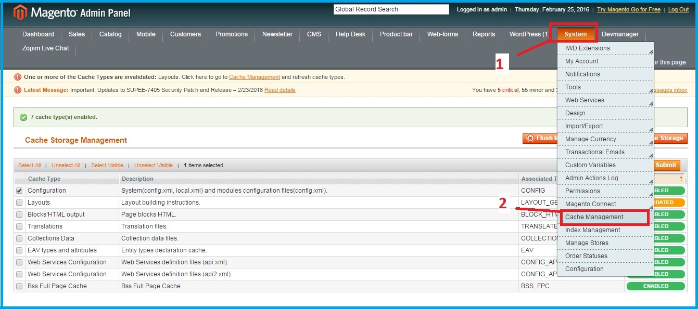
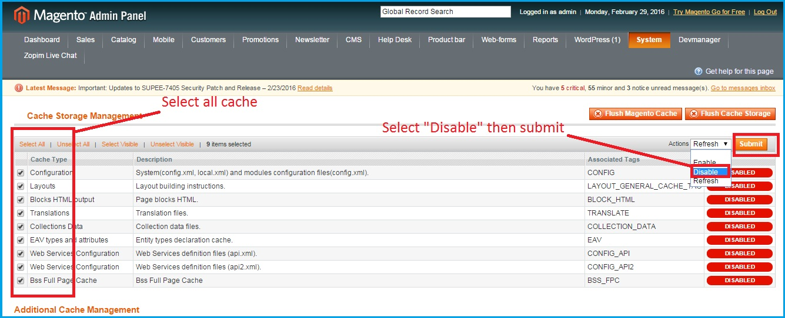
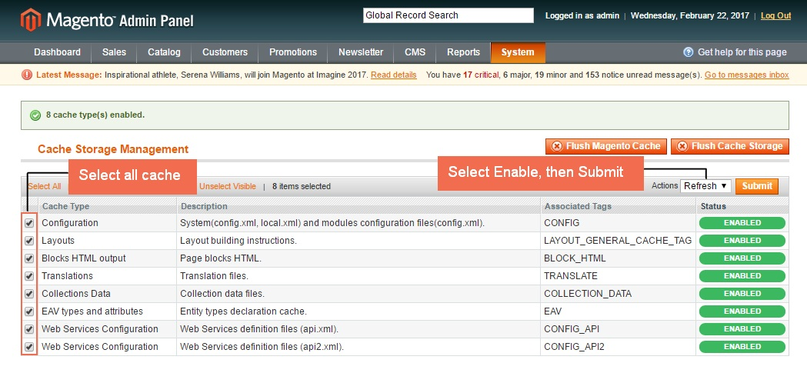
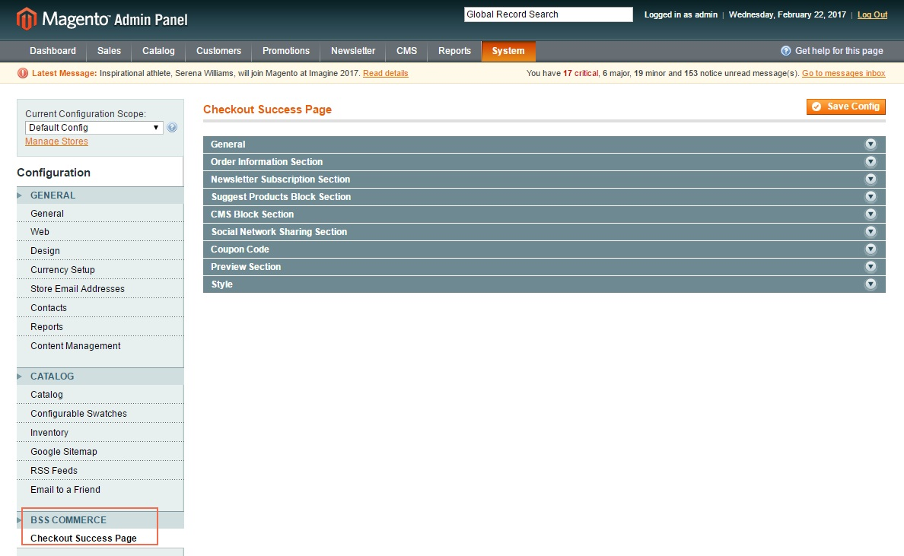

Installation Guide for Magento 1 Extensions
==========================================================

.. role:: step

.. role:: mail

.. role:: remark
	
:step:`Step 1:`
	
When you finish purchasing process, we will immediately send you an email that includes the link to download the extension.
On the other hand, you can `log in <https://bsscommerce.com/customer/account/login/>`_ your account, in `My Downloadable Products <https://bsscommerce.com/downloadable/customer/products/>`_ section, click on **Download Link** to download the extension.

.. image:: images/bss_installation_guide_1.jpg

:step:`Step 2:`

The file that you download is normally a zip file. Then, please properly unzip that file before installing it.

:step:`Step 3:`

Turn off Magento Compilation by navigating to System-Tools-Compilation or you can try to use following command line to disable it 

			php -f shell/compiler.php -- clear
 
:step:`Step 4:`
 
It's required to disable cache in the administration panel of your site. Go to **System/Cache Management**. Select all caches and click **"Disable"** then submit.   

:step:`Step 5:`

Use FTP client (such as Filezilla, WinSCP, cuteFtp) to upload or copy all folders in the zip package to your Magento site root folder. This will not overwrite any existing file; just add new files to the folder structure.

:step:`Step 6:`

After uploading is done, **log in your Magento administration** panel to refresh cache. Go to **System/Cache Management**. Select all caches and take action **"Refresh"** then submit.

:step:`Step 7:`

Navigate to **System/Configuration**, if you can see the extension tab, it isinstalled properly.   

:remark:`*Note`: Some extensions don't have Configuration in BSSCOMMERCE section of CATALOG tab. Therefore, please take a look their User guides for better usage. 

:step:`Step 8:`

Now if you get Access denied error when click on the extension tab, you need to **log out** admin panel and **log in** again.

:step:`Step 9:`

Check everything in **front-end** and try to process, make sure that the extension is successfully installed and well compatible with your site.
  
:step:`*Note`

After purchasing it, you should add our skype account at **support.bsscommerce** to contact us if you cannot install the extension by yourself. 
BSS Support Team will help you to install the **Magento** module and the installation fee will follow our 
`Terms and Condition <http://bsscommerce.com/terms-conditions>`_ in Installation Policy section. Further assistance is available via Email and Skype.
In case, you have followed all above steps but the extension doesn't work properly, you can delete the file or change the module's filename extension 
to keep your website function as normal. Then please contact us at :mail:`support@bsscommerce.com` or Skype: support.bsscommerce. Our supporters will assist you 
in resolving any issues within 24 hours.
You also can see the example about installation guide for `Checkout Success Page <http://bsscommerce.com/magento-checkout-success-page.html>`_ exention's video below: 

.. raw:: html

   <iframe width="560" height="315" style="margin-left:calc(25% - 	100px); margin-bottom: 30px" src="https://www.youtube.com/embed/hGikzwrC3BI" frameborder="0" allowfullscreen></iframe>
   
   