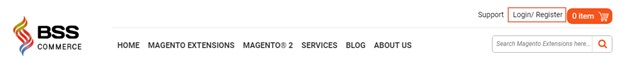
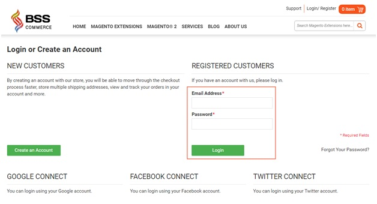
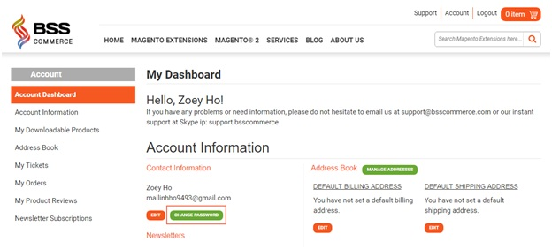
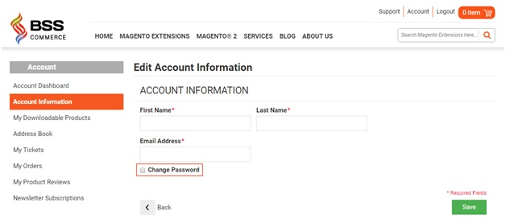
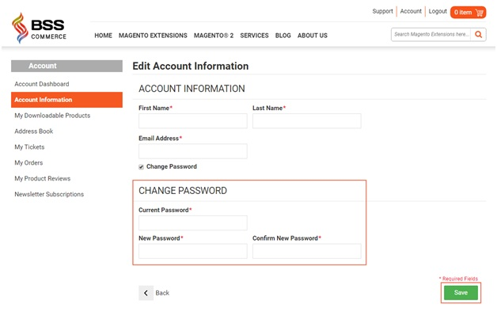
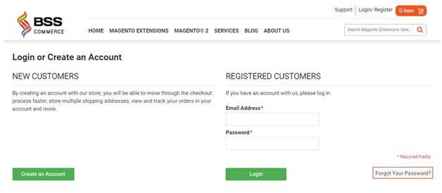
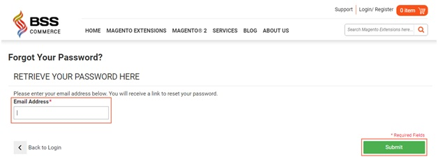
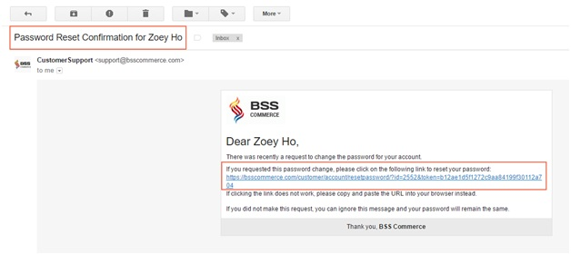
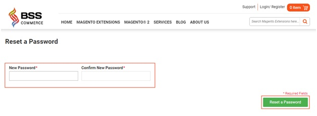

My Account
===========

Change or reset your password
-----------------------------
	
Your password is the key to not only logging into your account, but also to changing your private information such as username or email address and your account 
setting. Therefore, it is vital that you keep your passwords safe. This guided assistance article will help you change your password for security reasons or reset it if you forget it.

1.	Change your password
^^^^^^^^^^^^^^^^^^^^^^^^^

**Step 1**: Go to Login/Register.

**Step 2**: Under "REGISTERED CUSTOMERS", fill in "Email Address" and "Password" blank, then click Login.

**Step 3**: In Account Dashboard/Account Information, choose CHANGE PASSWORD

**Step 4**: Enter Current Password, New Password, and Confirm New Password, then click Save.

2. Reset your password
^^^^^^^^^^^^^^^^^^^^^^^

**Step 1**: Go to Login/Register.

.. image:: images/my-account/my_account_6.jpg

**Step 2**: Under "REGISTERED CUSTOMERS", choose "Forgot Your Password?"

**Step 3**: Enter your email address that you registered before into the blank, the click Submit.

**Step 4**: Check your email. A request confirmation email will be sent to your email, with a link to reset your password. Follow the link that you receive (if clicking the link does not work, please copy and paste the URL into your browser instead).

**Step 5**: Enter your New Password and Confirm New Password, then click Reset a Password.

:step:`*Note`:For security, password reset links become invalid once used. 

We hope this article is helpful for you. If you don't succeed in changing or resetting your password, please feel free to contact us for any further assistance.

**Skype: support.bsscommerce.**

**Email: :mail:`support@bsscommerce.com`**

**Tel: +84 983513599**

.. raw:: html

   