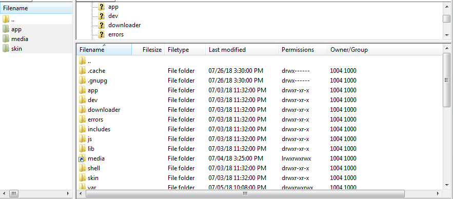

Update Module in Magento 1 Manually
==========================================================

.. role:: step

.. role:: mail

.. role:: remark

**Update module via FTP**
Extract module’s file, place this file into code folder of Magento site:

Log into backend, flush Magento cache and check the module function after updating.
In case you want to completely uninstall the old module before updating, follow these steps:

**Step 1**: To disable module, edit this file

/app/etc/modules/<your_module>.xml;

Replace <active>true</active>  by <active>false</active>;

**Step 2**: Delete all mysql tables created by the module

**Step 3**: Delete the module in the core_recourse table

**Step 4**: Delete files in the <project_root>/var/cache folder

**Step 5**: Refresh Magento site and the module has been removed successfully 

Then put the code of the module to site’s folder via ftp as mentioned above and flush Magento cache
