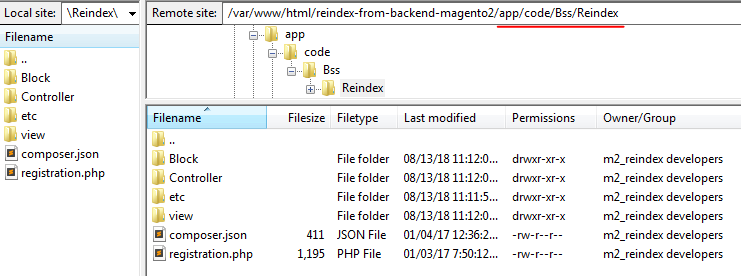

Update Module in Magento 2 Manually
==========================================================

**I Extension Update via FTP/SSH**

If you have an odd extension on your Magento 2, update the module manually following the steps below.

**Step 1:** Connect to the root of your Magento 2 installation (the folder contains the extension folder) via SSH:

**Step 2:** Remove the module files using the command:

**cd app/code/<VendorName>/**

**rm -rf <ComponentName>**

**Step 3:** Update module latest version

Put code module into app/code/<ExtensionProvider>/<ExtensionName>

(<VendorName>/<ComponentName> find in file composer.json )

Apply the commands to install it:

**php bin/magento setup:upgrade**

**php bin/magento setup:static-content:deploy**

**php bin/magento cache:flush**

Finally you should check again the function of module

**II Extension Update via Composer**

The extension update process is the same as the module installation process. To update the extension, simply execute the command:

**composer update  <composer_name>**

Instead of the ‘composer_name’ please specify the corresponding module name which is indicated in your customer account. This command updates only the last two version numbers: e.g. 1.x.x ( only x.x will be updated).

To update the version from 1.x.x to 2.x.x you need to execute the following command:

**composer require <composer_name> ^x.0.0 --update-with-dependencies**

Where x corresponds to the first version number. For example, to update the Improved Layered Navigation Extension for M2 from the 1.x.x version to the 2.x.x version you need to execute the command:

**composer require amasty/shopby ^2.0.0 --update-with-dependencies**
