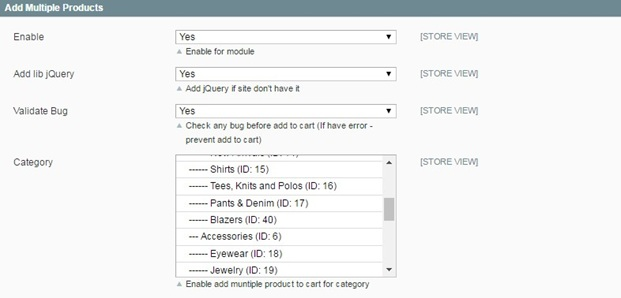
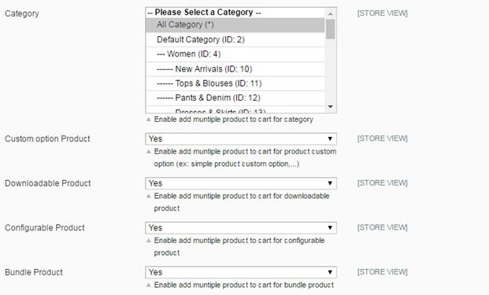

User Guide
=============

Magento Add Multiple Products to Cart Extension Overview
--------------------------------------------------------

As you know, Magento default does not allow customers to add many products to carts at one time in the product list pages such as category pages and 
search result pages. Therefore, customers cannot order their desired products with a large quantity when they do not want to visit each product page one 
by one because it is very time-consuming.

`Magento Add Multiple Products to Cart <http://bsscommerce.com/magento1/shopping-cart-rules-per-store-view.html>`_ is developed by BSSCommerce to solve 
this issue and bring better shopping experience for customers. By allowing customers to add multiple items to cart with various quantities at once, they can save 
a lot of time with the quicker order process than the normal one and also store owners can increase sales well, especially when target customers are wholesalers.

How does Magento Add Multiple Products to Cart Extension work?
--------------------------------------------------------------

You go to **System -> Configuration -> Add Multiple Products** to start making configuration.

In **Enable:**

	* Choose **Yes** to enable the module
	
	* Choose **No** to disable it 

In **Add Lib jQuery:**

	* Choose **Yes** to add Library jQuery if your site doesn't have it
	
	* Choose **No** if your site already have it
	
In **Validate bug:** in this field, you will select the way to notify errors occurring when customers add products to cart.

	* If you choose **Yes**, a popup of error notification will appear when customers add   to cart products without selecting custom options or when no products are added  to cart
	
	* If you choose **No**, error notification will be displayed in the shopping cart for products that customers do not select custom options for them. Other products are still added to cart.
	

In **Category**: you select categories that you want to apply this module to. It means that when you choose a category, customers can add multiple products 
belonging to this category to cart

In **Custom Option Product:**

	* Choose **Yes** to enable the function of adding multiple products to cart for products with custom options
	
	* Choose **No** to disable this function for products with custom options 

Next, you can choose product types to apply this module:
	
In **Downloadable Product:**

	* Choose **Yes** and customers can add multiple downloadable products to cart
	
	* Choose **No** and there are not check box and quantity box for this product type. It means that customers cannot also add downloadable products along with other product types

In **Configurable Product:**

	* Choose **Yes** and customers can add multiple configurable products to cart
	
	* Choose **No** and there are not check box and quantity box for this product type. It means that customers cannot also add configurable products along with other product types

In **Bundle Product:**

	* Choose **Yes** and customers can add multiple bundle products to cart
	
	* Choose **No** and there are not check box and quantity box for this product type. It means that customers cannot also add bundle products along with other product types

Finally, you click **Save Config** and see changes in the frontend.

Note
----

`Magento Add Multiple Products to Cart Extension <http://bsscommerce.com/magento1/shopping-cart-rules-per-store-view.html>`_ does not work with pagination of 
product list pages. It means that if customers select multi products in page 1, they can add all of these products to cart in only page 1, not in other pages

.. raw:: html

   

