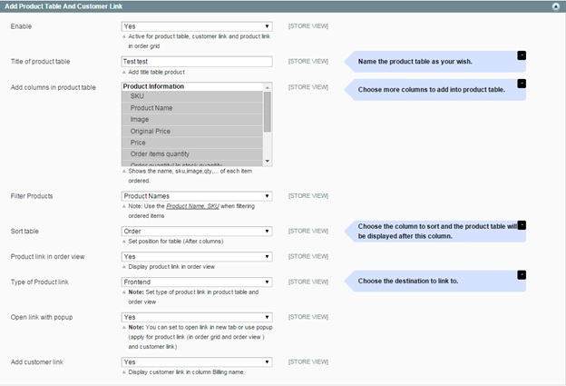
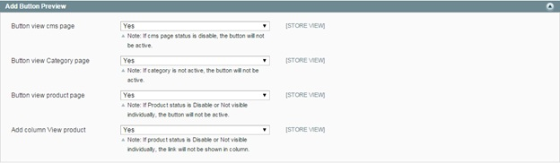

User Guide
=============

Magento Admin Product Preview Plus Extension Overview
------------------------------------------------------------

`Magento Admin Product Preview Plus Extension <http://bsscommerce.com/magento1/magento-admin-product-preview-plus-extension.html>`_ by BSSCommerce helps 
administrators to check out the front end page right from Magento admin by just some clicks without saving any configuration. This extension adds 
preview buttons in Product grid view and Product Edit Page to view the frontend product page directly in the backend. It allows accessing customer 
and product information easily  by clicking to the product and customer names. Magento Admin Product Preview Plus Extension also provides preview 
buttons in Category and CMS page for linking to the front end of Category and CMS page quickly. Especially, this extension links to shipping address 
by Google Map to locate customer positions and optimize shipping process. 

How does Magento Admin Product Preview Plus Extension work?
------------------------------------------------------------

1.	Add Product Table And Customer Link 
^^^^^^^^^^^^^^^^^^^^^^^^^^^^^^^^^^^^^^^

In **Enable**: Choose **Yes** to make product table, customer link and product link active or choose **No** if you want to deactivate them 

In **Title of product table**: You name your own title for product table as your wish 

In **Add columns in product table**: You choose columns that you want to add to the product table such as SKUs, names, images and so on 

In **Filter Products**: You can select **Product names** or **Product SKUs** to filter products

In **Sort Table**: You choose the column to sort and the product table will be displayed behind this column. 

In **Type of product link**: You can choose to link to **Frontend** or **Backend** page  

In **Open link with pop up**: Choose **Yes** to open link in a pop up and choose **No** to open in a new tab [Please note that this function just applies for 
product link (in order grid and order view ) and customer link]

In **Add customer link**: Choose **Yes** to display customer links in the column "Billing name" or choose **No** to exclude them.

2.	Add Button Preview 
^^^^^^^^^^^^^^^^^^^^^^^

In **Button view CMS page**: Choose **Yes** to add preview buttons in Admin-CMS page or choose **No** to disable them. Please remember that in case CMS page status 
is Disable, the buttons will not be active. 

In **Button view Category page**: Choose **Yes** to add preview buttons in Admin-Category page or choose **No** to disable them. Please remember that in case the 
category is not active, the button will not be available to use. 

In **Button view Product page**: Choose **Yes** to add preview buttons in Admin-Product Edit Page or choose **No** to disable them. Please remember that in case 
Product status is Disable or Not Visible Individually, the button will not be active. 

In **Add column View product**: Choose **Yes** to add a column of View product to Admin-Product Grid View or choose **No** to disable them. Please remember that in 
case Product status is Disable or Not Visible Individually, the link will not be shown in the column. 

3.	Google Map For Shipping 
^^^^^^^^^^^^^^^^^^^^^^^^^^^

.. image:: images/admin_product_preview2.jpg

In **Active Google Map**: Choose **Yes** to link to shipping address by Google Map or choose **No** to disable this function. 

.. raw:: html

   