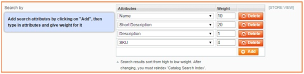
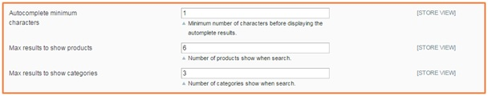

User Guide
=============

Advanced Search and Fast AutocompleteOverview
---------------------------------------------

Everybody knows how important is make customers find what they want faster, it's an important part of any ecommerce system because it seems impossible to show all products 
with full details to customers at the same time. With a powerful search tool, a web-store can increase selling chance as well as customer ease of use. Magento by default use a 
simple searching function which takes a long time to show the entire search result page and does not provide most relevant results at first case.

On average, 15% of visitors use the product search in online store. These are the visitors who know what they want and are looking for it to buy, which brings about half of 
orders to your shop. Therefore, the sales of online store depend on whether a website search is able to quickly find a proper and satisfying goods and 
services. `BSS Magento Search and Fast AutoComplete Extension <http://bsscommerce.com/magento-advanced-search-and-fast-autocomplete-extension.html>`_ will effectively deal with this issue.

How does Advanced Search and Fast Autocompletework?
---------------------------------------------------

As an admin, you can set up your own store page by the most effective way that supports your trading objective. To polish the website configuration:

* Step 1: Go to **Admin Panel -> System ->Configuration.**

* Step 2: At the left side of the page, find **BSS COMMERCE** -> select **Advanced Search + FastAutoCompelete.**

You can select between enable and disable Advanced Search and Fast Autocomplete Extension by selecting Yes/ No in **Enabled Module** box.

There are 6 sections for admin to continue configuring the extension: **Enable search categories, Enabled jQuery, Search by, Autocomplete minimum characters, Max results to show products, Max result to show categories.**

**1.	Enabled searchcategories**

Choose Yes to enable searching by category

**2.	EnabledjQuery**

Choose Yes to enable jQuery of module

**3.	Searchby**

In this field, you can configure which attributes of product will be used to search product. Click to "Add" button to add more attribute, then choose attribute name from 
dropdown selection. Type a number in "Weight" box for each attribute. Search results will be sorted from high to low weight.

**4.	Autocomplete minimumcharacters**

Type a number to this box to set up the minimum number of characters before displaying autocomplete result

**5.	Max results to showproducts**

Type a number to this box to set up the maximum of product will be shown when searching

**6.	Max results to showcategories**

Type a number to this box to set up the maximum of category will be shown when searching

.. raw:: html

   

