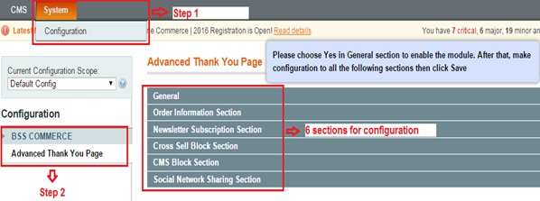
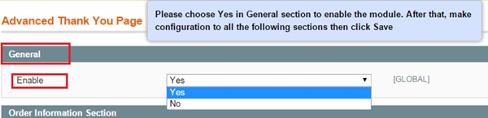
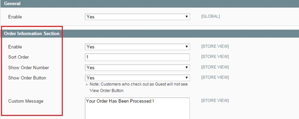
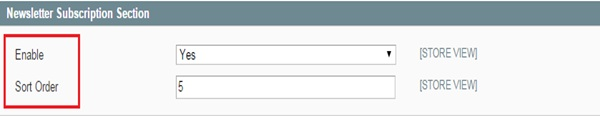
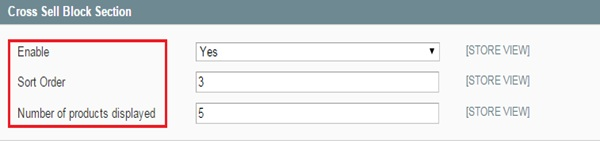
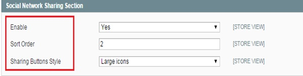
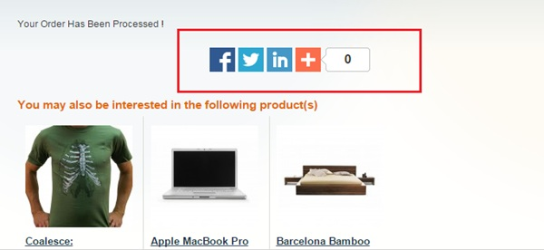

User Guide
=============

.. role:: italic

.. role:: example

Magento Advanced Thank You Page Overview 
-----------------------------------------

`Magento Advanced Thank You Page <http://bsscommerce.com/magento1/magento-advanced-thank-you-page-extension.html>`_ extension is a unique extension which 
allows admin to tweak the success page or also called "thank you page" for better sales conversion.

The Success page, which appears when customer's order process is accomplished, is often forgotten by many Magento users. Interestingly, this page can be of 
much value when admin know how to make use of it properly. Our Advanced Thank You Page Extension is designed with the hope to help you utilize the success page 
to empower your sale.

How does Magento Advanced Thank You Page extension work? 
--------------------------------------------------------

As an admin, you can set up your own store page by the most effective way that supports your trading objective. To polish the website configuration:

* Step 1: Go to **Admin Panel** => **System** => **Configuration**

* Step 2:  At the left side of the page, find **BSS COMMERCE**  => select **Advanced Thank You Page** 

After these 2 steps, a screen for configuration appears like the below picture:

There are 6 sections for admin to continue configuring the extension: **General, Order Information Section, Newsletter Subscription Section, 
Cross Sell Block Section, CMS Block Section, Social Network Sharing Section.**

1.	General Settings 
^^^^^^^^^^^^^^^^^^^^

There are 2 options in box **Enable**: **Yes** and **No**.

* Choose :italic:`Yes` to enable the module and continue customizing on other sections. 

* Choose :italic:`No` to disable this module.

2.	Order Information Section 
^^^^^^^^^^^^^^^^^^^^^^^^^^^^^

There are 5 boxes appear in this section:

* **Enable**: Choose :italic:`Yes` to enable appearing order's detail information on the Thank you page. Otherwise, choose :italic:`No`.

* **Sort Order**: Insert appearing ordinal number of :italic:`order information` (E.g: if you insert "**1**" => order information will appear first on the thank you page)

* **Show Order Number**: Choose :italic:`Yes` to enable showing :italic:`Order number` on the thank you page. Otherwise, choose :italic:`No`.

* **Show Order Button**: Choose :italic:`Yes` to show **View Order** button for customer on thank you page. This button allow customers view all their orders' detail information when click on through a navigation. 

The frontend will appear like this below picture:

.. image:: images/advanced_thank_you2_1.jpg

:example:`*Note: Customers who check out as guests will not able to see` :italic:`View Order` *button*.

* **Custom Message**: Insert your custom message which appears on the thank you page to inform that orders are successful or being processed. (E.g: *Your order has been processed*)

After configuration, click on **Save config** button and reload the frontend to see the change.

3.	Newsletter Subscription Section 
^^^^^^^^^^^^^^^^^^^^^^^^^^^^^^^^^^^

There are 2 boxes appear for customization in this section:

* **Enable**: Choose :italic:`Yes` to enable appearing :italic:`newsletter subscription` on the Thank you page which allows customers subscribe their email for your newsletter. Otherwise, choose :italic:`No`.

* **Sort Order**: Insert appearing ordinal number of :italic:`newsletter subscription` on the thank you page (E.g: if you insert "**5**" => newsletter subscription will appear last on the thank you page)

The frontend will appear like this below picture:

.. image:: images/advanced_thank_you3_1.jpg

4.	Newsletter Subscription Section
^^^^^^^^^^^^^^^^^^^^^^^^^^^^^^^^^^^

There are 3 boxes appear for customization in this section:

* **Enable**: Choose :italic:`Yes` to enable appearing :italic:`cross sell block` which shows related products on the Thank you page. Otherwise, choose :italic:`No`.

* **Sort Order**: Insert appearing ordinal number of :italic:`cross-selling products` on the thank you page.

* **Number of products displayed**: Insert the number of related products you want to display on the thank you page. (E.g: **3**). 

The frontend will appear like this below picture:

.. image:: images/advanced_thank_you4_1.jpg

5.	CMS Block Section
^^^^^^^^^^^^^^^^^^^^^

.. image:: images/advanced_thank_you5.jpg

There are 3 boxes appear for customization in this section:

* **Enable**: Choose :italic:`Yes` to enable appearing :italic:`CMS block` on the Thank you page. Otherwise, choose :italic:`No`.

* **Sort Order**: Insert appearing ordinal number of :italic:`CMS block` on the thank you page.

* **CMS**: Pick from the list the :italic:`CMS block` you wish to appear on the landing page.

E.g: *If you choose* :italic:`"Electronics Landing"`, *the frontend will appear like this picture:*

.. image:: images/advanced_thank_you5_1.jpg

6.	Social Network Sharing Section
^^^^^^^^^^^^^^^^^^^^^^^^^^^^^^^^^^

There are 3 boxes appear for customization in this section:

* **Enable**: Choose :italic:`Yes` to enable appearing :italic:`Social Network Sharing` on the Thank you page which allows customer to share their orders on their own social pages. Otherwise, choose :italic:`No`.

* **Sort Order**: Insert appearing ordinal number of :italic:`Social Network Sharing` on the thank you page.

* **Sharing Buttons Style**: There are 3 options for admin to choose for the social icon appearances as wish: :italic:`Large icons, Small icons, Small icons with titles.`

*E.g: If choosing* :italic:`"Large icons"` *the frontend will appear like this picture:*

.. raw:: html

   

