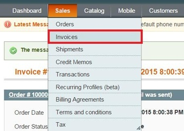
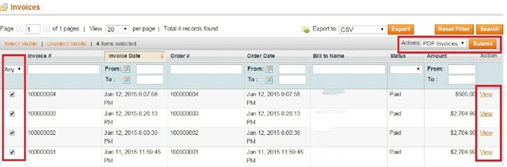
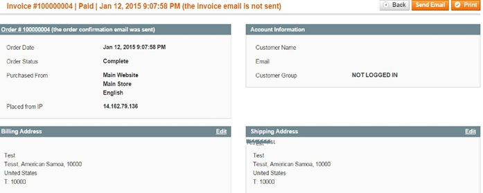
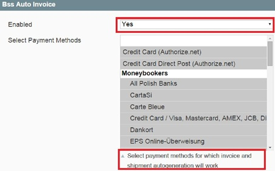
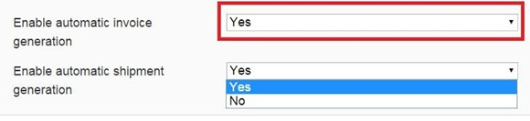

User Guide
=============
Magento Auto Invoice Overview
-------------------------------

`Magento Auto Invoice <http://bsscommerce.com/magento1/magento-auto-invoice-extension.html>`_ simplifies order status management which not only reduces 
significant admin works but also satisfies customers’ need. Customers always want the place order as fast as possible and at once. With Auto Invoice, all 
status of orders will be automatically changed into "Complete" and invoices will accordingly be created. As a result, Magento Auto Invoice will put an end 
of overload of manually creating an invoice too much for Magento Store Owners.

How Magento Auto Invoice works?
-------------------------------

Invoice Management
^^^^^^^^^^^^^^^^^^

Step 1: After the orders has been successfully made with all required fields to be filled in, checking in your Sales->Invoices

Step 2: Submit your wanted confirmed orders, choose "Action" status into "PDF" if you want to attach invoice PDF files into the email. After submitting, 
Click "View" button!

Click "Send Email" and your customer will be successfully received it.

 
Backend Configuration
^^^^^^^^^^^^^^^^^^^^^

Magento Auto Invoice is easily configured from backend by these steps: 

Go to Backend-> system->configuration

Easily **enable/disable** the extension and select the suitable **Payment Methods**

Set enable or disable for automatic invoice and shipment generation in the same page as:

.. raw:: html

   

