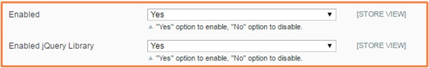

User Guide
=============

I.	BSS Configurable Products Grid Table View Extension 
--------------------------------------------------------

Configurable Products Grid Table View by BSS enables Magento Shop Owners to displays associated products, creating a neat and professional table 
to show specific features of selected products. Configurable Product Grid Table View is a rock- solid, thoroughly tested and developed extension 
that we are willing to provide free support if you run into problems.

II.	How does Configurable products grid table view work? 
--------------------------------------------------------

The configurable product grid table view extension allows your customer to increase/decrease the quantity of product configuration in a grid view 
table and can add more than one product configuration to cart at a time.

1. Optimize the effectiveness of product management
^^^^^^^^^^^^^^^^^^^^^^^^^^^^^^^^^^^^^^^^^^^^^^^^^^^

The extension also enables Magento Shop Owners to display the simple associated products in a convenient table which makes it easier to manage them. 
From back-end of this extension, you can plainly edit simple products and manage inventory within a configurable product in a convenient table.

2. Show associated products in convenient table
^^^^^^^^^^^^^^^^^^^^^^^^^^^^^^^^^^^^^^^^^^^^^^^^^^^^

**Configurable Product Grid Table View** extension intelligently chooses how to arrange your options in to a grid like table for example size by color and price. 
As a result, this extension enables you to show configurable products in a completely different way rather than displaying drop down boxes which utilizes 
an intuitive visual editor to tailor the size, price, colors, availability, subtotal and quantity of your products.

.. raw:: html

   