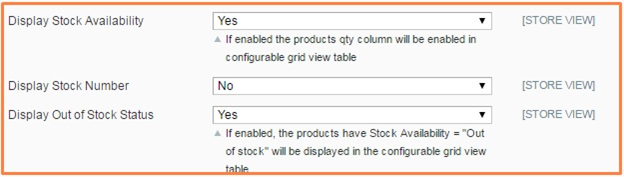
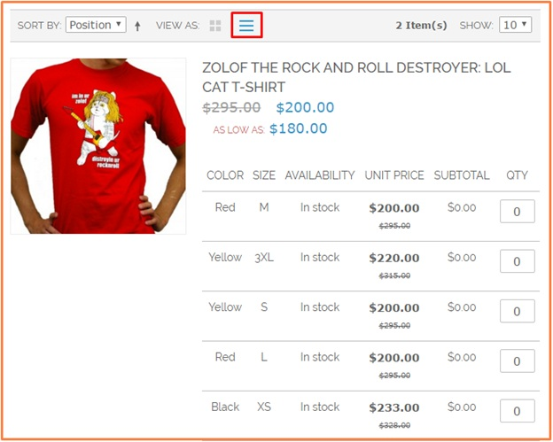

User Guide
=============

Configurable Product Grid Table View Extension 
--------------------------------------------------------

`Configurable Products Grid Table View <http://bsscommerce.com/magento-configurable-product-grid-table-view.html>`_ by BSS enables Magento Shop Owners 
to displays associated products, creating a neat and professional table to show specific features of selected products. Configurable Product Grid Table 
allows your customer to increase/decrease the quantity of product configuration in a grid view table and can add more than one product configuration to 
cart at a time.

How does Configurable product grid table view work? 
--------------------------------------------------------

**In the frontend:**

Associated products are shown in the grid table with custom options and other information of products:

.. image:: images/configurable_product_1.jpg

**Configuration in the backend:** 

.. image:: images/configurable_product_2.jpg

In **Enabled**: Choose **Yes** to enable the module or choose **No** to disable it 

In **Enabled jQuerry Library**: Choose **Yes** to enable it or choose **No** to disable it 

In **Display Stock Availability:** 

* Choose **Yes** to show a column of stock availability in the table 

* Choose **No** to hide it 

In **Stock Number**: If you choose to enable the column of Stock Availability in the table, you just can choose to display Stock Number or hide it 

* Choose Yes to show Out of Stock Status in the table 

* Choose No to exclude out of stock product from the table 

.. image:: images/configurable_product_4.jpg

In **Subtotal:**

* Choose **Yes** to show the column of Subtotal in the table 

* Choose **No** to hide it 

In **Show on Category:** The grid table is only displayed in the product list

* Choose Yes to show the grid table in the category page

* Choose **No** to hide it from the category page 

In **Show Unit Price:**

* Choose **Yes** to display the column of Unit Price in the table 

* Choose **No** to hide it 
 
 

.. raw:: html

   