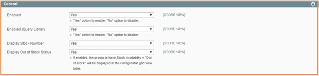

User Guide
=============

Magento Configurable Product Matrix View Extension Overview
-----------------------------------------------------------

`Magento Configurable Product Matrix View Extension <http://bsscommerce.com/magento1/magento-configurable-product-matrix-view.html>`_ is one of 
three kinds of display  for configurable products which are developed by BSSCommerce . This extension helps administrators to create a matrix form for 
configurable products with two attributes including unlimited custom options. Attributes are put in a column and a row and options are combined together 
to make a complete children product. Moreover, stock numbers  are displayed in the matrix form to let customers know about product availability and also 
enable store owners take control in supplying products timely.

With the help of Magento Configurable Product Matrix View, store owners can target wholesale customers effectively because they can purchase your products 
in a large quantity without repeating this process. Therefore, owners will have more chances to boost up their sales and retain customers for better shopping 
experience in the site. In addition, this module is especially good for inventory management with stock numbers direct displayed in the matrix form.

How does Magento Configurable Product Matrix View Extension Extension work?
---------------------------------------------------------------------------

You go to **System** -> **Configuration** -> **BSSCOMMERCE** -> **Configurable Matrix View**

	
In **Enabled:** Choose **Yes** to enable the module or choose No to disable it in your site 

In **Enabled jQuery Library:**

	* Choose **Yes** to enable jQuery Library to run things related to jQuery.
	
	* Choose **No** if your site already has jQuery Library already because it will cause some conflicts

In **Display Stock Number:**
	
	* Choose **Yes** to show stock number in the matrix form
	
	* Choose **No** to hide them 
	
In **Display Out of Stock Status:**	

	* If you choose **Yes**, out of stock products are still shown in the matrix form and stock numbers are equal to 0

	.. image:: images/configurable_product_matrix1.jpg

	* If you choose **No**, customer cannot choose these products due to no quantity box  to select and also stock number are not displayed.
	
	.. image:: images/configurable_product_matrix2.jpg

.. raw:: html

   

