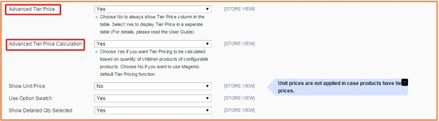

User Guide
=============

.. role:: menu

.. role:: dollar

Magento Configurable Product Tab Table View Extension Overview
--------------------------------------------------------------------

`Magento Configurable Product Tab Table View <http://bsscommerce.com/extensions/magento-configurable-product-tab-table-view.html>`_ by BSSCommerce allows 
displaying configurable products in a very simple table to help customers easily choose multiple products at once. 

Magento Configurable Product Tab Table View displays custom options of the first attribute of configurable products in a tab and custom options of the second 
one in a table. This brings customers the easier selection when they just need to choose a custom option of an attribute first and then other corresponding 
custom options of the second attribute will come out in a table with stock availability, stock number, out of stock status, tier prices, quantity and subtotal. 
In addition, this extension also allows showing advanced tier prices in a separated table for children products with the same tier prices and also functions for 
advanced tier price calculation for children products. In case, all children products have different tier prices or at least a children product have different 
tier price from others, this extension will show tier prices in the table. 

How does Magento Configurable Product Tab Table View Extension work?
--------------------------------------------------------------------

.. image:: images/configurable_product_tab_1.jpg

In **Enabled**: Choose **Yes** to enable this module or choose **No** to disable it

In **Enabled jQuery Library**: Choose **Yes/No** to enable or disable it 

In **Display Stock Availability**: 
	
	:menu:`Choose` **Yes** to show the column of Availability in the table
	
	:menu:`Choose` **No** to exclude this column from the table 

In **Stock Number**: If you choose to enable Stock Availability, you just choose **Yes** to show Stock number in the table or choose **No** to hide Stock number. 
In case you choose to disable Stock Availability, Stock number is also not active. 

In **Display Out of Stock Status**: 

	:menu:`Choose` **Yes** to display Out of Stock  Status in the table
	
	:menu:`Choose` **No** to exclude out of stock products from the table 
	
In **Show Subtotal**: 

	:menu:`Choose` **Yes** to display the column of Subtotal in the table 
	
	:menu:`Choose` **No** to exclude it  

In **Advanced Tier Price**:
	
	:menu:`Choose` **Yes** to display Tier Prices in a separated table (Only apply to children products with the same tier prices). Tier prices are shown as below:

	.. image:: images/configurable_product_tab_3.jpg

	:menu:`Choose` **No** to display Tier Prices in the table (Please note that Tier prices are shown in the table when children products have different tier 
	prices or at least a children product has different tier prices from other ones). In that case, Tier prices are displayed as below: 

	.. image:: images/configurable_product_tab_4.jpg

In **Advanced Tier Price Calculation**: 

	:menu:`If you choose` **Yes**, Tier price is based on tier prices of total quantity of chosen children products to calculate total amount
	
 For example, tier price of buying 1-9 Pink-M shirts and 1-9 Pink-L shirts is similarly :dollar:`210`. Tier price of buying 10-more Pink-M shirts and 10-more Pink-L 
 shirts is :dollar:`200`. Therefore, when you buy 5 Pink-M shirts and 5 Pink-L shirts, tier price is now determined as :dollar:`200`/shirt (Tier price of buying 10-more Pink-M 
 shirts and 10-more Pink –L shirt). Total amount is now :dollar:`2,000`. 
 
 
	.. image:: images/configurable_product_tab_5.jpg

	:menu:`If you choose` **No**, Magento default Tier Pricing function will be used to calculate. It means that total amount is calculated by tier prices of 
	each children product multiply to total quantity of each chosen children product. 
	
	For the above example, when using Magento default tier price calculation, total amount is determined as $2,100,000 because it is calculated based on each 
	tier price of each children product (Tier price is equal to $210 shirt)
	
.. image:: images/configurable_product_tab_6.jpg

In **Show Unit Price**: Choose **Yes** to show unit price in the table (Please note that Unit prices are shown in the table only when products have fixed 
prices, not tier prices)

In **Use Option Swatch**: Choose **Yes** to enable Color Swatch function or choose **No** to disable it 

In **Show Detailed Qty Selected**: 

	:menu:`Choose` **Yes** to display detailed quantity of selected products corresponding to each custom option in the attribute tab as below:
	
	.. image:: images/configurable_product_tab_7.jpg

	:menu:`Choose` **No** to disable this function  
	
	
	
	
.. raw:: html

	