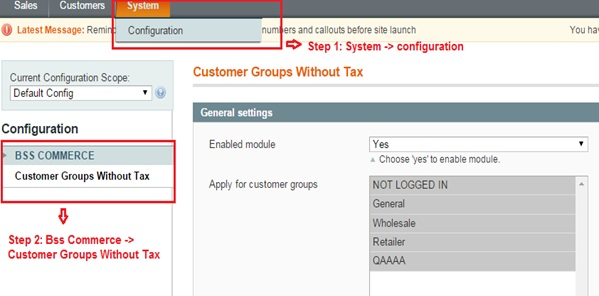
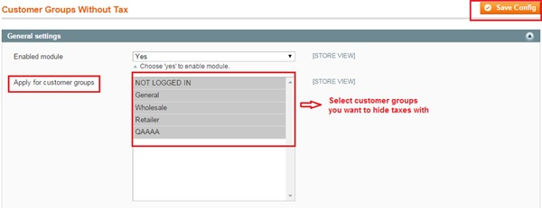
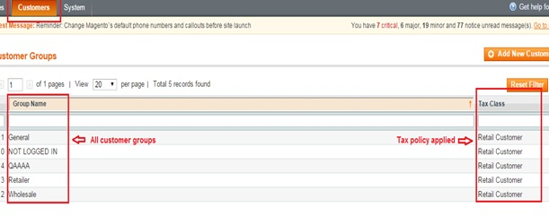

User Guide
=============

.. role:: italic

Magento Customer Group without Tax Overview
-------------------------------------------

`Magento Customer Group without Tax extension <http://bsscommerce.com/extensions/order-management/magento-customer-group-without-tax-extension.html>`_ has ability 
to reject taxes on category page and product page. Also, customers won't see tax rate in their cart and check out with pay no tax. This unique extension also 
allows admin apply for specific customers and individual customer groups while tax rates are still shown to remained customers. Hence, it's really useful for 
your website's marketing and sale policy. 

How Magento Customer Group without Tax works
--------------------------------------------

1.	Instruction Manual
^^^^^^^^^^^^^^^^^^^^^^

As an admin, you can set up your own store page by the most effective way that supports your trading objective. To make the configuration:

* Step 1: Go to **System** => **Configuration**.

* Step 2:  At the left side of the page, find **BSS Commerce** => select **Customer Group Without Tax**

After this 2 steps, a screen for configuration appears like the following picture:

In box **Enable module**, choose :italic:`Yes` to enable the module. After being enabled, a box named **Apply for customer groups** will appear for you to 
continue configuring the extension. 

In the box **Apply for customer groups**, select one, some or all customer groups' names which you want to reject taxes on website view.

After all above configuration is done, you save the configuration by clicking on **Save config** button to the right of the backend. To see the change, go to 
frontend and reload the page.

2.	Preview tax policy on customer groups
^^^^^^^^^^^^^^^^^^^^^^^^^^^^^^^^^^^^^^^^^

To preview which customer group is applied tax policy, go to **Admin Panel** -> **Customers** -> **Customer Groups**. All groups of customer will be shown with 
applied tax policy like this following picture:

The result in frontend when applying Magento Customer Group without Tax will be shown like this:

.. raw:: html

   

