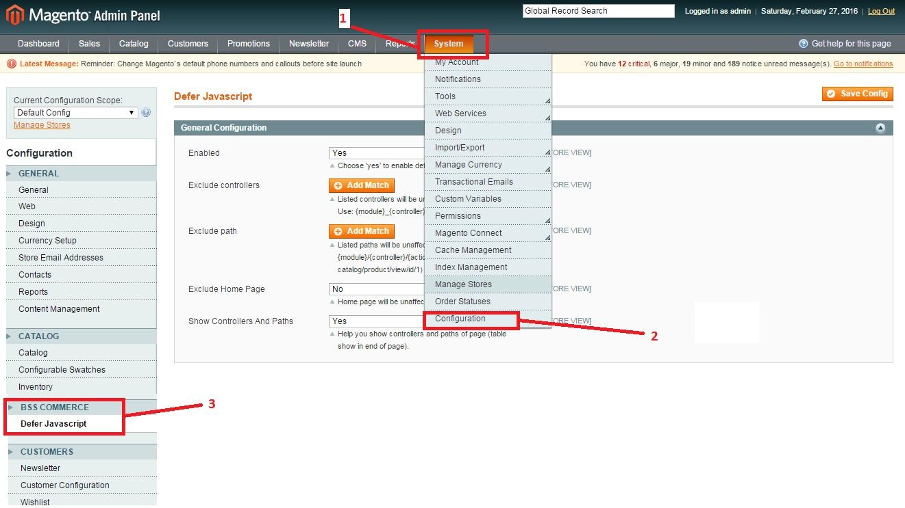
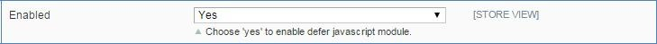
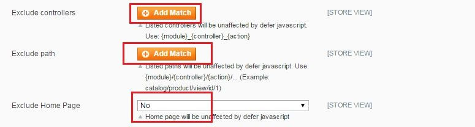
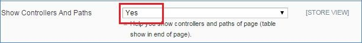
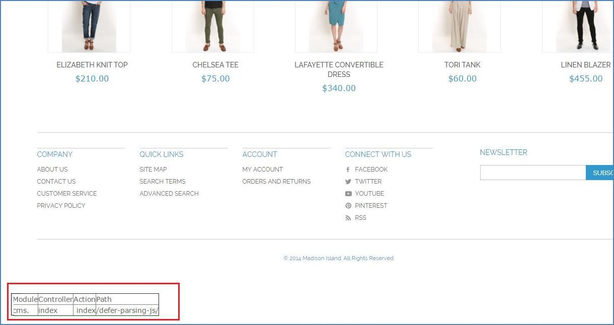

User Guide
=============

Defer Javascript Extension Overview 
---------------------------------------------

Defer Parsing of JavaScript is listed as one of the most impactful factors of speed improvement for websites that you can implement among many 
website optimization tips.

When customers visit your website, they do not expect to wait so long for loading pages because this makes them impatient and leave your website 
after waiting in vain. Therefore, Defer JavaScript Extension is developed to effectively reduce loading time by automatically putting JavaScript 
files to the end of page after loading all HTML and CSS. As a result, you will keep customers stay on your site as well as engage more customers 
and your sales is of course on the way to boost up!

How does Defer JavaScript Extension work?
--------------------------------------------- 

To configure the module, follow these below instructions:

**Step 1**: Go to **Admin Panel** -> **System** -> **Configuration**

**Step 2**: On the left side of the page, find **BSS COMMERCE** -> select **Defer JavaScript**

After these two steps, you can see your admin screen as this image:

1.  Enable Defer JavaScript
^^^^^^^^^^^^^^^^^^^^^^^^^^^^^^^^^^^^^^^^

You can easily enable or disable BSS Defer JavaScript module by selecting **"Yes" or "No"** in the Enable box.

2. Manage Controllers, Path, and Homepage
^^^^^^^^^^^^^^^^^^^^^^^^^^^^^^^^^^^^^^^^^

There may be some pages you do not want them to be affected by Defer JavaScript. Therefore, to exclude impact of BSS Defer JavaScript from some pages, 
you can fulfill these pages’ information into **Excluded** boxes:

	* Exclude controllers and paths: By clicking **Add Match** button and then write down your wished paths or controllers you can disable defer JavaScript 
	on these paths or controllers page. 
	
	* Exclude Homepage: you can disable this module on Homepage through only a click. Select "Yes" in the **Exclude Home Page** box, you can disable the 
	module on your home page. 
	

Please remember that, when you click **Add Match** button, you have to fill in the controllers/ paths which you want not to be affected by our module. 
You should not leave it blank as below picture.

.. image:: images/defer_javascript_4.jpg
	
If you do not fill it up, the system will automatically set all pages in your website affected by our module.

You can click on **Delete** button in the right side of the box to close the created blank box.

If you want to disable Defer JavaScript function in some pages, however, you do not know the controllers/ paths to fulfill the **Exclude Controllers** box or 
**Exclude Paths** box;

**Show Controller and Paths** will help you solve the problem. When you select **"Yes"** like this:

You can see the information you need in the table shown in the end of frontend page. For example:

After finishing configuration process, you can click on **"Save Config"** button to save all of your setting with Defer JavaScript.

.. raw:: html

   