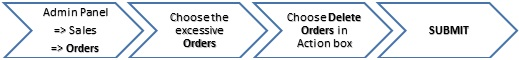
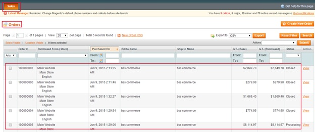
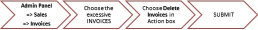
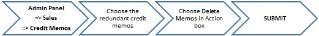
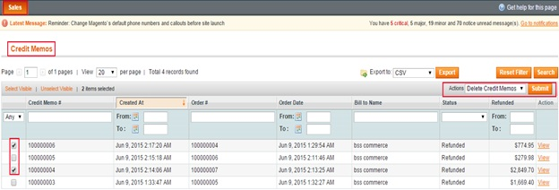

User Guide
=============

.. role:: italic

.. role:: red

.. role:: rednote

I. BSS Delete Order Overview
---------------------------------------------------------

Imagine that a ton of unnecessary orders, invoices, shipments and credit memos are account for large scale of Database memory, 
which results in diminishing Server performance and bothers shop owners. Magento, however, allows you to **cancel** the orders, 
it does **not support you to delete** them. Moreover, there is almost no plug-in solve this problem.

Fortunately, BSS Delete Order extension addresses this vital weakness of Magento and helps you to manage the Data better with superior benefits.

II. What makes BSS Delete Order Your Must-Have Extension?
---------------------------------------------------------

The default Magento lacking of offering deleting function leads to a result that the store backend is full of useless invoices, orders, 
shipments or credit memos.

In order to strengthen the effectiveness of your backend, our best developers have designed a convenient extension called **Magento Delete Order extension**.
 This tool helps to delete all redundant invoices, shipments, orders, or credit memos at ease. Eventually, the backend will be neater and handier.

	* **Make backend will be neater and handier**
	
	Instead of bothering with manual select needed files in a wide range of disorganized orders, invoices, shipments and credit memos, 
	you will find it easier to classify them within clicks. 
	
	* **Delete all invoices, shipments, orders, or credit memos at ease**
	
	Not only helping the admin find clearer ways to manage data thanks to neater and handier backend, the plug-in receives users’ 
	appreciation with a premium feature: Deleting.

III. How does BSS Delete Order work? ( Instruction Manual)
---------------------------------------------------------

3.1. Delete orders
^^^^^^^^^^^^^^^^^^^^^^

In order to delete orders, following these below instructions:

In **Sales** section, choose **Orders**. Here, a list of orders is shown. 

* First: Go to **Admin Panel** => **Sales** => **Orders**
* Next: Choose the excessive orders you want to delete
* Next: In the **Actions** box => choose :italic:`Delete Orders` 
* Last: click on **Submit** button

:red:`*Note: Remember that if you choose` :rednote:`Delete Orders` :red:`, all the related information about` :rednote:`order's invoice, shipment, credit memo` :red:`will be deleted 
from backend at ease.`

:red:`If you want to delete only` :rednote:`invoice* :red:`or` :rednote:`shipment` :red:`or` :rednote:`credit memo` :red:`of any order, you have to` :rednote:`keep this order remaining.`

.. image:: images/delete_order_3.jpg

**NOTE:** :italic:`You can choose to delete one, more or all orders`

3.2. Delete Invoices
^^^^^^^^^^^^^^^^^^^^^^

In order to delete Invoices, follow this following instructions: 

* First: Go to **Admin Panel** => **Sales** => **Invoices**
* Next: Choose the excessive invoices you want to delete
* Next: In the **Actions** box => choose :italic:`Delete snvoices` 
* Last: click on **Submit** button

.. image:: images/delete_invoices_2.jpg

3.3. Delete Shipments
^^^^^^^^^^^^^^^^^^^^^^

In order to delete Shipments, follow this following instructions: 

.. image:: images/delete_shipments_1.jpg

* First: Go to **Admin Panel** => **Sales** => **Shipments**
* Next: Choose the excessive shipments you want to delete
* Next: In the **Actions** box => choose :italic:`Delete shipments` 
* Last: click on **Submit** button

.. image:: images/delete_shipments_1.jpg

3.4. Delete Credit Memos
^^^^^^^^^^^^^^^^^^^^^^^^

In order to delete Credit Memos, follow this following instructions: 

* First: Go to **Admin Panel** => **Sales** => **Credit Memos**
* Next: Choose the excessive shipments you want to delete
* Next: In the **Actions** box => choose :italic:`Delete Credit Memos` 
* Last: click on **Submit** button

.. raw:: html

   

