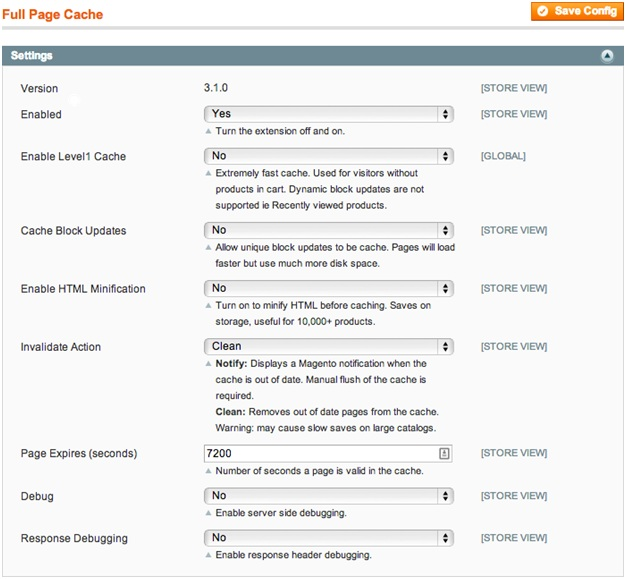
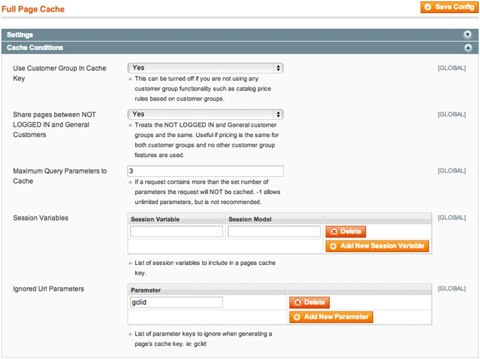
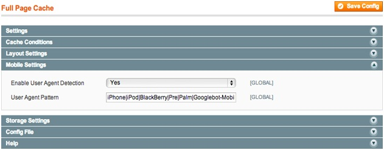
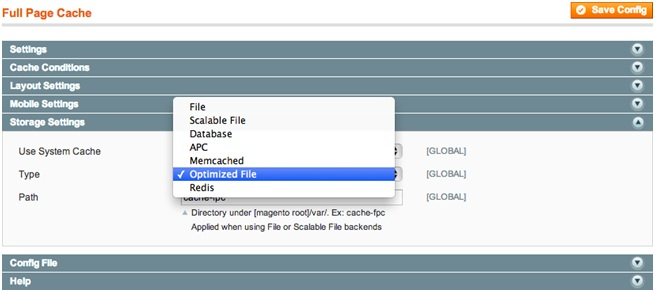
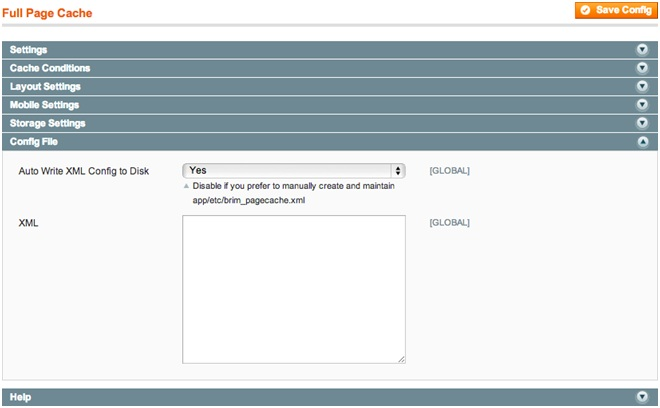

User Guide
=============

What is Full Page Cache?
------------------------

`Full Page Cache for Magento <http://bsscommerce.com/magento-full-page-cache.html>`_ is an ideal way to speed up your Magento eCommerce site by reducing server responsive time, reducing hardware requirements and costs, and making your 
Website more responsive to shop on. A fast site can place directly higher in search engines and increase profits amazingly.

Full page caching ensures your content is always up to date with the auto refresh cache system and allows for easily configurable hole, punching from the admin panel. With a quick and simple 
install, our `Full Page Cache <http://bsscommerce.com/magento-full-page-cache.html>`_ helps you achieve 
blazing fast page load times. This massively improves page load time and allows your server to handle many more requests! 

Why should install Full Page Cache?
-----------------------------------

Literally, Full Page cache relates to the storage of the full output of a page in a cache, so that in subsequent page loads will not require much server load at all.
 
Full Page cache extension is indispensable especially for enterprise level eCommerce sites with high-traffic visiting in order to keep server load as low as possible, and to avoid downtime during periods of high traffic. For instance, If 1000 users are visiting 
the site at once, memory capacity used with full page caching enabled is inappropriate in comparison to the server load caused by 1000 Users Magento at a time.
 
Throughly considered, Full page cache extension will increase site speed, since all the server needs to do is fetch and render the page from the cache.

Configuration Settings
-----------------------

**BSS's** FPC has a handful of configurable settings to control how pages are cached. All settings are located in **"System -> Configuration -> Brim Extensions -> Full Page Cache"**

**General Settings**

**Cache Conditions Settings**

.. image:: images/full_page_cache_3.jpg

**Mobile Settings**

**Storage Setttings**

**Config File Settings**

+------------------------+------------------------------------------------------------------------------------------------------------------------------------------------------+
| Setting                | Explanation                                                                                                                                          |
+========================+======================================================================================================================================================+
| Auto Write XML         | When set to “Yes” required XML configuration will be written directly to app/etc/brim_pagecache.xml.                                                 |
| Config to Disk		 | This can be set to “No” if for some reason the                                                                                                       |
|                        | web server is not able to write to the file or if additional customization is required.                                                              |
+------------------------+------------------------------------------------------------------------------------------------------------------------------------------------------+
| XML                    | If empty, no additional configuration needs to be written to disk. If not empty, this configuration must be present in app/etc/brim_pagecache.xml    |
+------------------------+------------------------------------------------------------------------------------------------------------------------------------------------------+

.. raw:: html

   

