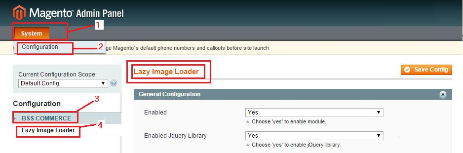
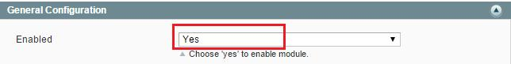
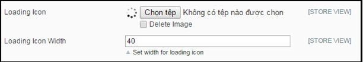
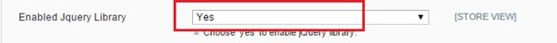
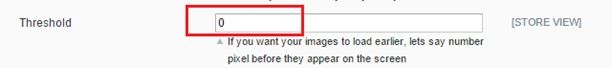
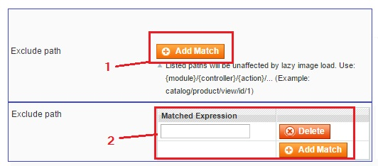

User Guide
=============

.. _my-reference-label:

Lazy Image Loader Extension Overview
----------------------------------------------

If you are a Facebook user, you definitely know its image load mechanism. For the purpose of reducing image load time to enhance customer experience, 
Facebook permits pages loading images as customers' scroll.

`Lazy Image Loader extension <http://bsscommerce.com/magento1/magento-lazy-image-loader.html>`_ possesses the same functionality 
which loads product images on your Magento site only when customers scroll the page. By the same token, the extension easy usage drives Magento newcomers 
at ease. Likewise, the abilities to exclude particular controllers and paths from the effect of Lazy Image Loader extension promote the extension to be 
the adorable extension that needs to be added to shop owners carts.

How does Lazy Image Loader extension work?
----------------------------------------------

To make configuration of this module, follow these below instruction:

* Step 1: Go to **Admin Panel** => **System** => **Configuration**

* Step 2:  At the left side of the page, find **BSS Commerce** => select **Lazy Image Loader**

After these 2 steps, a screen for configuration appears like the below picture:

1.	Enabled
^^^^^^^^^^^^

You can select between enable and disable Lazy Image Loader Extension by setting the status in **Enabled** box into "Enable" or "Disable".

2.	Loading Icon 
^^^^^^^^^^^^^^^^^

In **Loading Icon**: you choose the files to upload images from your computer 

In **Loading Icon Width**: you set the width for icon loading

3.	Manage Jquery Library
^^^^^^^^^^^^^^^^^^^^^^^^^

When setting up Lazy Image Loader, you can also control Jquery Library in your website. You can select "**Yes**" to allow Jquery Library combining with 
Lazy Image Loader extension when it runs on your website.

4.	Threshold
^^^^^^^^^^^^^^

In **Threshold** box, you can set the number pixel before image appear on the screen, then the image will be loaded earlier as the pixels you set. For instance, 
if you set the number in the box is 14, it means that the images will be loaded before when your scroll position is far from 14 pixels.

5.	Exclude controllers, Path, Homepage
^^^^^^^^^^^^^^^^^^^^^^^^^^^^^^^^^^^^^^^

Lazy Image Loader Extension allows admin deciding which part will be excluded from lazy-loaded function. To exclude controller, admin can click on 
**Add Match** and then filling the match in the box. Admin also can delete the **Match** and add more by clicking on **Delete**, and **Add Match** 
button alternately. 

.. image:: images/lazy_image_loader5.jpg

Similar to **Controller**, admin can control the **Path** which they do not want to be affected by Lazy Image Loader. 

Finally, admin can set whether Homepage be affected by lazy image load or not in the box **Exclude Home Page**.

6.	Exclude lazy images 
^^^^^^^^^^^^^^^^^^^^^^^^

In **Help Exclude lazy images**: Our extensions allows adding attribute **notlazy** after **src** attribute to  to help you prevent loading lazy images and 
make them not be affected by this extension.   

.. image:: images/lazy_image_loader6.jpg

For example:  If you want to exclude an image named BSS from Lazy Image Loader's impact, you do as the following:
 
	*From: *
	
	*To: *
	
It means that you just need to add **notlazy** after **src** attribute to  and then this image is not affected by Lazy Image Loader 

After finishing all of these set-up steps, you can click on **Save Config** button to start using :ref:`Lazy Image Loader extension`.

.. raw:: html

	