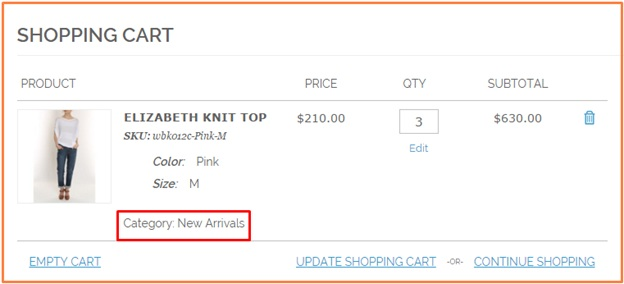

User Guide
=============

Magento Limit Order Quantity Per Category Overview
--------------------------------------------------

`Magento Limit Order Quantity Per Category Extension <http://bsscommerce.com/magento1/magento-limit-order-quantity-per-category.html>`_ allows setting 
minimum and maximum quantity of all products per category in an order that customers have to meet before processing a successful order. This extension also 
helps Magento store owners limit order quantity per category for each specific customer group. This makes them to control product quantity to reduce shipping 
costs and other related costs and especially is an ideal choice for wholesale. 

Magento Limit Order Quantity Per Category  Extension also allows determining  product category in the shopping cart for the products belonging to multiple 
categories when customers directly search products and add to cart. In addition, updating product category becomes more easily in case customers continuously 
add the same products in the different categories to cart.  

How does Magento Limit Order Quantity Per Category  Extension work?
-------------------------------------------------------------------

.. image:: images/limit_order_quantity_category.jpg

1.	In **Enable**: 
^^^^^^^^^^^^^^

	Choose **Yes** to enable module or choose **No** to disable it

2.	In **Show Category**: 
^^^^^^^^^^^^^^^^^^^^^

* Choose **Yes** to display product category in the shopping cart as below: 

* Choose **No** to hide product category 

3.	In **Category of Product From Search Result**: 
^^^^^^^^^^^^^^^^^^^^^^^^^^^^^^^^^^^^^^^^^^^^^^

This function is applied to products belonging to multiple categories. When customers directly search these products and add to cart, this extension 
determines product category in the shopping cart by applying minimum and maximum rules of products 

There are two options for you to choose: 
	
	* Choose **Min Qty**: the product is determined to belong to the category with the biggest value of minimum quantity set up between categories
	
	* Choose **Max Qty**: the product is determined to belong to the category with the smallest value of maximum quantity set up between categories. 

**Take an example to make it sense:**

Product A belongs to 2 categories: **X** and **Y**

	* For category **X**, minimum and maximum quantities per category are set up as: min qty=2, max qty=8
	
	* For category **Y**, minimum and maximum quantities per category are set up as: min qty=5, max qty=15

When customers search Product A and add to cart 

	* If you choose "category of product form result search" as **Min qty**, in the shopping cart, Product A belongs to category **Y** (because  the biggest value of minimum quantity between two categories is 5) 

	.. image:: images/limit_order_quantity_category2.jpg
	
	* If you choose "category of product form result search" as **Max qty**, in the shopping cart, Product A belongs to category **X** (because the smallest value of maximum quantity between two categories is 8) 
	
	.. image:: images/limit_order_quantity_category3.jpg
	
	

4.	In **Category Update**: 
^^^^^^^^^^^^^^^^^^^^^^^

This function is also applied to products in multiple categories. When customers continuously add these products to cart from category pages or search results 
and this configuration will allow updating the product category in the shopping cart 

There are two options to select: 

	* Choose **Yes** to update category based on the final product category added to cart 
	
	* Choose **No** to update category based on the first product category added to cart 

**Take an example as below:**

For example, customers add Product A (in category X) to cart first and then they continue to add this Product A (also in category Y) to cart.  Therefore, there 
is a question that which category this product A belongs to when it is displayed in the shopping cart - category X or Y? Let’s follow to see the more detailed 
explanation!

+If you choose **Yes**, the category of Product A will be updated into category Y (the most recent category added) and of course all minimum and maximum quantity 
rules are applied according to category Y 

+If you choose **No**, the category of Product A will be updated into category X (the first category selected) and all minimum and maximum quantity rules are 
applied according to category X
	
	
5.	In Min/Max Order Quantity 
^^^^^^^^^^^^^^^^^^^^^^^^^^^^^

.. image:: images/limit_order_quantity_category4.jpg

Click "**Add Qty**" button to set minimum and maximum quantity per category for specific customer group 

.. raw:: html

   

