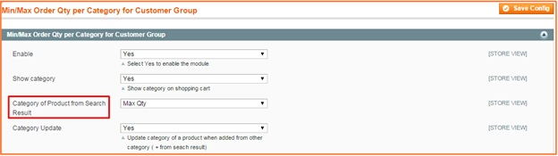
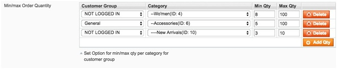

User Guide
=============

.. role:: bold

Magento Limit Order Quantity Per Category Overview
--------------------------------------------------

`Magento Limit Order Quantity Per Category Extension <http://bsscommerce.com/magento1/magento-limit-order-quantity-per-category.html>`_ allows setting 
minimum and maximum quantity of all products per category in an order that customers have to meet before successfully checking out. This extension also 
helps Magento store owners limit order quantity per category for each specific customer group, which gives them more control over order product quantity 
to reduce shipping costs and other related costs like storage management and package.

How does Magento Limit Order Quantity Per Category  Extension work?
-------------------------------------------------------------------

Go to **System -> Configuration -> BSSCOMMERCE -> Min/Max Order Quantity per Category for Customer Group** to begin setting up

1.	In Enable: 
^^^^^^^^^^^^^^

	Choose **Yes** to enable module or choose **No** to disable it

2.	In Show Category: 
^^^^^^^^^^^^^^^^^^^^^

* Choose **Yes** to display all product category in the shoppingcart.

* Choose **No** to hide product category

3.	In Messages Limit Max:
^^^^^^^^^^^^^^^^^^^^^^^^^^

You can change the notification messages when maximum required order quantity per category is not met (This message locates at the top left corner of the Shopping Cart). Without any 
changes,default message will be shown as: The max quantity allowed for purchase at category{category_name} is {qty_limit} [ Product Name : {product_name} ]

4.	In Messages Limit Min:
^^^^^^^^^^^^^^^^^^^^^^^^^^

You can change the notification messages when minimum required order quantity per category is not met. Without any changes, default message will be shown as: The min 
quantity allowed for purchase at category {category_name} is {qty_limit} [ Product Name : {product_name}]
	
5.	In Min/Max Order Quantity 
^^^^^^^^^^^^^^^^^^^^^^^^^^^^^

You can freely choose customer group and category to apply the min/max quantity rule. Click **Add** button for more options.

After finishing with setup, choose **Save Config**

:bold:`*Note:`

For products belong to multiple categories, the order quantity of products needs to meet the min/max requirement of all thosecategories.
The min/max rule is applied to the total number of products in each category added to cart, not the order quantity of each particular product.

.. raw:: html

   

