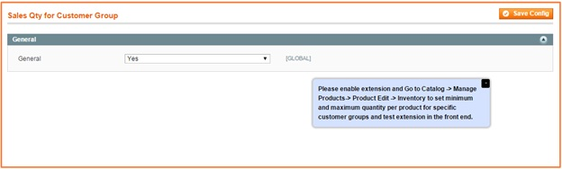
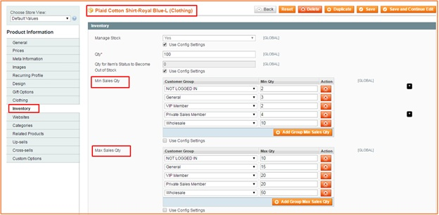

User Guide
=============

Magento Limit Order Quantity Per Product Extension Overview
-----------------------------------------------------------

`Magento Limit Order Quantity per Product Extension <http://bsscommerce.com/magento1/magento-limit-order-quantity-per-product.html>`_ by BSSCommerce is 
developed to help administrators to take control the allowed number of products that customer need to order for a sucessful purchase. In Magento default, you can 
also set up the minimum and maximum order quantity for each product but it does not allow you to apply these settings to specific customer groups. Therefore, this 
module enhance your customization to make it suitable with your products and your customers you want to control their order quantity. 

By setting minimum and maximum order quantity per product for specific customer groups, you can save a lot of shipping costs and other related costs due to 
preventing the very small quantity of products and also increases sales effectively for your store.  

How does Limit Order Quantity Per Product  Extension work?
----------------------------------------------------------

You go to **System** -> **Configuration** -> **BSS COMMERCE** -> **Sales Qty for Customer Group** 

In **General**: Choose **Yes** to enable the module or choose **No** to disable it 

After you enable the module, you go to **Catalog** -> **Manage Products** -> **Product Edit** -> **Inventory**. (At this step, you choose each product in 
product grid table to make configuration) 

After going to **Inventory** of each product, you set up minimum and maximum order quantity for each customer group.

In **Min Sales Qty**: click **Add Group Min Sales Qty** to set up the minimum order quantity for each customer group 

In **Max Sales Qty**: Click **Add Group Max Sales Qty** to set up the maximum order quantity for each customer group 
=>Then Save configuration and repeat this process for other products. 

In the frontend, if the requirements about minimum and maximum order quantity for a product are not met, they cannot add it to cart and Magento default will show a notification about the order quantity limitation of this product.

 .. image:: images/limit_order_quantity_product2.jpg

.. raw:: html

   

