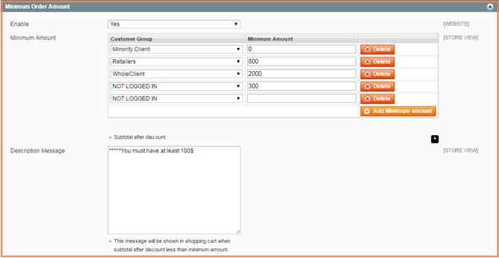
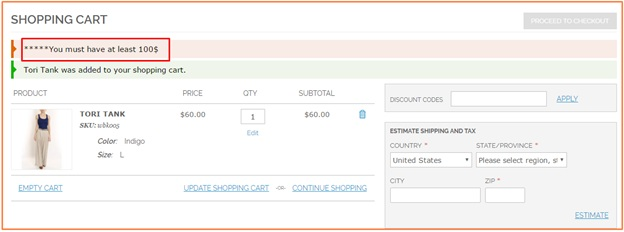

User Guide
=============

I.	Magento Minimum Order Amount for Customer Group Extension Overview
----------------------------------------------------------------------------

Magento Minimum Order Amount for Customer Group Extension is a must-have extension that allows setting up the minimum amount 
of an order that each customer group has to meet. 

	* Flexibly set the limitation for each customer group 

	* Extremely Suitable For B2B Business Model 

	* Well-compatible with all Magento theme 

	* Life time support and free installation 

II.	How does Magento Minimum Order Amount for Customer Group Extension work? 
----------------------------------------------------------------------------

**Easily configure from backend** 

Administrator can easily enable/disable this extension from backend without special knowledge needed. 
Check it at **System**-> **Configuration** -> **Sales** -> **Minimum Order Amount** 

In **Enable**: Choose **Yes** to enable the module or choose **No** to disable it. 

In **Minimum Amount**: click **"Add Minimum Amount"** to set up minimum order amount for each customer group. 
In **Description Message**: you customize your own message/notification to show customers in the shopping cart in case requirements about 
order amount are not met. 

For example, if customer does not order with the minimum amount of $100, the message is displayed in the shopping cart as below: 

.. raw:: html

   