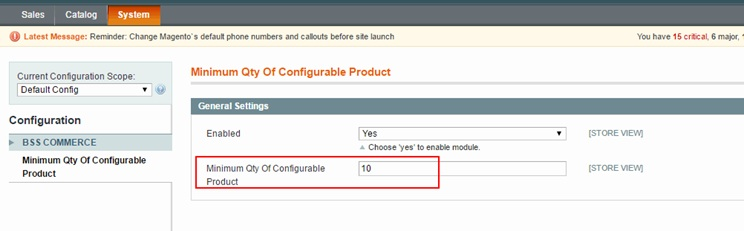
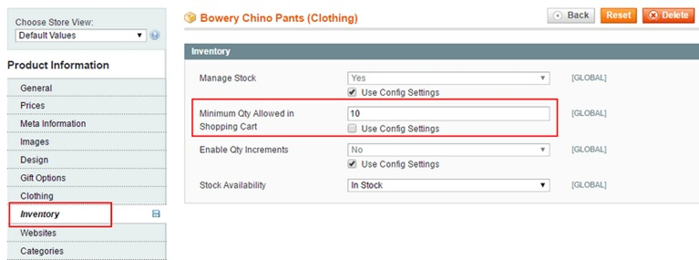

User Guide
=============

Minimum Quantity of Configurable Product Extension Overview
-------------------------------------------------------------

`Minimum Quantity of Configurable Product <http://bsscommerce.com/magento-minimum-quantity-of-configurable-product.html>`_ is developed to allows admin to set 
minimum quantity as the compulsory condition for customer’s checkout. This minimum quantity value can be specifically set for a configurable product or some 
specific configurable products. Besides, admin can also choose to apply this minimum value for all configurable products on large scale. 

How does Minimum Quantity of Configurable Product Extension work?
------------------------------------------------------------------

1. Set minimum quantity for all configurable product
^^^^^^^^^^^^^^^^^^^^^^^^^^^^^^^^^^^^^^^^^^^^^^^^^^^^

Navigate to **System -> Configuration -> BSSCOMMERE -> Minimum Quantity of Configurable Product**

In **Enabled**, choose **Yes** to enable or **No** to disable the extension
 
In **Minimum Qty of Configurable Product**, enter a number to set minimum quantity for all configurable products in store.

2. Set minimum quantity for a specific configurable product 
^^^^^^^^^^^^^^^^^^^^^^^^^^^^^^^^^^^^^^^^^^^^^^^^^^^^^^^^^^^

Go to **Catalog -> Manage Product -> Find the configurable product -> Inventory**

In **Minimum Qty Allowed in Shopping Cart**, use config setting or remove tick from the checkbox to enter a new value for minimum quantity of the chosen 
configurable product 

.. raw:: html

   

