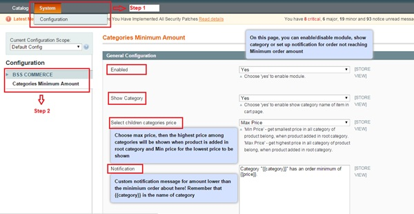
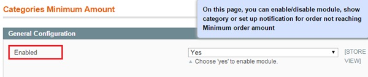
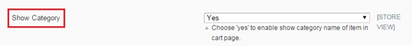
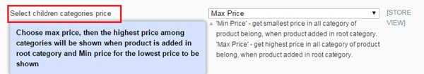
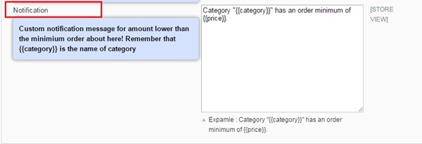
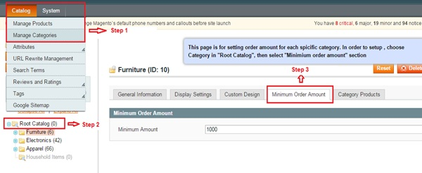
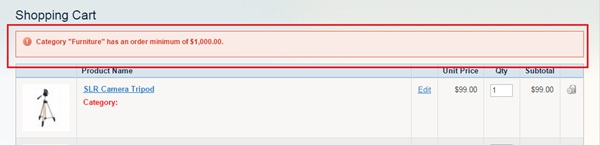

User Guide
=============

.. role:: italic

.. role:: dollar

Magento Minimum Amount For Category Overview
--------------------------------------------

`Magento Minimum Amount For Category extension <http://bsscommerce.com/magento1/magento-minimum-amount-for-category-extension.html>`_ is a unique extension 
which allows admin to customize the minimum order amount for individual categories.

In order to better boost up your sale, shop owners always try to make efforts to promote customers' amount purchase. Set up a minimum order amount for each 
category when customers are purchasing is a good idea. Only when customers' total amount is met with the minimum amount admin already set up, can customers' 
order be moved to checkout process.

In order to avoid tiny order amount, setting the minimum order amount is the optimal choice. Besides minimum order amount for customer group, we can also 
configure minimum order amount for different categories. The extension is beneficial as it forces customers to shop more to meet the minimum order amount if 
they would like to complete the checkout process. The extension is one simple tool to boost your sales in particular and your overall revenue in general.

How does Magento Minimum Amount For Category extension work?
------------------------------------------------------------

1.	Instruction Manual
^^^^^^^^^^^^^^^^^^^^^^

As an admin, you can set up your own store page by the most effective way that supports your trading objective. To polish the website configuration:

* Step 1: Go to **Admin Panel** => **System** => **Configuration**

* Step 2:  At the left side of the page, find **BSS COMMERCE**  => select **Categories Minimum Amounts**

After these 2 steps, a screen for configuration appears like the below picture:

In the configuration table, there are 4 boxes for admin to customize the extension: **Enabled, Show Category, Select children categories price, Notification**.

In **Enabled**: There are 2 options in **Enable** box: **Yes** and **No**.

	* Choose **Yes** to enable the module and continue customizing on other sections. 

	* Choose **No** to disable this module.

In **Show Category**: 

There are 2 options in **Show Category** box: **Yes** and **No**.

* Choose **Yes** to enable showing category name of item in shopping cart page 

* Choose **No** to disable showing category name of item in shopping cart page 

In **Select children categories price**: 

There are 2 options in box: **Min Price** and **Max Price** 

This box allows admin to set up price displaying for products which belong to many categories and have different prices in each category. When customers 
don't add product to cart from any specific category but adding from other pages, for instance in the search result page, the price will be shown as the 
customization.

	* Choose **Min Price** to show the lowest price in all categories which products belong to when products are purchased.

	* Choose **Max Price** to show the highest price in all categories which products belong to when products are purchased.

In **Notification**: 

In this box, admin can insert :italic:`a custom notification message` appears when customers order an amount lower than the minimum order amount being set. 

Remember to use **{{category}}** in the custom message to automatically display exactly name of category the product are in, use **{{price}}** to automatically 
display exactly the minimum price for each category being set.

E.g: :italic:`Category {{category}} has an order minimum of {{price}}`

After all, click on **Save Config** button to save all configuration.

2.	Set up Minimum Order Amount for each category 
^^^^^^^^^^^^^^^^^^^^^^^^^^^^^^^^^^^^^^^^^^^^^^^^^

To set up minimum order amount for each category, follow these below instructions: 

* Step 1: Go to **Admin Panel** => **Catalog**  => **Manage Categories**

* Step 2:  In **Root Catalog** at the left side => select category to set up minimum order amount.

* Step 3: In the appearing configuration page, choose **Minimum Order Amount** section

After these 3 steps, a screen for configuration appears like the below picture:

In the box **Minium Amount**, fill in with number of the minimum amount of each category.

*In this example, when filling* **1000** => *the minimum amount of Furniture category is :dollar:`1000` for customers. So that customers have 
to place orders which worth more than 1000$ to proceed checkout*.

*If customer orders under-:dollar:`1000-product`, a message notification will appear in frontend like this picture*:

After all, don’t forget to click on **Save Config** button to save all configuration.

.. raw:: html

   