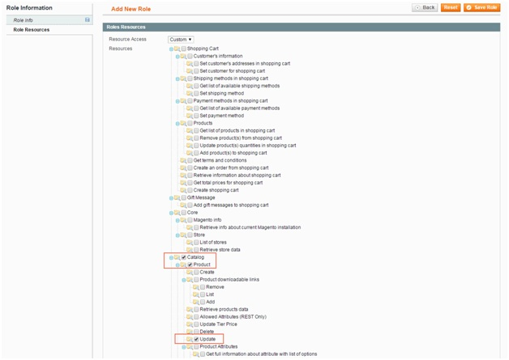

How to update product price per Magento store view by SOAP API v2
=================================================================

**Step 1: Create an an API account to use SOAP**

You go to **System -> Web Services -> SOAP/XML-RPC -> Roles** to create Roles

In Role Resources, tick Update (as the following image) to have rights to update products :

Next, you go to **System -> Web Services -> SOAP/XML-RPC -> Users** to create users. In **User Role**, you choose Roles that you have just created.

**Step 2: Call API to update product price per store view**)

* Assume that the account created in the step 1 has the following information:

	* User name: api
	* Password: api123

* You use this code to run update:

.. literalinclude:: code_examples/update_product_price.py

:step:`*Note`: you need to change some things such as: 

	* Replace `{magentohost} <http://magentohost/api/v2_soap/?wsdl>`_ by the domain of the website that you want to update 
	* Replace {product_sku} by the SKU of product that you want to update 
	* Replace {price} by prices that you want to update 
	* Replace {store} by store code or store idd of store that you want to update product price

.. raw:: html

   

