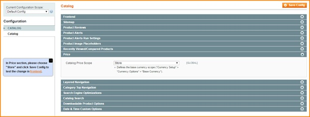
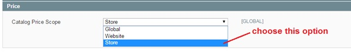
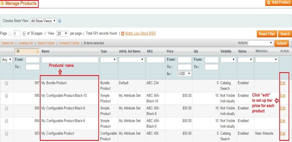
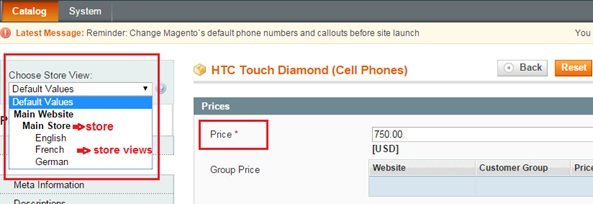
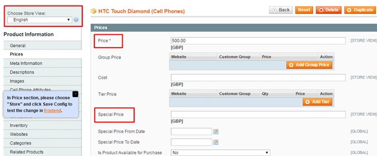
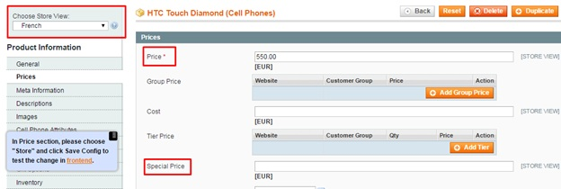
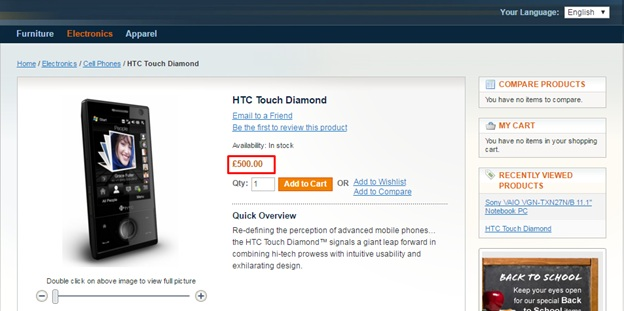
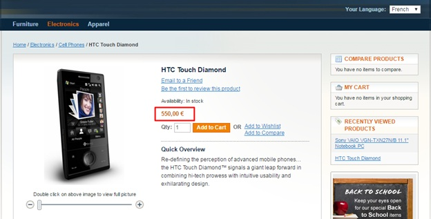

User Guide
=============

.. role:: italic

.. role:: euro

.. role:: france

Magento Multistore Pricing Extension Overview
---------------------------------------------------

Being an e-Commerce shop owner, have you ever found a temporary solution to set particular prices for each store view of the whole store system? Nevertheless, 
what will you do if you have a desire for setting multiple prices of the same items in each store view of each local store but all default Magento functions 
ucannot help you handle it?

Multistore Pricing extension is a useful tool which allows online shop owners set and display different prices for each product in each store view of the 
corresponding store as wish. With this powerful extension, now you will not face with any trouble in setting specific prices in multi store views for same 
products. Therefore, you can attract specific customers from different store views by price policy as you want.

How does Magento Multistore Pricing Extension work?
---------------------------------------------------

1.	Enable Multistore Pricing Extension 
^^^^^^^^^^^^^^^^^^^^^^^^^^^^^^^^^^^^^^^^
You go to **System** -> **Configuration** -> **Catalog** 
	
Among all sections shown up in the page, find **Price** section to start the customization.
	

In box **Catalog Price Scope**, there are 3 options for admin to choose: :italic:`Global, Website, Store`. 

You choose :italic:`Store` to enable the module.

Then you click Save Config and begin to customize prices of products in each store view of each store

2.	Set up different prices for products in each store view of corresponding store.
^^^^^^^^^^^^^^^^^^^^^^^^^^^^^^^^^^^^^^^^^^^^^^^^^^^^^^^^^^^^^^^^^^^^^^^^^^^^^^^^^^^^

Go to **Catalog** -> **Manage Products** and start price customization for each product in each store view

In product grid, you choose each product to set up prices by clicking to **Edit** button 

2.1.	Set up price for a product in the English store view : HTC Touch Diamond (Cell Phones), for example
************************************************************************************************************

**Step 1**: Choose **English** store view per store (Main Store) in **Choose store view box**

Step 2: In **Price** section (on the left side column), you unmark **"Use Default Value"** and add your wanted price for the product in this 
English store view: :france:`500`, for instance 

In addition, you can also set up **Special Prices** for this product 

Finally, you save configuration and continue to set up price in the other store view 

2.2.	Set up price for a product in the French store view : HTC Touch Diamond (Cell Phones), for example
************************************************************************************************************

**Step 1**: Choose **French** store view per store (Main Store) in **Choose store view box**

**Step 2**: In Price section (on the left side column), you unmark **"Use Default Value"** and add your wanted price for the product in this 
French store view: :euro:`550`, for instance 

Finally you save configuration in go to the frontend to see the changes: 

.. role:: francebold 

* **Product page in the English store view with the price of** :francebold:`500`:
	

.. role:: eurobold 

* **Product page in the French store view with price of** :eurobold:`550`:

As a result, you can set up different price for a product: **HTC Touch Diamond (Cell Phones)** in two store views

.. raw:: html

   