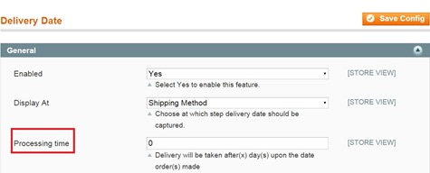
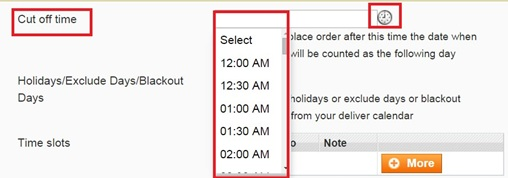
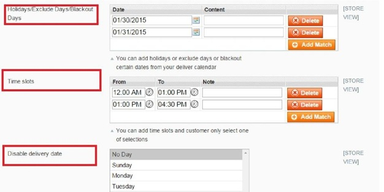
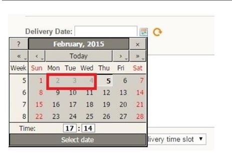
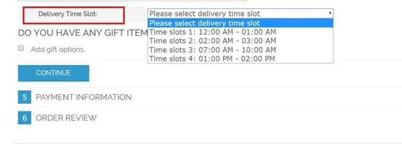
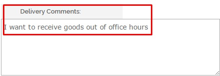
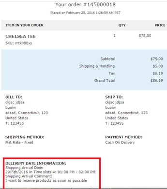
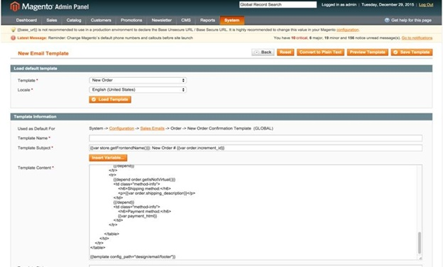
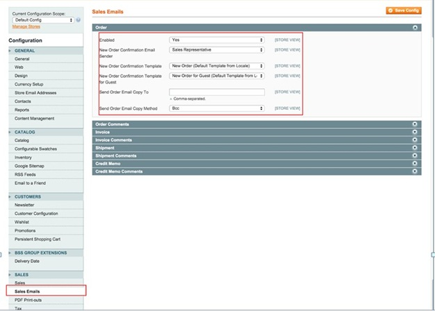
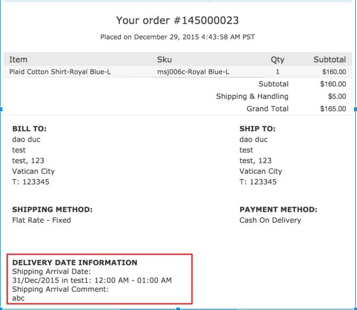

User Guide
=============

Order Delivery Date Extension Overview
--------------------------------------------

After installing `Order Delivery Date Extension <http://bsscommerce.com/magento-order-delivery-date-extension.html>`_, your customers can choose their preferable 
delivery arrival dates and can leave a message for their postal or delivery person as well. With Order Delivery Date, store owners can set their own regulations 
including "Cut off Time", "Processing time", "Holidays/Exclude Days/Blackout Days" in backend. In specific time and date fixed, customers cannot choose these 
options and these dates because they will be fader than the others and non-clickable.

How does Order Delivery Date Extension work?
--------------------------------------------

The Order Delivery Date professionally provides an advanced configuration to determine where to place delivery date from customers.

You can set the most convenient delivery schedule for your business and your customers. Check it in **System -> Configuration -> Order Delivery**.

In **"Display at"**, you can set up where the delivery date customization will display. It means the steps in the check-out process at which customers 
can give their requirements of delivery.

.. image:: images/order_delivery_date_1.jpg

**"Processing time"** is a minimal time that store owner can process purchasing order and start delivering your goods. For instance, admin sets the processing 
time is 2 days then customers can choose after 3 days processing time.

**"Cut off time"** is defined as the "last hour" they can order goods. If customers place order after this time, the date when orders made will be counted as the 
following day

With Order Delivery Date, admin can also exclude holidays or blackout days by choosing exactly days from the table **"Holidays/Exclude Days/Blackout Days"**

These unavailable days will come up as processing days, fader and non-clickable.
 

Beside the days excluded, if a company or store wants to disable any other days which are not suitable for shipping goods for their own reasons or regulations, 
**"Time Slots"** will be selected as store owners' wishes. Then customers can choose one of options as below:

In case, customers find hard to choose one of available slots, they can comment directly in the box **"Delivery comments"**

Finally, your customer can see all of their requirements including order delivery date info through transactional emails sent out to them

To add Order Delivery Date info to transactional emails, please check out below example.

We will do an example about inserting delivery date in the New Order Confirmation Template.

Step 1: Go through **System** -> **Transactional Emails** -> **Add new template:**

In **Load Default Template**: choose the email template in which you want to add delivery date (New Order in this case) and then click **"Load Template"** button.

In **Template Information**:

	* Firstly, set up Template name (New Order Delivery Date, for example)
	
	* Secondly, set up Delivery Date as your wish in Template Content by adding:
	
		+{{**var deliverydate_arrival_date**}} in corresponding to **Shipping Arrival Date**: xxxx (xxx is the time in each order)
		
		+{{**var deliverydate_comment**}} in corresponding to **Shipping Arrival Comment**: xxxx (xxxx is the comment in each order)
		
		
	* Finally, click **"Save Template"** button

	.. image:: images/order_delivery_date_10.jpg
	
Step 2: Go through **System** -> **Configurable** -> **Sales Emails** -> **Tab Order**

In **New Order Confirmation Template**, you choose the name of the template created in the previous steps and click **"Save Config"** button.

As a result, your email to confirm orders sent to customers will be added with delivery date information.

You can do the same when creating/editing other email templates to add delivery date information.
 

.. raw:: html

   

