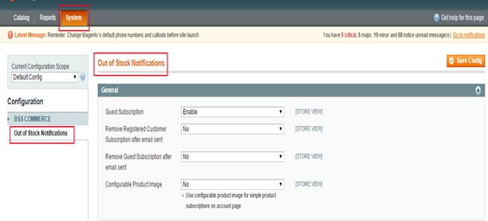
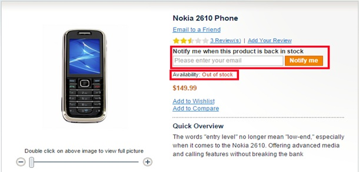
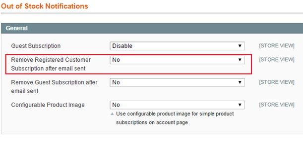
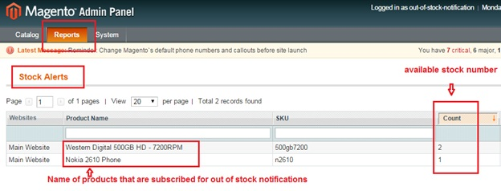

User Guide
=============

.. role:: italic

Magento Out Of Stock Notification Overview
------------------------------------------

`Magento Out Of Stock Notification extension <http://bsscommerce.com/extensions/magento-configurable-product-tab-table-view.html>`_ is a convenient plug-in 
offering customers a chance to sign up for back in stock notification with currently out of stock product so that whenever the stock is available, a notification 
email will be sent to customers.

The extension is much of value in boosting up sale, operating inventory management and increasing customer satisfaction.

How Magento Out of Stock Notification works?
--------------------------------------------

1.	Instruction Manual
^^^^^^^^^^^^^^^^^^^^^^^

To set up **Magento Out of Stock Notification**, go to **System** => **Configuration**. 

At the left side of the page, find **BSS Commerce** => select **Out of stock Notifications**

After this 2 steps, a screen for configuration appears like the following picture:

There are 4 boxes for admin to configure.

* First box: **Guest subscription,** 
-When choosing :italic:`Enable`, customers will be able to subscribe their email to out of stock notifications. In front-end, a box will appear allowing 
customers to directly enter their emails for out of stock notifications.

-When choosing :italic:`Disable`, guest customers will not be able to subscribe their emails to out of stock notifications. In front-end, the screen will 
suppose to appear like this following picture.

.. image:: images/out_stock_notification2.jpg

The :italic:`"Notify me when this product is back in stock"` line will appear and when customers would like to get out of stock notification email, they will 
click on this line and will be redirected to customer account page for account registration.

* Second box: **Remove Registered Customer Subscription after email sent**

Choose :italic:`Yes` if you wish to remove registered customer subscriptions to out of stock notification email after notifying them for the first time. 
Choose :italic:`No`, their subscription will be saved and whenever the product they would like to get notified email is available, an email will be sent to them.

* Third Box: **Remove Guest Subscription after email sent**
 
Similarly to the second box, choose :italic:`Yes` if you would like to send email to customers once and after sending email, their subscription will be removed. 
Otherwise, you choose :italic:`No`.

* Last box: **Configurable Product Image**

Choose :italic:`Yes` to use configurable product image for simple products subscriptions on the account page. 

After all above configuration is done, you save the configuration by clicking on **Save config** button to the right of the backend. To see the change, 
go to frontend and reload the page.

2.	Manage Product Inventory Status: 
^^^^^^^^^^^^^^^^^^^^^^^^^^^^^^^^^^^^

In order to see inventory status of your products, go to **Admin Panel** => **Reports** => **Out of Stock Notifications**. 

In **Stock Alerts**,  all products that customers subscribed for out of stock notifications will be displayed with available stock number so that admin can 
notice and have suitable sale decision.

.. raw:: html

   