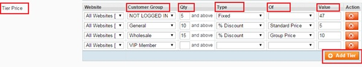

User Guide
=============

.. role:: italic

.. role:: example

.. role:: center

Magento Percentage Off Tiered Price Extension Overview 
------------------------------------------------------

`Magento Percentage Off Tiered Pricing extension <http://bsscommerce.com/magento1/magento-percentage-off-tiered-pricing.html>`_ extends default 
Magento Tier Price function by allowing admin to define tier prices as a percentage.

* Easily set up tier price based on standard price or group price

* Set tier price in a fixed amount or in percentage

* Automatically update tier price when price is changed

Magento Percentage Off Tiered Pricing updates the tier prices according to the percentages you have inputted when you update the price of your product. 
This extension will effectively reduces your time-consuming and optimizes your sale activity.

How does Magento Percentage Off Tiered Pricing work? 
------------------------------------------------------

1.	Instruction Manual
^^^^^^^^^^^^^^^^^^^^^^

As an admin, you can set up your own store page by the most effective way that supports your trading objective. To polish the website configuration:

* Step 1: Go to **Admin Panel** => **System** => **Configuration**.

* Step 2:  At the left side of the page, find **BSS Commerce** => select **Percentage Off Tiered Pricing**.
After these 2 steps, a screen for configuration appears like the following picture:

.. image:: images/percentage_tier_price.jpg

The **General** tab appears with a box named **"Enabled"** for admin to enable **Percentage Off Tiered Pricing extension**. There are 2 options in the box: 
:italic:`Yes` or :italic:`No`. Choose :italic:`Yes` to enable the extension, choose :italic:`No` to not. 

After that, don't forget to click on **Save config** button to continue the configuration.

2.	Set up tier price in percentage or a fix amount based on standard price or group price
^^^^^^^^^^^^^^^^^^^^^^^^^^^^^^^^^^^^^^^^^^^^^^^^^^^^^^^^^^^^^^^^^^^^^^^^^^^^^^^^^^^^^^^^^^

To continue setting up tier price based on standard price or group price for each product, go to **Catalog** => **Manage Products**.

The list of all products that are available in your own store is shown up. 

Click on **Edit** button at right side to set up tier price for each shown-up product on the list.

.. image:: images/percentage_tier_price1.jpg

After choose to edit the product price, go to board **Product Information** on the left => choose **Price** to see :italic:`standard price`.

.. image:: images/percentage_tier_price2.jpg

:example:`In this example,` :italic:`standard price` *of the product which being set up tier price is $50*.

Next, go to **Percentage Tier Price** to set up the tier price as you want. There are 2 sections for admin to configure: **Group Price** and **Tier Price**.

	* In **Group Price**, click on **Add Group Price** button to add specific price for each customer group. 

	.. image:: images/percentage_tier_price3.jpg

:example:`In this example, the` :italic:`group price` *for* :italic:`"Not logged in"` *customers is $50, for* :italic:`"General"` *customers is $45, for* 
:italic:`Wholesalers` *is $40*.

	* In **Tier Price**, click on **Add Tier** button to set up tier price in percentage or a fixed amount for each customer group based on 
	:italic:`Standard price` and :italic:`Group price`.

There are 4 criterias admin need to know and fill in: :italic:`Customer Group, Quantity, Discount Type, Applied Price, Tier Value`.

	+In **Customer Group** column, choose each customer group (E.g: :italic:`Not Logged In, General, Wholesale, VIP Member, Private Sales Member…`)  
	you want to set tier price on.
	
	+In **Qty** column, fill minimum quantity of product which each customer group has to buy with to get the tier price. 
	
	+In **Type** column, there are 2 types of discount: :italic:`Fixed` and % :italic:`Discount`. Choose one of them to apply on new tier price. 
	
	+In **Of** column, choose 1 of 2 options to apply discount on: :italic:`Standard Price` *and* :italic:`Group Price`. *Remember that if admin choose* 
	:italic:`Fixed` *on* :italic:`Type` *column, this section is disabled*.
	
* In *Value* column, fill with new value for tier price by a new dollar amount (for fixed discount) or by percentage (for % discount)

:example:`For this example:`

-Only when not-logged-in customers buy this product with at least 5 items, they will get the new tired price which is fixed-discount ($47).

- Only when general customers buy this product with at least 10 items, they will get the new tier price which is 5% discount on the standard price ($50).
 
	:center:`The new tier price = $50 - $50*5% = $47.5`

.. raw:: html

   