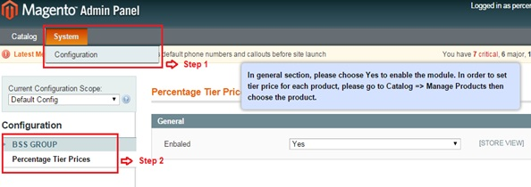
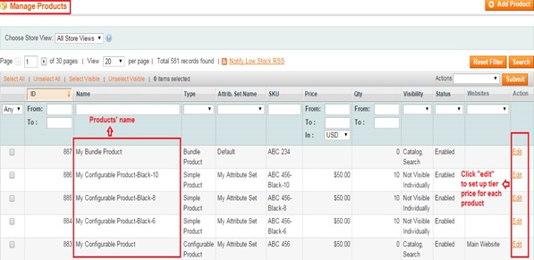
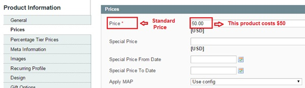

User Guide
=============

.. role:: italic

Magento Percentage Off Tiered Price Extension Overview 
------------------------------------------------------

`Magento Percentage Off Tiered Pricing extension <http://bsscommerce.com/magento1/magento-percentage-off-tiered-pricing.html>`_ extends default 
Magento Tier Price function by allowing admin to define tier prices as a percentage.

* Easily set up tier price based on standard price or group price

* Set tier price in a fixed amount or in percentage

* Automatically update tier price when price is changed

Magento Percentage Off Tiered Pricing updates the tier prices according to the percentages you have inputted when you update the price of your product. 
This extension will effectively reduces your time-consuming and optimizes your sale activity.

How does Magento Percentage Off Tiered Pricing work? 
------------------------------------------------------

1.	Instruction Manual
^^^^^^^^^^^^^^^^^^^^^^

As an admin, you can set up your own store page by the most effective way that supports your trading objective. To polish the website configuration:

* Step 1: Go to **Admin Panel** => **System** => **Configuration**.

* Step 2:  At the left side of the page, find **BSS Commerce** => select **Percentage Off Tiered Pricing**.
After these 2 steps, a screen for configuration appears like the following picture:

The **General** tab appears with a box named **"Enabled"** for admin to enable **Percentage Off Tiered Pricing extension**. There are 2 options in the box: 
:italic:`Yes` or :italic:`No`. Choose :italic:`Yes` to enable the extension, choose :italic:`No` to not. 

After that, don't forget to click on **Save config** button to continue the configuration.

2.	Set up tier price in percentage or a fix amount based on standard price or group price
^^^^^^^^^^^^^^^^^^^^^^^^^^^^^^^^^^^^^^^^^^^^^^^^^^^^^^^^^^^^^^^^^^^^^^^^^^^^^^^^^^^^^^^^^^

To continue setting up tier price based on standard price or group price for each product, go to **Catalog** => **Manage Products**.

The list of all products that are available in your own store is shown up. 

Click on **Edit** button at right side to set up tier price for each shown-up product on the list.

After choose to edit the product price, go to board **Product Information** on the left => choose **Price** to see :italic:`standard price`.

* *In this example,* :italic:`standard price` *of the product which being set up tier price is $50*.

.. raw:: html

   