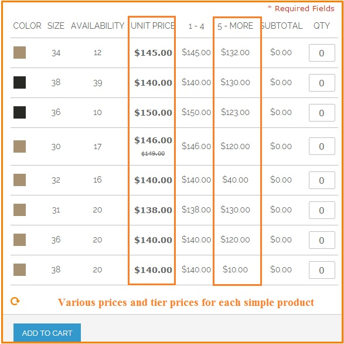
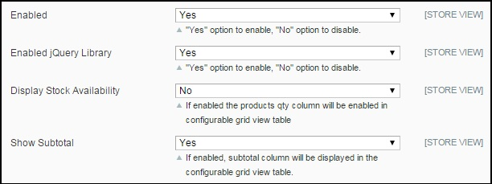
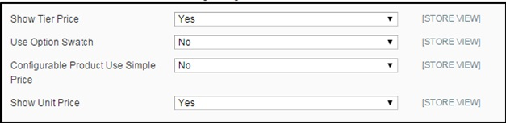
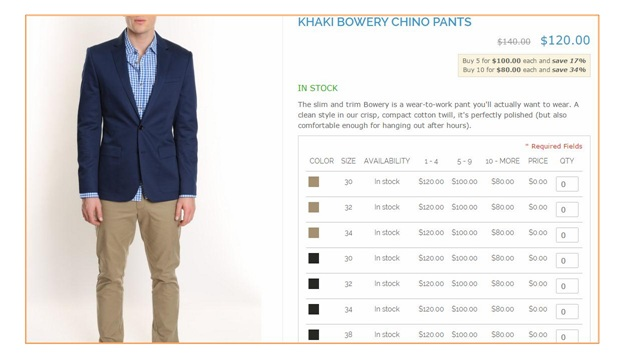

User Guide
=============

.. role:: italic

I.	BSS Pro Configurable Product Grid Table View Extension’s Overview
-------------------------------------------------------------------------

Pro Configurable Products Table View enables Magento Shop Owners to display associated products, creating a neat and professional table to show 
specific features of selected products, especially including color-swatch function built-in and tier price display.

II.	How does BSS Pro Configurable Product Grid Table View Extension work?
-------------------------------------------------------------------------

1. In the frontend
^^^^^^^^^^^^^^^^^^^^

.. image:: images/pro_configurable_product_1.jpg

:italic:`Detailed explanation`
	* Professional grid view table for configurable products
	* Ability	to	increase/	decrease	product	quantity	in	convenient	table	and automatically calculate the total payment
	* Built-in Color swatch function
		-	Color swatch displays as label with Magento version 1.4.x to 1.8.x
		-	Color swatch displays as picture with Magento version 1.9.x
	* Tier price display for configurable product
	* Demonstrate in stock/ out of stock status
	* Display different price and tier price for each simple product
	* Display the price range of configurable product
	* Allow customer to add more than one product configuration to cart at a time

2.	How to configure BSS Pro Configurable Products Grid Table View Extension in the backend
^^^^^^^^^^^^^^^^^^^^^^^^^^^^^^^^^^^^^^^^^^^^^^^^^^^^^^^^^^^^^^^^^^^^^^^^^^^^^^^^^^^^^^^^^^^^

Go through **System** -> **Configuration** -> **BSS COMMERCE** -> **Configurable Grid View**

* In Enable: Choose Yes/ No to enable or disable the module

* In Enable jQuery Library: Choose Yes/ No to enable or disable jQuery Library You can also choose to display Stock Availability. When you enable it, you 
can see stock availability in the configurable grid table.

* In **Show Subtotal**, you can choose Yes or No to display or hide the subtotal column

* You can choose to show or hide **Tier Price** by selecting Yes or No

* In **Use Option Swatch**: Choose Yes or No to enable/disable Swatch

* In **Configurable Product Use Simple Price**:

	- If you choose Yes, you have to do the two following things:
	
		+You have to set different prices for simple products. 
		
		Go through: **Catalog** -> **Manage Catalog**
		
		You click to each simple product to set price and choose **Price** in **Product Information**:
	
	
		.. image:: images/pro_configurable_product_4.jpg
		
		
		In **Price**: you set specific price for the product
		
		+Set different tier prices of simple products for ranges of quantities (the quantity ranges of products are the same):
		
		In **Tier Price**, click **Add Tier** to set up specific tier price for each range of quantity and customer group
		
		The pro configurable product grid table view is displayed as below:

		
		.. image:: images/pro_configurable_product_5.jpg
	
	- If you choose No, this extension will display the prices of configurable products instead of the different prices of simple products.
	
	The pro configurable product grid table view is displayed as below:

* In **Show Unit Price**: Choose **Yes** to display unit price column in the grid table view and choose **No** to hide it.

.. raw:: html

   
