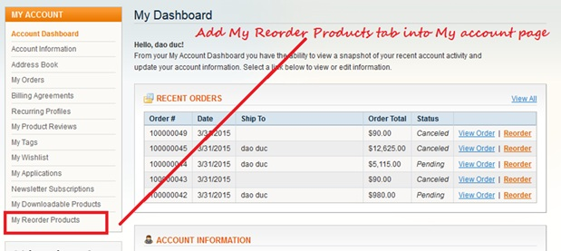
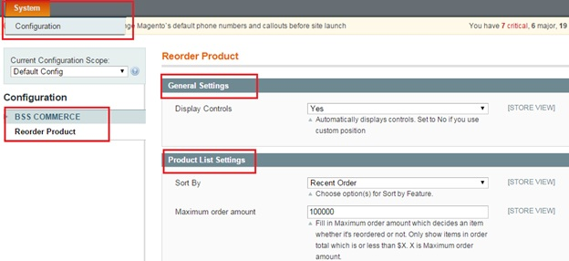
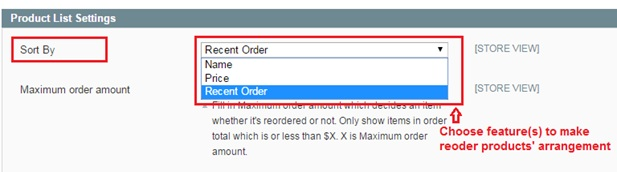
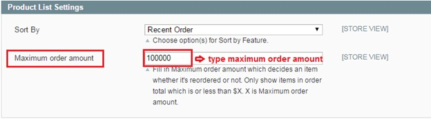

User Guide
=============

.. role:: italic

Magento Reorder Extension Overview
-----------------------------------

`Magento Reorder Products <http://bsscommerce.com/magento1/magento-reorder-product-extension.html>`_ is an excellent extension that facilitates customers 
to reorder products on their dashboard. Your customers can rearrange product positions as they wish, which increases their satisfaction with your 
services. Magento Reorder Product Extension allows customers to quickly reorder their previously chosen products and make any necessary changes as they wish!

This extension enables to separate reorder product section on customer account page to a board named **My reorder product** which helps customers reorder any 
products they want instantly and easily add them back to cart as fastest as possible for checkout.

How Magento Reorder Extension works
-----------------------------------

In order to configure BSS Reorder extension,

Step 1: Go to **Admin Panel** => **System** => **Configuration** 

Step 2: At the left side of the page, find **BSS Commerce** => select **Reorder Products** 

After these 2 steps, a screen for configuration appears like the following picture:

There are two sections for admin to continue configuration: **General Settings** and **Products List Settings**. 

* First section: **General Settings** 

	In **Display Controls** box, choose :italic:`Yes` to enable the extension. To disable all functions of this extension, choose :italic:`No`.

* Second section: **Product List settings** 

	**Sort By** box allows admin to choose from listed options for setting the arrangement of reorder products in :italic:`"My Reorder Products"` board of 
	customer account page. 

Admin can set customer's reoder products by 3 following features: :italic:`Name, Price, Recent Order`.

In **Maximum Order amount** box, type the maximum amount of orders that can be reordered. 

For all orders with total amount is more than this typed amount will not be able to be reordered and will not be displayed in :italic:`"My reorder products"` 
board of customer account page.

After all above configuration is done, you save the configuration by clicking on **Save config** button to the right of the backend. To see the change, go to 
frontend and reload the page.

.. raw:: html

   

