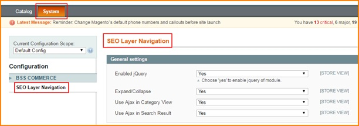
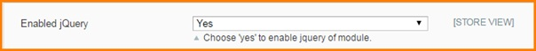
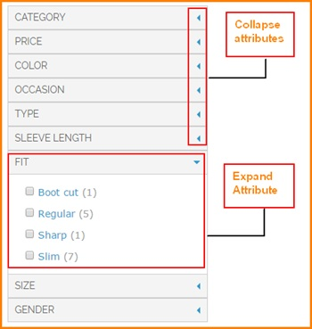
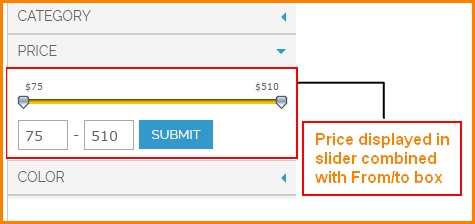
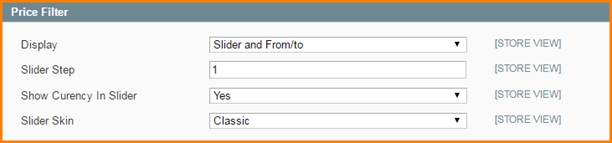
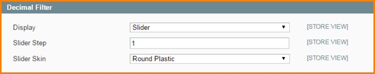
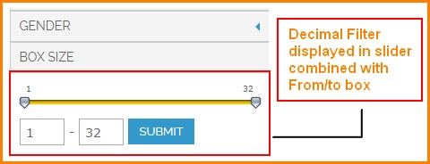
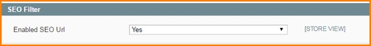
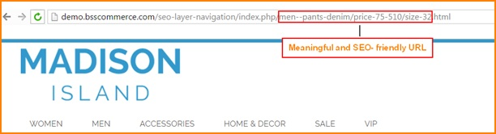
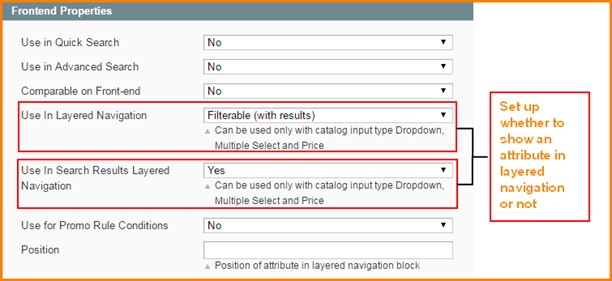

User Guide
=============

SEO Layered Navigation Extension Overview
------------------------------------------

Filtering product with layered navigation is a very useful tool that Magento supports users. However, it still has a lot of disadvantages: selecting 
only one option at once; inflexible price filter; unfriendly URLs… It will take much valuable time as well as be inconvenient for users. With the aim 
of providing best experience in filtering product by layered navigation, BSSCommerce 
launched `Magento SEO Layered Navigation Extension <http://bsscommerce.com/magento-seo-layered-navigation.html>`_ to improve all above drawbacks of Magento default.

`SEO Layered Navigation Extension <http://bsscommerce.com/magento-seo-layered-navigation.html>`_ provides powerful functions that help users to filter products 
in the most effective way. Thus, your site will become more professional and user- friendlier, which is an important factor that keeps loyal customers as well as 
enhance business performance. 

How does SEO Layered Navigation Extension work?
-----------------------------------------------

1. SEO Layered Navigation Setting
^^^^^^^^^^^^^^^^^^^^^^^^^^^^^^^^^

To make configuration of this module, follow these below instruction:

* Step 1: Go to **Admin Panel =>System => Configuration**

* Step 2:  At the left side of the page, find **BSS Commerce => select SEO Layered Navigation**

After these 2 steps, a screen for configuration appears like the below picture:

There are 4 main parts you can fix as your wishes: General settings, Price Filter, Decimal Filter, SEO Filter

**1.1 General settings**

* **Enable jQuery**

When setting up SEO Layered Navigation, you can also control Jquery Library in your website. You can select "Yes" in Enable Jquery to allow Jquery Library 
combining with SEO Layered Navigation Extension when it runs on your website.

* **Expand/Collapse**

In Expand/ Collapse, choose Yes/No to enable/ disable expand/ collapse function.

When this function is enabled, in frontend, users will have choice of expanding or collapsing an attribute as wish.

* **Use Ajax in Category View/ Search Result**

You can manage whether to use Ajax to load product or not. Using Ajax will help you to load product only with changed part instead of the whole page. 

Select Yes/No to enable/disable Ajax loading for category view and search result separately. 

.. image:: images/seo_layer_navigation1.1_4.jpg

**1.2 Price Filter**

* **Display**

In Display box, you can choose how to display price filter from 4 forms: Default, Slider, From/to, and finally combination of Slider and From/to 
	
	* Default: price will be displayed in fixed ranges as default of Magento
	
	* Slider: price will be displayed in a slider which allows users to slide leftward and rightward to choose a suitable price range
	
	* From/to: users can add specific values into 2 input boxes and click Submit to select a suitable price range 
	
	* Slider and From/to: users can use both slider and input box to filter price

This is an example of Slider and From/to displaying: 

* **Slider Step**

In this field, you can decide how many price units will be added/ subtracted each time users slide rightward/ leftward. For example, if you set up Slider 
Price = 3, users only can slider from $1 to $4 to $7 and so on. 

* **Show Currency in Slider**

If you choose Yes, the currency will be displayed beside price in slider. If you choose No, it will be hidden.

* **Slider Skin**

In this field, you can choose the appearance of slider with 4 forms: Classic/ Round/ Plastic/ Round Plastic 

**1.3 Decimal Filter**

In this field, you can set up how to display attributes which are in decimal forms such as size, weight, height, age… 

Similar to Price Filter, you can decide how to display, slider step and slider skin for decimal filter.

**1.4 SEO Filter**

If you enable SEO URLs, all URLs created after filtering will follow a logical rule. It will contain the product name and selected attribute’s options.

For example, this is the URL created after user select pants and denim category, price from $75 to $510 and size 32 for a kind of men shirt: 

2. Attribute Configuration
^^^^^^^^^^^^^^^^^^^^^^^^^^

* **Use in Layered Navigation**

You can set up whether to show an attribute in layer navigation or not by going to Catalog -> Attributes -> Manage Attributes 

Select one attribute -> Attribute Property -> Frontend Properties, select from 3 options: No/ Filterable (with results)/ Filterable (with results)/ Filterable 
(no results) in field **Use In Layered Navigation**

	* No: not show this attribute in layered navigation
	
	* Filterable (with results): attribute will be shown in layered navigation only when result > 0
	
	* Filterable (no results): attribute will be shown in layered navigation even when result = 0

* **Use In Search Results Layered Navigation**

Select Yes/No to set up whether to show attribute in  search results layered navigation or not

After finishing all of these set-up steps, you can click on **Save Config** button and go to frontend to see 
how `SEO Layered Navigation Extension <http://bsscommerce.com/magento-seo-layered-navigation.html>`_ makes change to your site.
	
	
.. raw:: html

   

