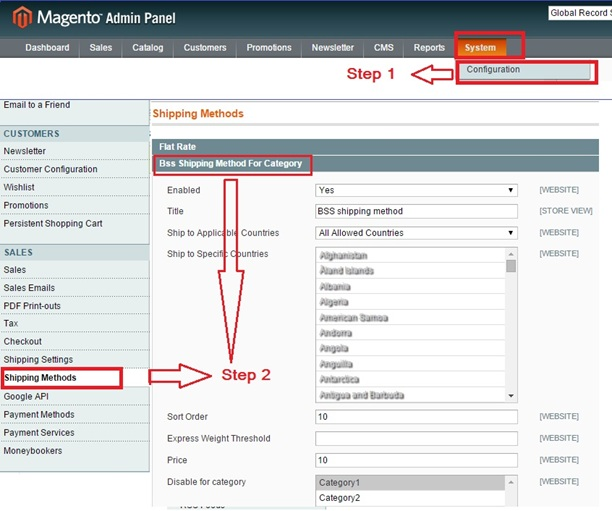
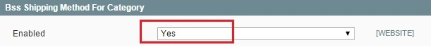
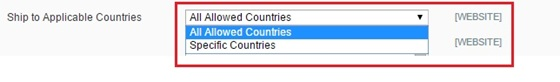
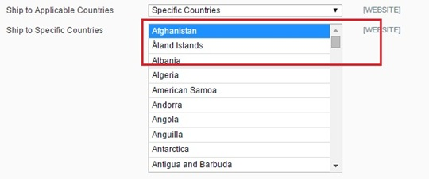
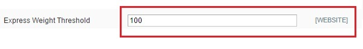
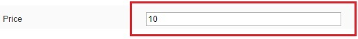
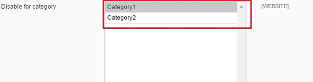

User Guide
=============

.. role:: menu

Magento  Shipping Method for Category Extension Overview
-----------------------------------------------

Have you ever wished to disable one shipping method in some categories in Magento platform? As you know, in Magento default, whenever admin sets up a 
shipping method in backend, this method will be applied for every product in all categories. Therefore, it is difficult to set up some special Magento 
shipping methods by category. For instance, your website sells both fresh and dried fishes. You can ship dried ones to customers via air highway, however, 
you cannot do the same method with fresh fish, in this situation; you can have some troubles when setting **up this method in the backend**.

With `Magento Shipping Method for Category <http://bsscommerce.com/extensions/checkout/magento-shipping-method-for-category.html>`_ , managers do not need to 
worry about this problem anymore. This extension allows admin to enable a shipping method based on category. As in the above example, admin can disable airline 
shipping method of all fishes in 'Fresh' category in the backend.

How does Magento Shipping Method for Category extension work?
-----------------------------------------------------

To make configuration of this module, follow these below instruction:

* Step 1: Go to **Admin Panel** => **System** => **Configuration**

* Step 2:  At the left side of the page, find **Sales** => **Shipping Methods** => select **Bss Shipping Method for Category** 

After these 2 steps, a screen for configuration appears like the below picture:

There are 8 parts you can fix as your wishes: Enabled, Title, Ship to Applicable Countries, Ship to Specific Countries, Sort Order, Express Weight Threshold, 
Price, Disable for Category

1.	Enabled
^^^^^^^^^^^^

After opening this part in Shipping methods, you can enable the method by selecting **"Yes"** status in **Enabled** box.

2.	Title
^^^^^^^^^^^^

You can easily change the title name displayed on the frontend as a name of shipping method in **Title** box. As in the example, the name of method is 
"BSS shipping method", and then in the frontend page, this shipping method will also appear in this name. 

	:menu:`Backend`
	
	.. image:: images/shipping_category_method2.jpg
	
	:menu:`Frontend`
	
	.. image:: images/shipping_category_method2_1.jpg
	

3.	Ship to Applicable Countries
^^^^^^^^^^^^^^^^^^^^^^^^^^^^^^^^

You can choose which countries this shipping method could be applied in the **Ship to Applicable Countries** box.

4.	Ship to Specific Countries
^^^^^^^^^^^^^^^^^^^^^^^^^^^^^^

If you decide the shipping method can only be used in some specific countries, you can select "Specific countries" in **Ship to Applicable Countries** box.

Then you can select your wished countries in the table in the box **Ship to Specific Countries**.

5.	Sort Order
^^^^^^^^^^^^^^

In the Sort Order box, you can decide the position of the Shipping method. For example you set in the **Sort Order** box number 2, then in the front end the 
Bss shipping method will appear in the no.2 position. 

	:menu:`Backend`
	
	.. image:: images/shipping_category_method5.jpg
	
	:menu:`Frontend`
	
	.. image:: images/shipping_category_method5_1.jpg
	
	

6.	Express Weight Threshold
^^^^^^^^^^^^^^^^^^^^^^^^^^^^

You also can set the maximum-allowed weight in this shipping method by filling the value in **Express Weight Threshold** box.

7.	Price
^^^^^^^^^^^^

As another shipping method, to set the price for each method, you can fill the number in the **Price** box

8.	Disable for Category
^^^^^^^^^^^^^^^^^^^^^^^^

Finally part is also the most important part, which creates the difference from other Shipping method function.

You can control which product category can apply this shipping method or cannot apply. You can decide which category will be not applied Bss Shipping Method 
by **Disable for Category** box. For example, if you choose Category 1, then when customer buys any products in category 1, Bss Shipping Method will not appear 
in customers' shipping options.

After finishing all of these set-up steps, you can click on **Save Config** button to start using Shipping Method for Category extension.

.. raw:: html

   

