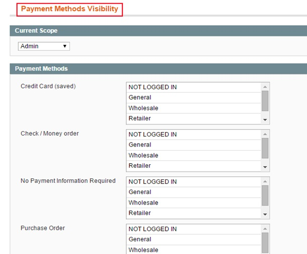
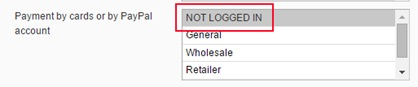
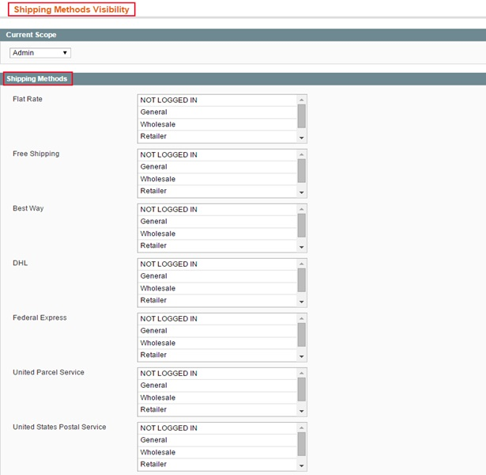

User Guide
=============

.. role:: italic

.. role:: menu

.. role:: bullet

Magento Shipping and Payment Per Customer Groups overview
----------------------------------------------------------

`Magento Shipping and Payment Per Customer Groups <http://bsscommerce.com/magento1/magento-shipping-payment-per-customer-groups-extension.html>`_ enables admin 
to set up different shipping and payment methods for various groups of customers. Once set up in the backend, only chosen methods display for particular customer 
groups in the shipping and payment process in the frontend.

This extension permits admin to satisfy their customers by providing their customers the most suitable products in the neatest organization.

How Magento Shipping and Payment per Customer Groups works
----------------------------------------------------------

After installing Magento Shipping and Payment Per Customer Group into your website, a new tab named **Advanced Shipping/Payment** methods will appear in your backend 
page allowing admin to set up advanced shipping and payment methods for each specific customer group.

1.	Set up Payment Methods for customer groups
^^^^^^^^^^^^^^^^^^^^^^^^^^^^^^^^^^^^^^^^^^^^^^^

To customize shipping methods for each specific customer group, follow steps below:

Go to **Admin Panel** => **Advanced Shipping/Payment Methods** => **Payment methods**
 
After that, a screen appears showing many payment methods for admin to make configuration. 

*NOTE: Before making configuration, you must firstly consider the Current scope for your configuration. Right in the top, there is a* :italic:`"current scope"` 
*box, in which there have two options*. 

* :italic:`Admin`: *If you choose the current scope to be Admin, the configuration runs in all of your websites*.

* :italic:`Main website`: *The configuration is only applied in the main website*.

Here, all payment methods which are set up by admin in payment section will be listed with various options of customer groups. 

In order to set up any **payment method** for customer group(s), 

	:menu:`Choose the` **Payment method**
	
	:menu:`Choose your desired customer group(s)`
	
	:menu:`Save your configuration`

*For instance, if you wish to set up* :italic:`Payment by cards or by PayPal account` *for NOT LOGGED IN CUSTOMERS*

	:menu:`Go to` **Payment by cards or by PayPal account**
	
	:menu:`Click on  NOT LOGGED IN`
	
	:menu:`Click on "save Visibility settings" to save your configuration`

The process is the same as other payment methods with any other customer groups.

	
2.	 Set up ShippingMethods for customer groups 
^^^^^^^^^^^^^^^^^^^^^^^^^^^^^^^^^^^^^^^^^^^^^^^

Go to **Admin Panel** => **Advanced Shipping/Payment Methods** => **Shipping methods**
 
After that, a screen appears showing many payment methods for admin to make configuration. 

*NOTE: Before making configuration, you must firstly consider the Current scope for your configuration. Right in the top, there is a* :italic:`"current scope"` 
*box, in which there have two options*. 

* :italic:`Admin`: *If you choose the current scope to be Admin, the configuration runs in all of your websites*.

* :italic:`Main store`: *The configuration is only applied in the main website*.

Just the same as payment methods, all shipping methods which are set up by admin in shipping section will be listed with various options of customer groups. 

You can entirely configure the shipping methods for specific customer group:

	:menu:`Choose the` **Shipping method**
	
	:menu:`Choose your desired customer group(s)`
	
	:menu:`Save your configuration.`

:italic:`For example`: *you would like to set flat rate, Federal express, United Parcel Service for General customers, In* :italic:`Flat rate, Federal express, United Parcel Service`, 
you click on :italic:`General`. 

:bullet:`As a result, these shipping methods will be shown for general customers`.

.. image:: images/shipping_payment_method3.jpg

.. raw:: html

   