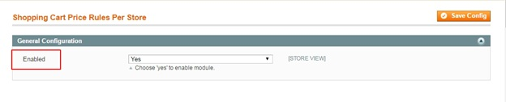

User Guide
=============

.. role:: italic

.. role:: example

Magento Shopping Cart Price Rule per Store View Extension Overview
-------------------------------------------------------------

If you are using multiple store views function to do business on your Magento site, have you ever had a demand of creating different shopping cart rules for 
each store view? Do you want to offer different promotional prices for each target customer group in each store view? 

`Magento Shopping Cart Price Rule per Store View Extension <http://bsscommerce.com/magento1/shopping-cart-rules-per-store-view.html>`_ is developed to optimize the 
multiple store view function by enabling admin to set up different price rules in shopping cart of different store views. With this powerful extension, you can 
manage your promotional price strategy effectively, leading to boosting up sale and completing multiple store view system.

How does Magento Shopping Cart Price Rule per Store View Extension work?
-------------------------------------------------------------------

1.	Enable Shopping Cart Price Rule per Store View Extension
^^^^^^^^^^^^^^^^^^^^^^^^^^^^^^^^^^^^^^^^^^^^^^^^^^^^^^^

You go to **System** -> **Configuration** -> **Shopping Cart Price Rules Per Store**

After choosing :italic:`Yes` to enable the extension, click :italic:`Save Config` to start set up shopping cart price rules per store as wish. 

2.	Set up different shopping cart price rules for products in each store view 
^^^^^^^^^^^^^^^^^^^^^^^^^^^^^^^^^^^^^^^^^^^^^^^^^^^^^^^^^^^^^^^^^^^^^^^^^^^^^^

Go to **Promotions** -> **Shopping Cart Price Rules Manage Products** and click :italic:`Add New Rule` to customize rules for shopping cart in each store view.
	
	* In **Rule Information**, fill in Rule Name, Description, Status and other fields with needed information as usual.

	.. image:: images/shopping_cart_rule_store_view1.jpg
	
	* In **Conditions**, choose Store View as an option in condition for rule
	
	.. image:: images/shopping_cart_rule_store_view2.jpg
	
	Then choose one Store View in the list of Website/ store/ store view that you want to set up rule for it
	
	.. image:: images/shopping_cart_rule_store_view3.jpg
	
	* In **Actions**, set up detail rules for the chosen store view
	
	.. image:: images/shopping_cart_rule_store_view4.jpg
	
	* Save configuration, then come back to **Conditions** and choose other store view to continue to set up
	
	:example:`Example`
	
	:italic:`Set up $ 100 discount rule for orders which have 3 items in English store view`
	
	**Step 1**: Creating Conditions
	
	-Choose **Store View** as a condition and select **English** store view (Main Website/ Madison Island Store)
	
	-Choose **Total Items Quantity** as a condition and fill in "**3**" in the box
	
	.. image:: images/shopping_cart_rule_store_view5.jpg
	
	**Step 2**: Creating Rules
	
	Go to **Actions**, choose :italic:`Fixed amount discount for the whole cart` as a rule to apply and fill in "100" in **Discount Amount** box
	
	.. image:: images/shopping_cart_rule_store_view6.jpg
	
	Finally, save configuration and go to the frontend to see the changes: 
	
	* **Shopping Cart in the English store view:**
	
	.. image:: images/shopping_cart_rule_store_view7.jpg
	
	* **Shopping Cart in the French store view:**
	
	.. image:: images/shopping_cart_rule_store_view8.jpg
	
	
.. raw:: html

   

