User Guide
=============

.. role:: italic

BSS Unboxed extension overview
-------------------------------

`Magento Unboxed Extension <http://bsscommerce.com/magento-unboxed-extension.html>`_ creatively uses customer unboxed product images as effective social 
proofs to attribute on marketing efforts. The extension shows customer product images of your products they have JUST purchased in a particular area and 
indirectly uses those images to attract more customers and make the higher conversion rate. There is beyond two facts that: "when buying new items, whether 
in direct or indirect ways, clients are likely to show them off and want to receive compliments from others."

Not a few people are influenced by mob mentality. People are easily impacted by their peers to ratify assertive behaviors, follow trends to buy items. There is 
also no deny that the power of visual content marketing can become magical: "Use a picture. It's worth a thousand words."

How Magento Unboxed extension works 
-----------------------------------

1. Manual instruction
^^^^^^^^^^^^^^^^^^^^^^^^

As an admin, you can set up your own store page by the most effective way that supports your trading objective. To make the configuration:

* Step 1: Go to **System -> Configuration.** 

* Step 2: At the left side of the page, find **BSSCOMMERCE -> select Unboxed** 

After these 2 steps, a screen for configuration appears like the following picture: 

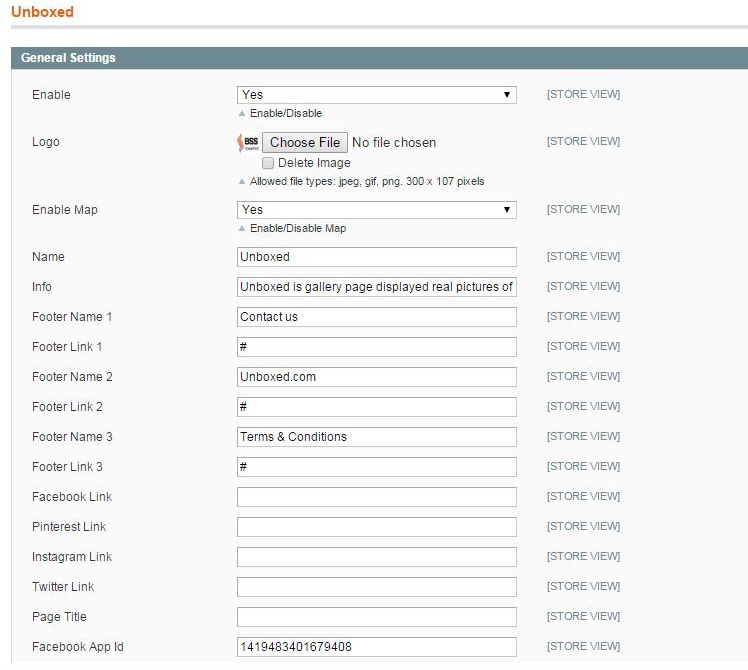

There are many boxes displaying on the page for shop owners to configure as they want.

**1.1. Enable module**

In box **Enable**, there are 2 options for admin to choose: **Yes** or **No**. Choose **Yes** to enable the module, choose **No** to disable it.

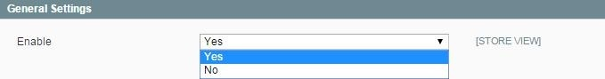

Save the configuration by clicking on **Save config** button on the right of the page.

**1.2. Header displaying**

To set up the display of header of your unboxed page on frontend, please follow these instructions.

* In box **Logo**, click on the button **Choose File** to browse from your computer a picture to display as your logo on the frontend. Remember that there are 3 file types are allowed including ***.jpg, *.png** and ***.gif.** The picture uploaded from your computer will be resized to fixed size (300 x107 pixels). 

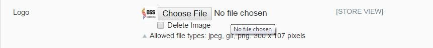

* In box **Enable Map**, there are 2 options for admin to choose: **Yes** or **No**. Choose **Yes** to enable the map on frontend, otherwise choose **No**. 

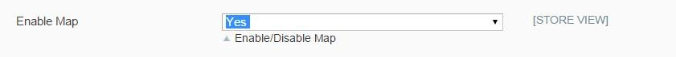

* In box **Name**, type a name for the page as you desire (e.g: Unboxed) 

* In box **Info**, type the text to describe the page to your customers 

*(e.g: Unboxed is gallery page displayed real pictures of products uploaded by real customers who have purchased those products on our main website)*

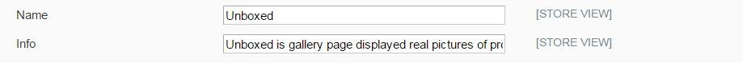

Save the configuration by clicking on **Save config** button on the right of the page. Then go to frontend, reload the page and see the change.

That is an example for the page header displaying on frontend:

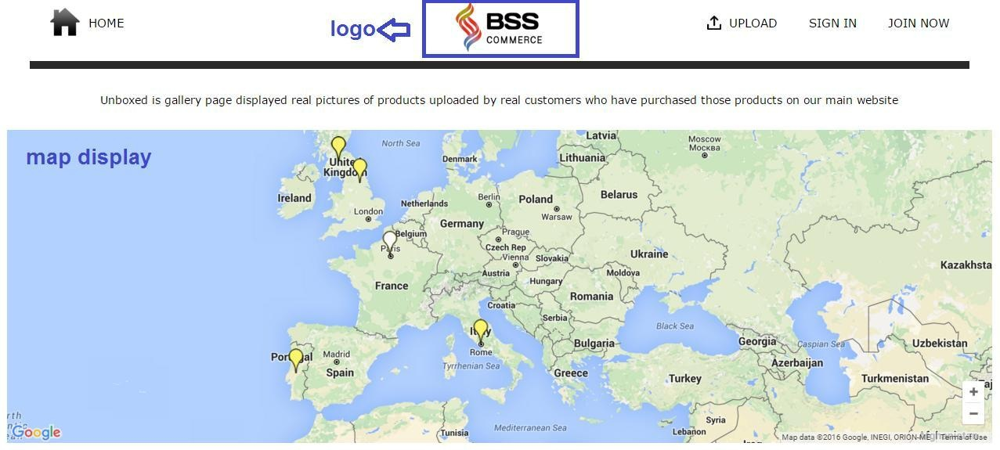

**1.3. Footer displaying**

The module allows admin to configure footer of the page with place special links and social media links.

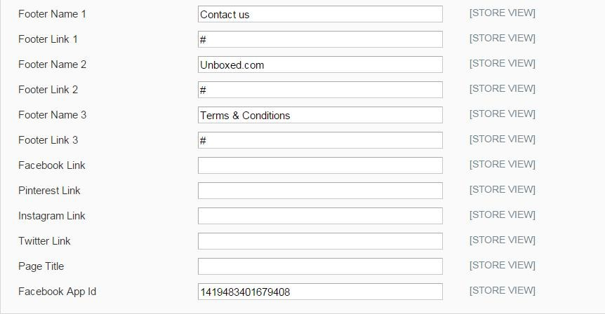

In all boxes named **Footer Name 1, Footer Name 2, Footer Name 3,** type in the boxes names of the footer links that you want to show on frontend.

(e.g: Term & Conditions; Contact us)

In all boxes named **Footer Link 1, Footer Link 2, Footer Link 3,** copy and paste in the boxes the links you want to redirect customer to.

*Note: the footer names must be corresponding with the footer links*

In box named **Facebook Link**, copy and paste in the box link of your facebook page

Do the same with other boxes named **Pinterest Link, Instagram Link, Twitter Link**

After that, save the configuration by clicking on **Save config** button on the right of the page. Then go to frontend, reload the page and see the change.

That is an example for the page footer displaying on frontend:

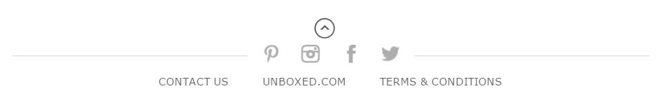

2. Manage/Edit/Upload image by admin
^^^^^^^^^^^^^^^^^^^^^^^^^^^^^^^^^^^^^^

**2.1. Manage image**

As an admin, you can manage all pictures uploaded. To find and manage all pictures, go to tab **Unboxed** on the top (beside tab System), then click 
on **Unboxed -> Manage**

After that, pictures uploaded by all users will appear in a page like this:

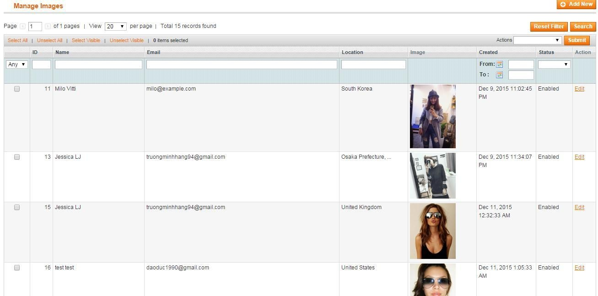

From this page, you can find customer's basic information (customer name, customer email), pictures are uploaded by which customers, picture uploading time and 
picture status. You also can filter picture by uploading time, picture ID, customer name, customer email…

**2.2. Edit image**

* **Step 1:** To edit pictures from admin, find the picture you want to edit on the list and then click on Edit button: 

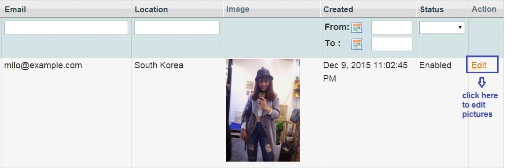

After choosing edit the picture, a screen will appear for you to edit like this:

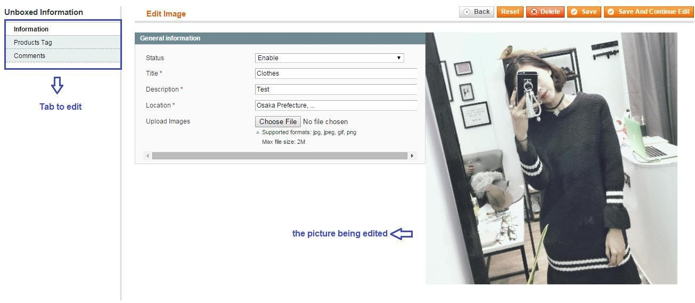

* **Step 2:** In tab **Information**, you can edit the picture information and change the image as you want: 

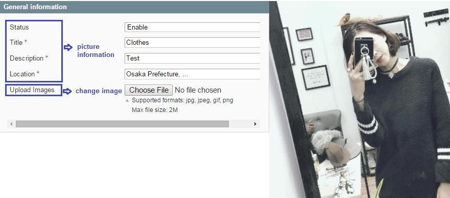

* In box **Status**, you can set for this picture enabled or disabled 

* In box **Title**, type the title for the picture uploaded 

* In box **Description**, type the text describing the picture uploaded 

* In box **Location**, choose the location for the picture uploaded (auto-complete location searching) 

* In box **Upload Images**, you can change the current image to other image by click on **Choose File** button, then you will be able to browse image from your computer to upload. 

After that, click on **Save and Continue Edit** button to save the configuration and continue editing.

* **Step 3:** In tab Product Tag, you can tag any product to the picture being edited. Here, a list of product will be shown like this:

.. image:: images/unboxed_2_5.jpg

You can tag one or more products on the list by clicking on the checkbox of column Select in each product line.

You also can filter product by name, SKU, attribute, product type, price…to find out the product you want to tag on the picture.

Click on **Save and Continue Edit** button to save the configuration and continue editing.

* **Step 4:** In tab **Comments**, you can add comments for the picture being edited with any user account shown on the list. 

Find one user to give comment to the picture, then click on the checkbox on column **Select** like this following example:

*Note: you can also filter user by name, email… to find out the relevant user who you want her/him to give comment on the picture being edited.*

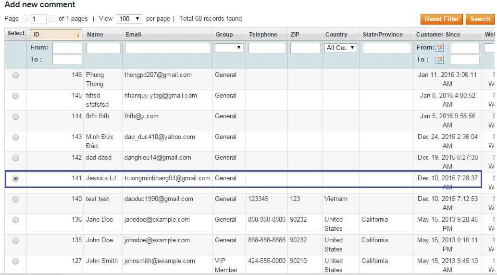

After choosing user, scroll down to the bottom of the page to write a comment under the name of the choosen user:

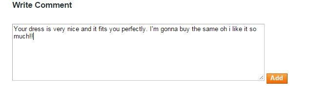

Click on **Add** button to add the comment you have already written on the picture. After adding comment, you will receive a success notification, scroll up 
to the top to see the all comments added to the picture:

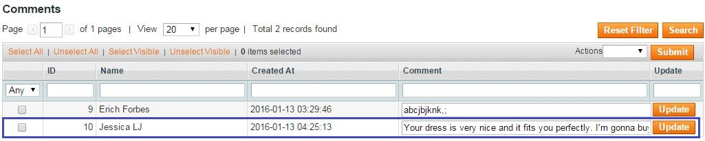

After all these steps, you have done picture edits. Click on **Save** button to save the result after editing. Go to front end, reload the page and see the change.

**2.3. Upload new image**

* **Step1:** To upload new image by admin, click on **Add new** button on the right of the page.

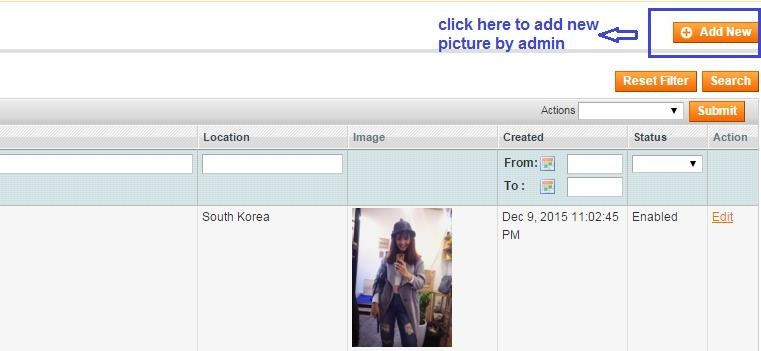

* **Step 2:** After that, you have will be redirected to a page to choose user who will own the new picture first. Click on checkbox in column **Select** to choose customer as you want: 

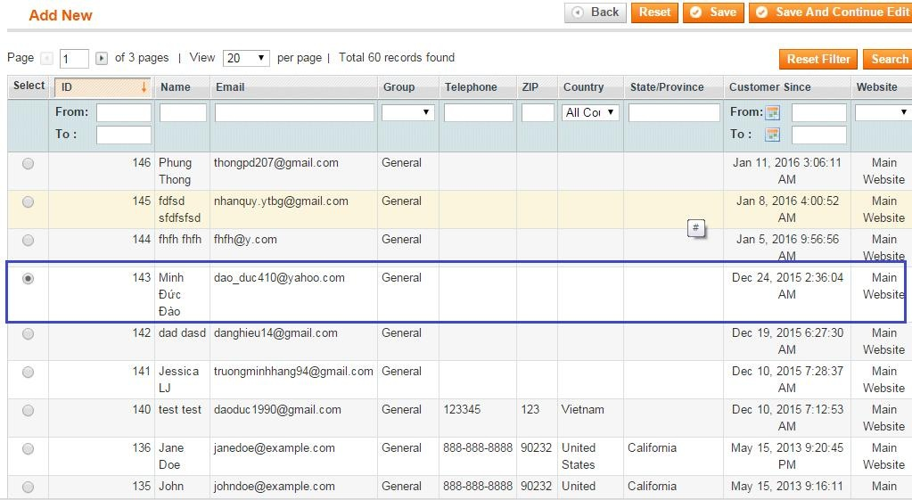

*Note: you can create a new user as you want and upload image under this new customer yourself by going to* **Admin Panel => Customer => Manage Customer => Add New Customer.** *After creating new customer, the new customer 
information will appear on this list as an user of Unboxed page.*

Click on **Save and Continue Edit** button to go to the next step.

* **Step 3:** Now you are in tab **Information**. In this tab, you fill all the boxes with image information and upload your image from your computer as desired. 

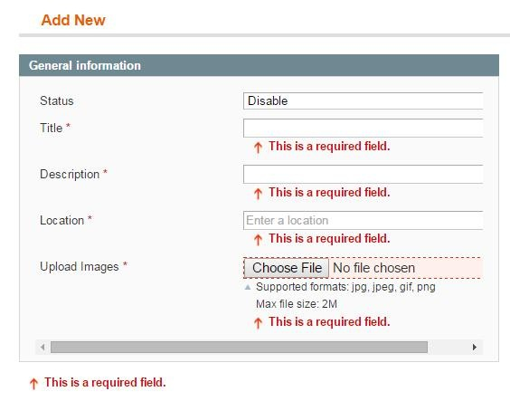

* In box **Status**, you can set for this picture enabled or disabled 

* In box **Title**, type the title for the picture uploaded 

* In box **Description**, type the text describing the picture uploaded 

* In box **Location**, choose the location for the picture uploaded (auto-complete location searching) 

* In box **Upload Images**, upload new image by click on **Choose File** button, then you will be able to browse image from your computer to upload. 

After that, click on **Save and Continue Edit** button to save the configuration to go to the next step.

* **Step4:** In this last step, you are in tab Product Tag. In this tab, you can tag any product to the picture already uploaded. 

Here, a list of product will be shown like this:

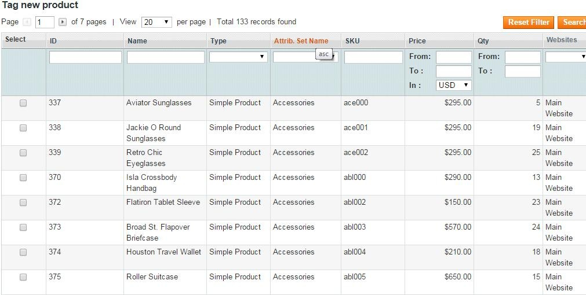

You can tag one or more products on the list by clicking on the checkbox of column Select in each product line.

You also can filter product by name, SKU, attribute, product type, price…to find out the product you want to tag on the picture.

After all these steps, you have done uploading picture under a specific user name. Click on Save button to save the result. Go to front end, reload the page 
and see the change.

.. raw:: html

   

