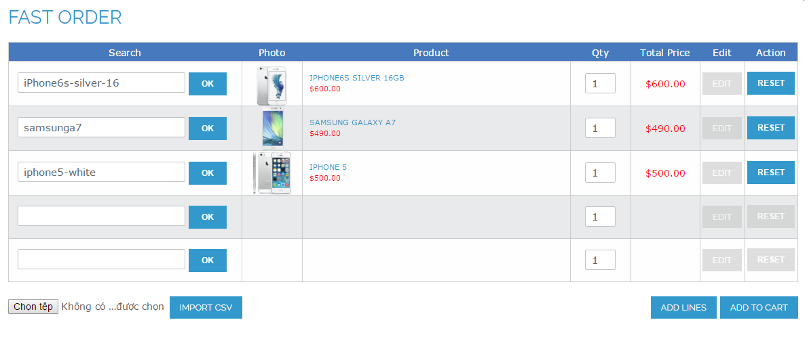

User Guide
=============

I.	BSS Wholesale Fast Order Extension Overview 
-----------------------------------------------------

Recently many researches have proved that even one second delay in buying process can engage your loyal customers in abandoning your online store. 
Therefore, you can enhance your online store performance and encourage customers to start searching and selecting products by using **Wholesale Fast 
Order** by BSS Commerce right now.

II.	How does BSS Wholesale Fast Order Extension work? 
------------------------------------------------------

1. How to use functions of BSS Wholesale Fast Order Extension
^^^^^^^^^^^^^^^^^^^^^^^^^^^^^^^^^^^^^^^^^^^^^^^^^^^^^^^^^^^^^

**Wholesale Fast Order** is a very useful extension that allows selecting multiple products at the same time and then adding them to shopping cart without 
spending too much time purchasing one by one. By this way, Wholesale Fast Order can optimize order process and decrease buying time by following these steps:

**Step 1**: Click **"Fast Order"** shortcut

When you install BSS Wholesale Fast Order Extension, Fast Order shortcut will appear in the right side of your website. Customers click to Fast Order shortcut 
and there is a Fast Order pop up for them to search.

.. image:: images/fast_order_step_1.png

**Step 2**: Search products by typing names or SKU in the search boxes of the Fast Order pop up

There will be some suggestions for customers to choose and both names and SKU are included in the search results with the highlighted search keyword.

.. image:: images/fast_order_step_2.png

**Step 3**: Select your wanted products with quantity and add them to cart

In addition, customers also import a CSV file of products (just require product name and SKU) to carry out the buying process faster without spending much time

If customers search for a configurable product, Wholesale Fast Order displays attributes in a pop up to choose. Moreover, you can edit product attributes and 
other custom options by clicking **"EDIT"** button.

.. image:: images/fast_order_step_3_1.png

**Step 4**: Customers can also view your shopping cart page to see chosen products. In the shopping cart page, there may be Fast Order Section to help customers 
continue their searching process.

.. image:: images/fast_order_step_4.png

**Step 5**: Process to checkout right after adding products into cart. The grand total will be automatically calculated as you add multiple desired items to cart at 
a time.

.. image:: images/fast_order_step_5.png

2. How to configure BSS Wholesale Fast in the backend
^^^^^^^^^^^^^^^^^^^^^^^^^^^^^^^^^^^^^^^^^^^^^^^^^^^^^^^^^^^^^^

For Admin Configuration, go through **"System > Configuration > BSS Commerce > Fast Order"**.

.. image:: images/fast_order.png

In **Enabled**: You can switch on/switch off Whole Sale Fast Order by choosing **Yes** or **No** it in the backend.

In **Fast Order Display**: Choose **Popup** to display Fast order function in a Popup. It will display a Fast Order shortcut in Magento default toplink. 
If the site does not have toplink or toplink has been edited this setting does not take effect. To put Fast Order shortcut to your wanted position please 
insert this html into the file you want the shortcut will display:

*<a href="domain/fastorder/ajax/loadform/" title="Fast Order" class="bss-fastorder" data-featherlight="ajax">Fast Order</a>*

Select CMS Page if you want to show Fast Order in a CMS Page. It’s required to create a CMS	Page from Admin panel and add this code below into its content.

*{{block type="core/template" template="bss/fastorder/form.phtml}}*

In **Enabled jQuery Library**:

	* Choose Yes to enable jQuery Library to run things related to jQuery. 

	* Choose No if your site already has jQuery Library already because it will cause some conflicts. 
	
With Wholesale Fast Order, you can easily set up the number of lines shown in the pop up and the shopping cart page.

.. image:: images/fast_order_1.png

In **Number of lines (Shopping Cart)**: you set the number of lines of Fast Order shown in the Shopping cart. For example, you set equal to 1 and the 
number of lines in the shopping cart is 1 as bellows:

.. image:: images/fast_order_2.png

In **Number of lines (Pop up)**: you set the number of lines of Fast Order shown in the pop up. For example, you set equal to 3 and Fast order pop up contains 
3 lines as bellows:

.. image:: images/fast_order_3.png

If you set these numbers of lines equal to 0, there is not any fast order shown in the pop up and the shopping cart page.

.. image:: images/fast_order_4.png

In **Autocomplete minimum characters**: you set the minimum characters customers have to type in the search box so that the result can appear.

In **Max results to show**: you set the number of results displayed in the autocomplete box

One of the differences of Wholesale Fast Order by BSS is the function of allowing admin to hide specific products with certain customer groups in fast order's 
searching box.

.. image:: images/fast_order_5.png

In **Enable for customer groups**: you choose group for whom you do not want to enable Wholesale Fast Order

In **Hide products with customer group**: You click “Add” to choose customer group and add product names or SKU that will be hidden from this group.

In **XML of update blocks**:

.. image:: images/fast_order_6.png
