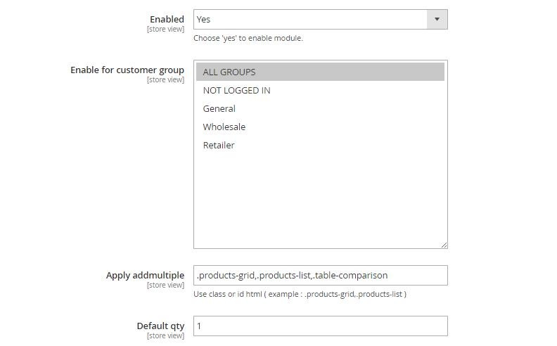
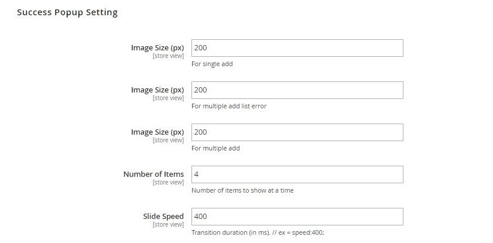

User Guide
=============

Add Multiple Products To Cart for Magento 2 Overview
----------------------------------------------------

For customers who want to buy a variety of products in default Magento store, they would have to spend more time on the purchasing process as the default setting 
does not allow buyers to add many products to cart at once. It is a real challenge for store owners especially those targeting for wholesalers. And BSSCommerce 
has come up with an effective and useful solution to this problem by developing `Add Multiple Products To Cart for Magento 2 <http://bsscommerce.com/magento-2-add-multiple-products-to-cart.html>`_. The 
extension helps customers to add multiple items to cart in different quantities at once on the homepage, category pages and search result pages. Moreover, they 
can select custom options for the products without visiting the product pages separately.

How does Add Multiple Products To Cart For Magento 2 work?
----------------------------------------------------------

You go to **Admin -> Store -> Configuration -> BSSCOMMERCE -> Ajax Add Multiple Products Cart** and start configuration

In **Enabled:** Choose **Yes** to enable the module or choose **No** to disable it. The module can be enable/disable on Store view level.

In **Customer group:** Choose customer group which you want to apply this module. Only customers in selected one are allowed to add multiple products to cart.

In **Apply addmultiple:** Use class or id html to apply the module. For example, use “.products-grid,.products-list” for the module to be applied in all pages with that class.

In **Default qty:** Select default quantity displaying in quantity box.

**In Image size (px) – For single add:** Choose the image size of the product displaying in the success pop-up in case of adding only one product to cart.

**In Image size (px) – For multiple add list error:** Choose the image size of the product displaying in the pop-up in case of having error in adding 
multiple products to cart (unselected custom options, error in quantity).

In **Image size (px) – For multiple add:** Choose the image size of the products displaying in the success pop-up in case of adding multiple products to cart.

In **Number of Items:** Choose the number of item displaying in one success pop-up slide at a time.

In **Slide Speed:** Choose the transition duration of the slide in a millisecond.

.. image:: images/add_multiple_products_to_cart_m2_3.jpg

In **Auto Slide:** Choose Yes for the slide in the success pop-up to be moved automatically.

In **Show “Continue” Button:** Choose **Yes** to show the continue shopping button at the success pop-up.

In **Show Product Price:** Choose **Yes** show product price in success pop-up in case of adding only one product to cart.

In **Show Product Image:** Choose **Yes** to show the products’ images in the success pop-up.

In **Countdown time for Button:**

	* Choose either **View cart Button** or **Continue Button** to show the countdown time.

	* Choose **No** to not display the countdown time.

In **Countdown time: …(s):** Choose the period of time to countdown until redirecting to either View cart or Continue shopping.

In **Show mini cart:** Choose **Yes** to display the mini cart on the success pop-up.

In **Checkout link in mini cart:** Choose **Yes** to show checkout link in the mini cart.

.. image:: images/add_multiple_products_to_cart_m2_4.jpg

In **Text button add multiple to cart:** Choose the text to be displayed in the Add multiple to cart button.

In **Button text color:** Choose the text color in the buttons.

In **Continue button text:** Choose the text to be displayed in the Continue button.

In **Continue button color:** Choose the color of the Continue button.

In **Continue button color on hover:** Choose the color of the Continue button when hovering.

In **View cart button text:** Choose the text to be displayed in the View cart button.

In **View cart button color:** Choose the color of the View cart button.

In **View cart button color on hover:** Choose the color of the View cart button when hovering.

.. raw:: html

   

