User Guide
=============

Admin Product Preview Plus for Magento 2 Extension Overview
------------------------------------------------------------

`Admin Product Preview Plus for Magento 2 <http://bsscommerce.com/magento-2-admin-product-preview-plus.html>`_ is an excellent tool that allows administrators to 
check preview of products/Category Pages/CMS Pages/customer information in the frontend while setting up in the backend panel. This extension offers great 
flexibility to add preview link of product and customer in order grid view, permission to log in customer account in the frontend with full display of account 
information; besides, it allows to edit frontend page by navigating to backend Edit Page, and offers backend data linked for both product and customer information. 

How does Admin Product Preview Plus for Magento 2 Extension work?
-----------------------------------------------------------------

1.	In Stores 
^^^^^^^^^^^^^

Please navigate to **Stores -> Settings -> Configuration**

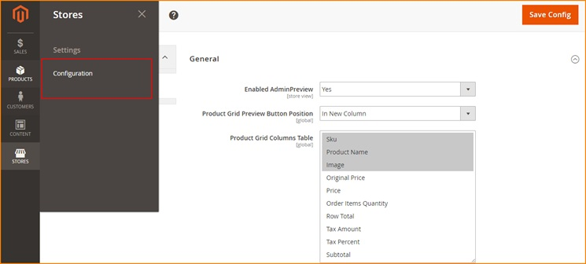

In **General Configuration**

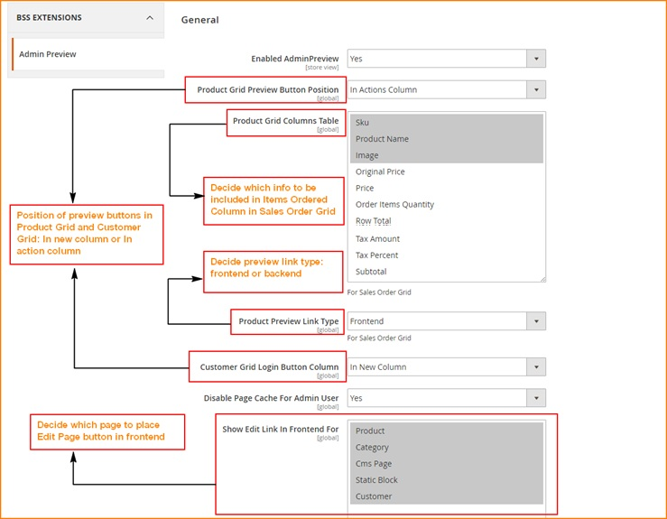

In **Enabled Admin Preview**, choose Yes to enable module or choose No to disable module

In **Product Grid Preview Button Position**, set position of product grid preview button by choosing In New Column or In Action Column 

In **Customer Grid Login Button Column**, set position of column of customer Log-in button by choosing In New Column or In Action Column

In **Product Preview Link Type**, choose Frontend or Backend to decide the navigation of preview links

In **Disable Page Cache For Admin User**, choose Yes to activate automatic cache flush before admin log in as customer and set show **Product Preview Link Type** to 
Frontend, otherwise choose No.

In **Show Edit Link In Frontend For**, choose one or multiple pages to place **Edit Page buttons** which directs admin to backend Edit Page from the frontend. 

2.	In Sales
^^^^^^^^^^^^

Please go to **Sales -> Operations -> Orders**

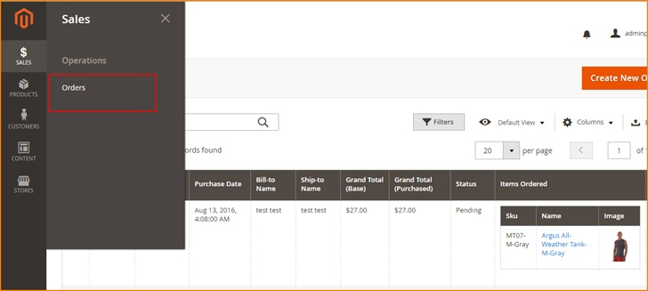

Then check the **Sales Order Grid table** consisting of various columns, in which **Bill-to-name column** presenting name of customers who have placed orders 
on site, and **Item Ordered column** displaying brief information of ordered product (SKU, name, image…)

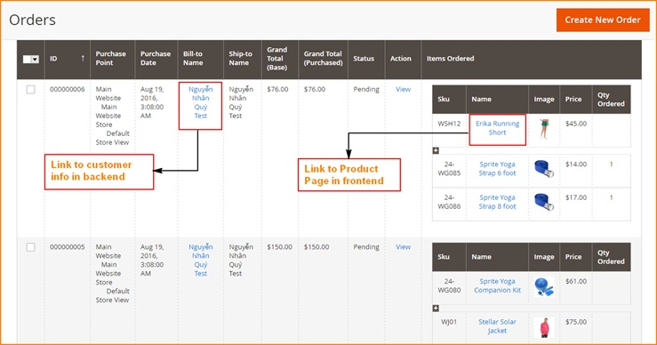

Click name of customer to navigate to **Customer Information** section in the backend to check or make changes if needed.

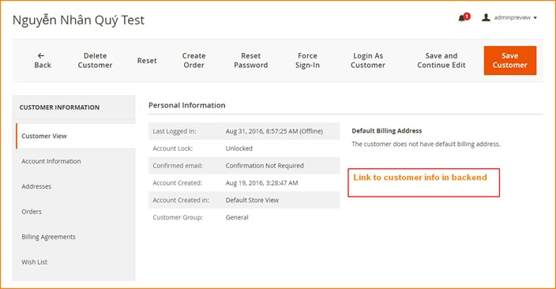

Click name of product to see preview of **Product Page** in the frontend. 

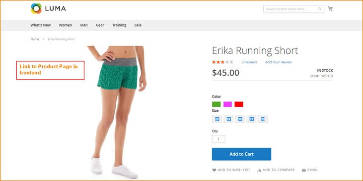

3.	In Products 
^^^^^^^^^^^^^^^

Please navigate to **Products -> Inventory -> Catalog**

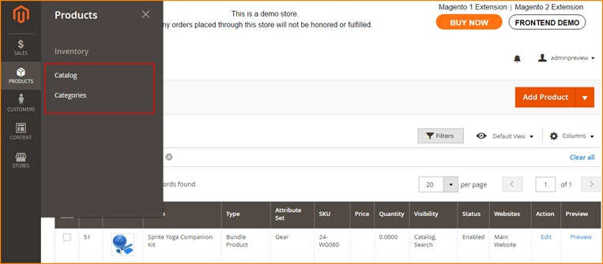

Click **Preview button** in product grid view in **Catalog section** to see preview of Product Page in the frontend, make changes in product information in 
Edit if necessary and click save. 

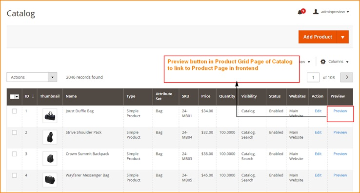

Please go to **Products -> Inventory -> Categories**

Check the list of Category Pages, make changes if needed, click Save then use **Preview button** to check frontend display of the chosen Category Page. 

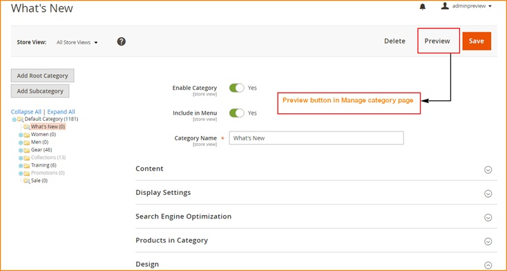

Display of the Category Page in frontend after clicking **Preview button**.

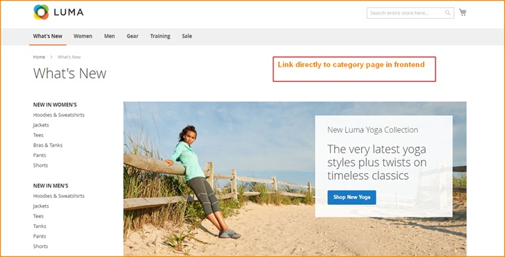

4.	In Customers
^^^^^^^^^^^^^^^^

Please go to **Customers -> All customers**

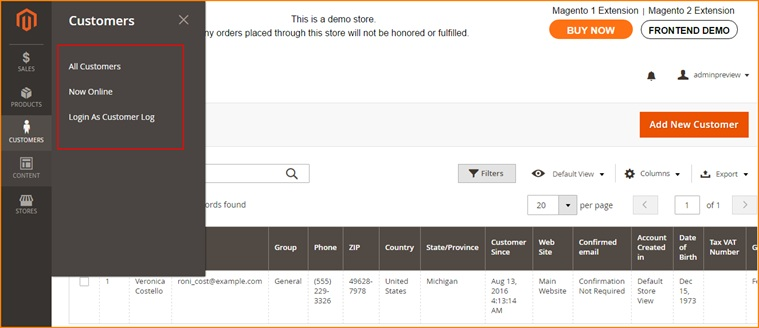

Click **Login button** to log in customer account from backend

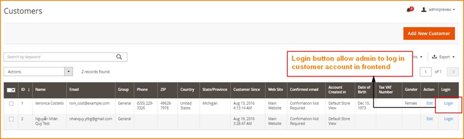

The module will permit admins to log in as customer in frontend page. 

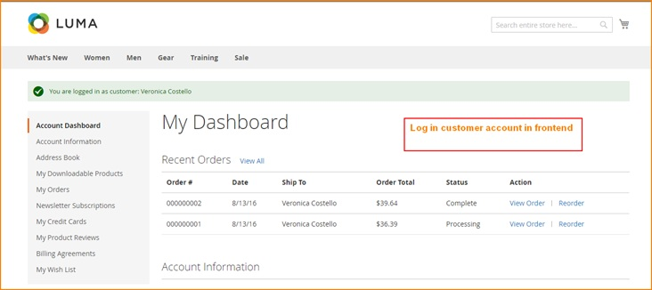

In **Customers -> Login As Customer Log**

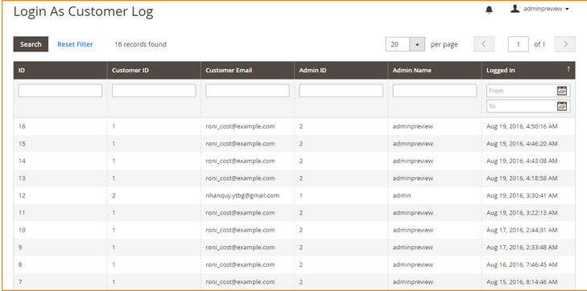

**Login As Customer Log** shows history of how many times admin have logged in as customer in frontend

5.	In Content 
^^^^^^^^^^^^^^

Please go to **Content -> Elements -> Pages**

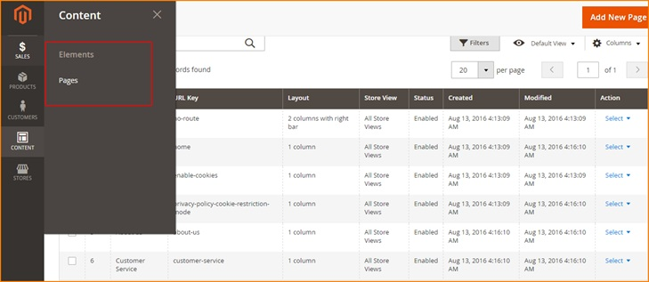

Check the list of **CMS Pages**, click select and choose Edit to make changes in content of CMS Pages, then click Save. 

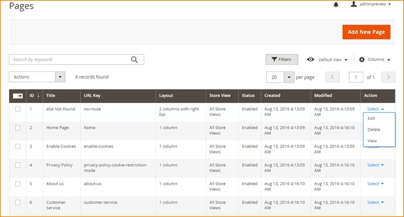

In **Edit CMS page**, make changes if necessary, click **Save Page** and use **Preview button** to check frontend display of the edited page. 

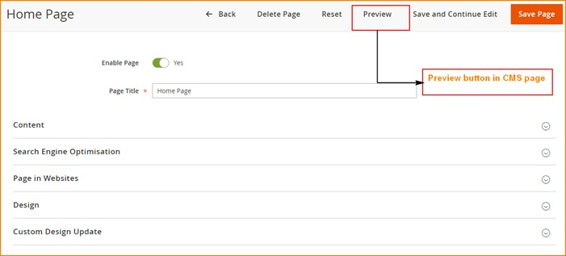

.. raw:: html

   

