User Guide
=============

.. role:: step

Magento 2 Ajax Social Login Overview
----------------------------------------

The ease of login or register process will inevitably encourage customers to interact more with your site. While traditional sign up form might drive customers 
to bounce out immediately due to the complication and amount of time they have to spend on that step, login with social media method can give them more incentive 
to sign up on your site. 

Understand the demand for a quicker and more convenient method of login and register on Magento site, BSSCommerce has 
developed `Magento 2 Ajax Social Login <http://bsscommerce.com/magento2-ajax-social-login-extension.html>`_ which allows customers to sign through social media 
accounts like Facebook, Twitter, Google Plus... quickly via Ajax pop-up. With `Magento 2 Ajax Social Login <http://bsscommerce.com/magento2-ajax-social-login-extension.html>`_, customer can signup or login on a 
site quickly within few clicks instead of wasting time on filling in register or login form. Ajax pop-up is also a method to save up time customers might spend on 
loading new pages. While many people tend to forget the information they used for signup like email, username and password, social login function will help them 
get rid of remembering all above information. Social login also benefits shop owners by encourage site visitors to share content with their social network, which 
is one of the most powerful free word-of-mouth advertising.

How does Magento 2 Ajax Social Login work?
----------------------------------------------

Log in as admin from backend, go to **Store -> Configuration -> BSS COMMERCE -> Ajax Social Login** to start setting configuration.

.. image:: images/ajax_social_login_1.jpg

1.	In General
^^^^^^^^^^^^^^

* In **Enable**:

	*	Choose **Yes** to enable the module.
	
	*	Choose **No** to disable it.
	
* In **Use Popup Ajax**:

	*	Choose **Yes** to enable the Ajax pop-up to replace Login and Create An Account pages.
	
	*	Choose **No** if disable it. 

* In **Display button social**: Hightlight to select position(s) on site that you want to place the social login block. 

* In **Send Password**: After customers successfully signed up through a social media account, you can decide whether to send them a password for following times they log in on site. With the password, customer can sign in in both ways: choose login with social account or use the email of that social account along with 
the password that they received.

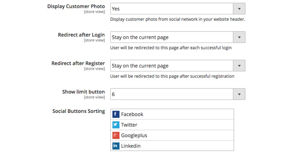

* In **Display Customer Photo**: 

	*	Choose **Yes** to display the customer's profile photo from the social account they used for signup at wherever the customer's photo on site usually shows up. 
	
	*	Choose **No** to not display customer's social photo.

* In **Redirect after Login**: Select the page on site or any particular URL you want to redirect after customer login successfully.

* In **Redirect after Register**: Select the page on site or any particular URL you want to redirect after customer completed register process. 

* In **Show Limit Button**: Choose the number of social login buttons which you want to display in social login block. If this number is smaller than the total amount of social accounts enabled on site, the "Show more" button will appear in social login block for customers to look for more available options.

* In **Social Button Sorting**: You can hold and drag the social accounts to re-order the position they appear in social login block.

2.	In reCaptcha
^^^^^^^^^^^^^^^^

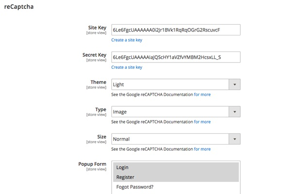

* In **Site Key** and **Secret Key**: Click "Create a site key" and register reCaptcha

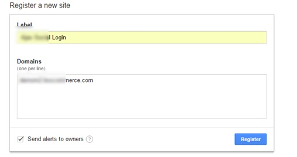

After registering, you will got the Site key and Secret key as below:

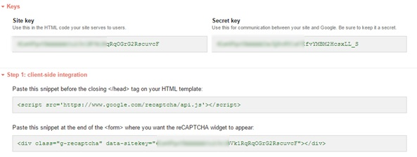

* In **Theme**: Choose the theme of reCaptcha between:

	*	**Light**:	
	
	.. image:: images/ajax_social_login_recaptcha_light.jpg
	
	* **Dark**:
	
	.. image:: images/ajax_social_login_recaptcha_dark.jpg
	
* In **Type**: Choose the type of robot checking between **Image** and **Audio**.

* In **Size**: Choose the size of reCaptcha widget between **Normal** and **Compact**. 

* In **Popup Form**: Choose the form(s) of popup on site to place the reCaptcha widget. Forms of popup to select from includes **Login**, **Register** and **Forgot Password?**

3.	Configuration of specific social account
^^^^^^^^^^^^^^^^^^^^^^^^^^^^^^^^^^^^^^^^^^^^

Take Facebook account as the example:

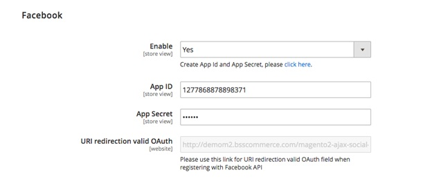

* In **Enable**: 

	*	Choose **Yes** to enable Facebook account for login and register on site. 
	
	*	Choose **No** to disable Facebook account for login and register on site. 

* In **App ID** and **App Secret**: Click on "click here" below Enable dropdown box, you will be redirect to a page to set up new API like below

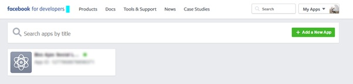

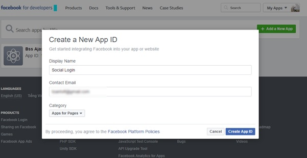

After completing register step, you will see a page as below. Click on Get Started in Facebook Login

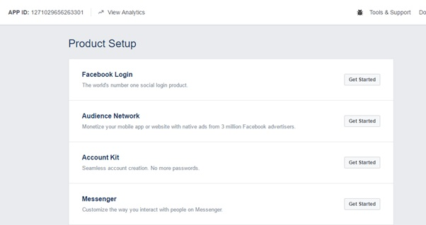

Click on Dashboard, you will see your App ID and App Secret - copy them and paste correspondingly into **App ID** and **App Secret** box in backend configuration. 

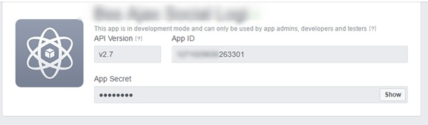

* In **URI redirection valid OAuth** copy the Valid OAuth redirect URIs like below and paste into the box **URI redirection valid OAuth**

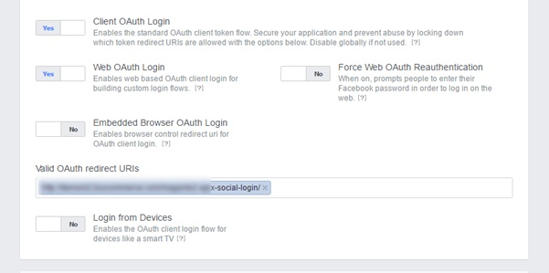

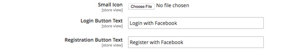

* In **Small Icon**: Upload the file for icon of this account displayed in frontend. 

* In **Login Button Text**: Customize the text in social login button. 

* In **Registration Button Text**: Customize the text in social registration button.

For other social accounts, follow similar steps like the setting for Facebook:

* **Twitter**

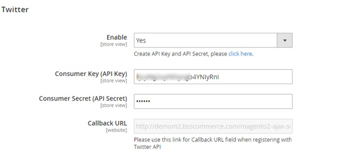

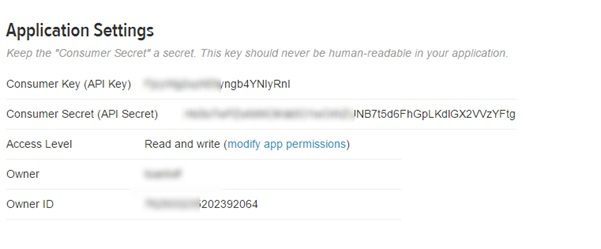

* **Google** 

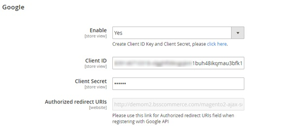

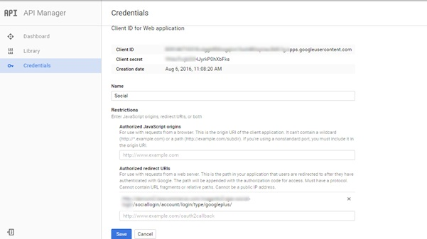

* **Yahoo**

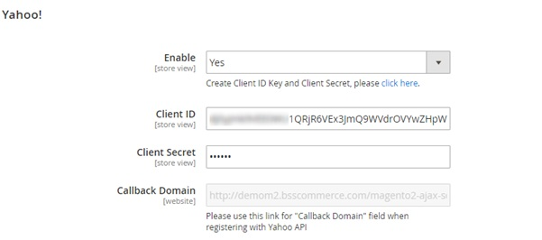

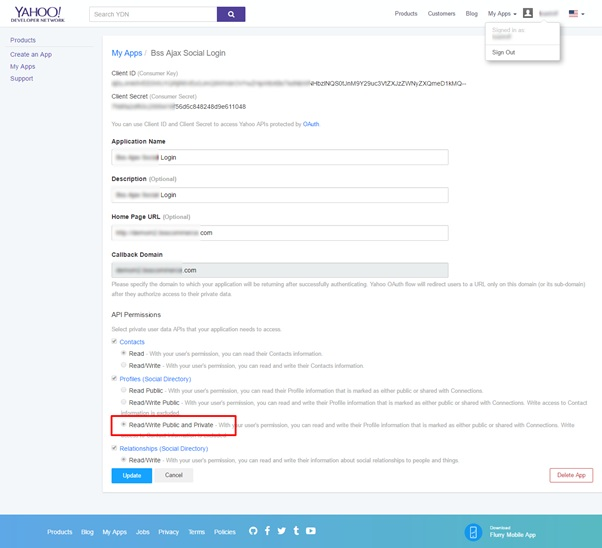

* **Linkedin**

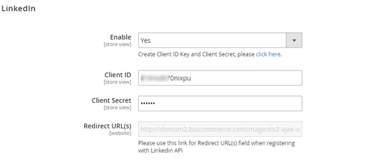

* **Window-Live**

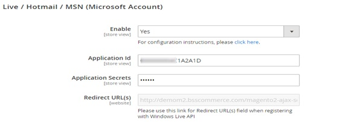

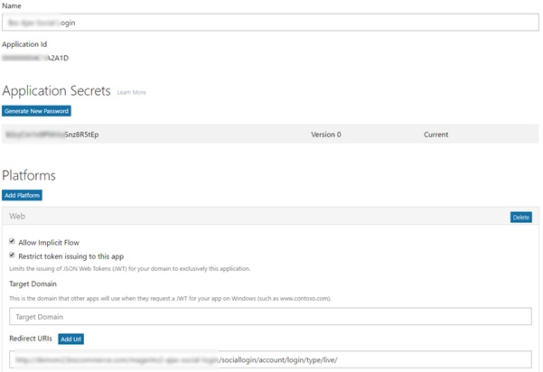

* **Instagram**

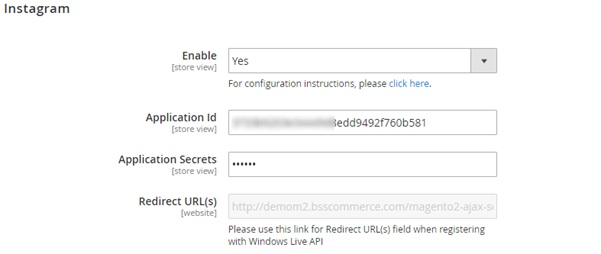

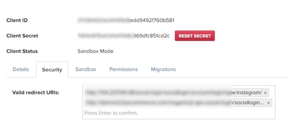

* **Vkontakte**

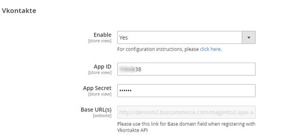

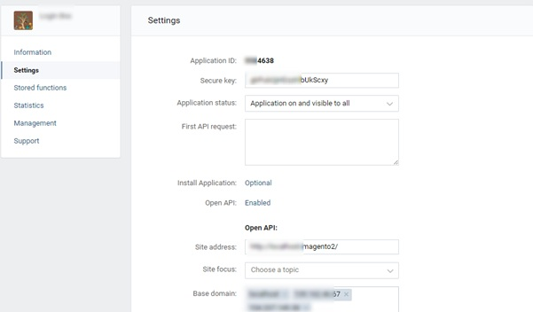

Finally, click **Save Config** and to complete setting process.

:step:`*Note` :  As claimed in the description, this module can support unlimited social accounts. Beside 8 accounts currently available for configuration, you 
can totally add more social media accounts to the list as wish by following below simple steps:

**Step 1**: Add code below to a template file

.. literalinclude:: code_examples/ajax_social_login_template.py

**Step 2**: Put a social login button block on a CMS page

.. literalinclude:: code_examples/ajax_social_login_cms_page.py

**Step 3**: Copy and paste the code below into one of xml layout files where you want to show the social button block

.. literalinclude:: code_examples/ajax_social_login_layout.py

.. raw:: html

   

