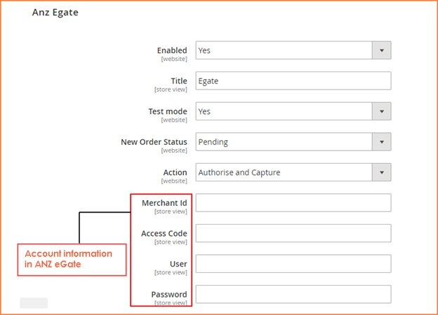
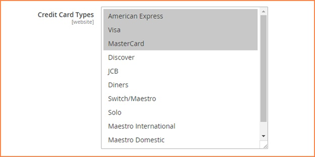
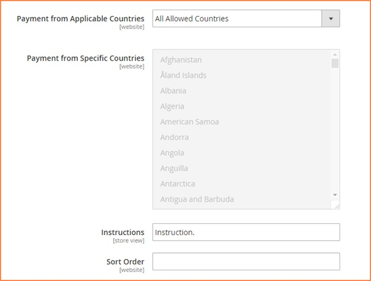

User Guide
=============

Multiple Store View Pricing for Magento 2 Extension Overview
------------------------------------------------------------

`ANZ eGate Payment Gateway for Magento 2 <http://bsscommerce.com/magento-anz-egate-payment-gateway-magento-2.html>`_ is developed to integrate ANZ eGate into 
Magento 2 sites to allow credit card processing right on the sites. This module provides more secure and reliable payment methods for customers to choose besides 
available ones. 

How does Multiple Store View Pricing for Magento 2 Extension work?
------------------------------------------------------------------

You go to **Stores** -> **Sales** -> **Payment Method**

In the **Payment Method, you go to ANZ Egate to begin setting up:** 

In **Enabled**: choose Yes to enable this module or choose No to disable it 

In **Title**: You type the name of payment method displayed on your site

In **Test module**: choose Yes to set up module in the test mode status, otherwise choose No 

In **New Order Status**: you pick up an order status that are displayed after these orders are successfully placed by customers 

In **Actions**: you can choose Authorize Capture or Authorize 

In these sections: **Merchant ID, Access Code, User and Password**:  you fill in with your account information in ANZ 

In **Credit Card Types**: you select types of credit cards that are allowed for payment 

In **Payment from Applicable Countries**:  You can select all countries allowed to apply this payment method or select some specific countries

In **Payment from Specific Countries**: if you choose some specific countries to apply this payment in the previous section, you can pick up your own 
countries from the drop-down list in this filed.

In **Instructions**: you can type some text to explain or describe more about this payment method 

In **Sort Order**: you choose the order of this payment method on the checkout page 

.. raw:: html

   

