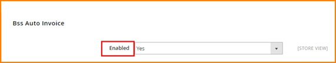
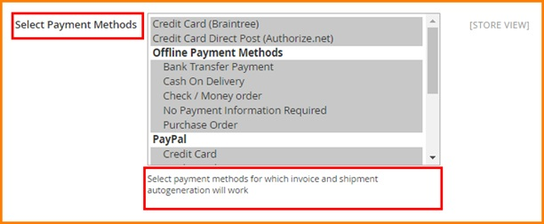
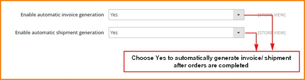
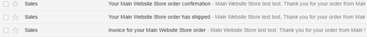
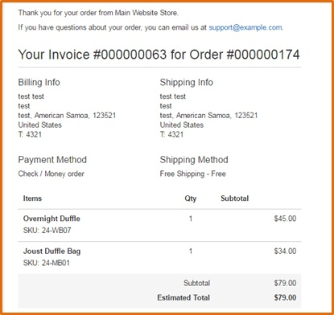
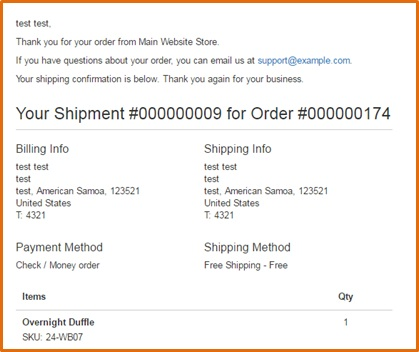

User Guide
=============

BSS Auto Invoice for Magento 2 Overview 
---------------------------------------

To reduce time and effort to generate invoice and shipment manually, `BSS Auto Invoice for Magento 2 <http://bsscommerce.com/magento-2-auto-invoice.html>`_ is 
specially created to automatically create invoice/shipment as well as send emails to customer. As a result, it will put an end of overload of manually creating 
invoices for Magento Store Owners. With this powerful extension, admin can easily manage orders and contact with customers quickly and effectively.  

How does BSS Auto Invoice for Magento 2 work?
---------------------------------------------

As an admin, you can set up your own store page by the most effective way that supports your trading objective. To polish the website configuration:

	Step 1: Go to **Admin Panel** => **Store** => **Settings** => **Configuration**
	
	Step 2:  At the left side of the page, find **BSS COMMERCE**  => select **Auto Invoice**
	
	Choose **Yes/No** to enable/disable BSS Auto Invoice for Magento 2 Extension 

There are 3 sections for admin to continue configuring the extension: **Select Payment Methods, Enable automatic invoice generation, Enable automatic 
shipment generation.**

1.	Select Payment Methods
^^^^^^^^^^^^^^^^^^^^^^^^^^
In the box Select Payment Methods, select all the payment methods for which you want invoice and shipment will be generated automatically. 

Remember that with Paypal method, invoice will be generated automatically by default.

2.	Enable automatic invoice/ shipment generation
^^^^^^^^^^^^^^^^^^^^^^^^^^^^^^^^^^^^^^^^^^^^^^^^^

In “Enable automatic invoice generation” box, after you choose Yes to enable the function, invoices will be generated automatically after orders are completed. 

You set up similarly with automatic shipment generation in the following box. 

Remember that only when automatic invoice generation is enabled, can you enable automatic shipment generation.

If you enable both automatic invoice and shipment generations, your customers will receive 3 emails after ordering completely: Order confirmation, Shipment 
confirmation and Invoice 

If you only enable automatic shipment generation, the first and third emails will be sent.

You can see email samples as below:

* Invoice

* Shipment confirmation

.. raw:: html

   

