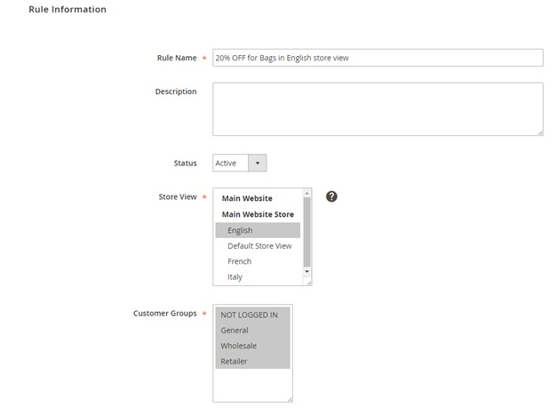
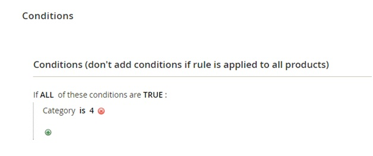
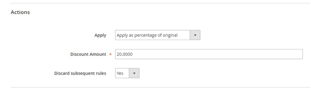
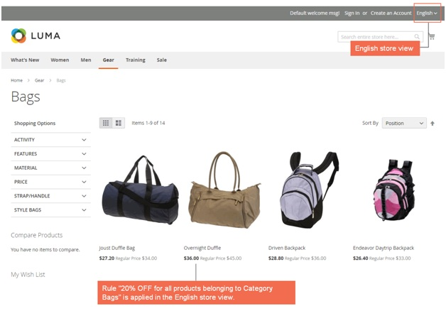
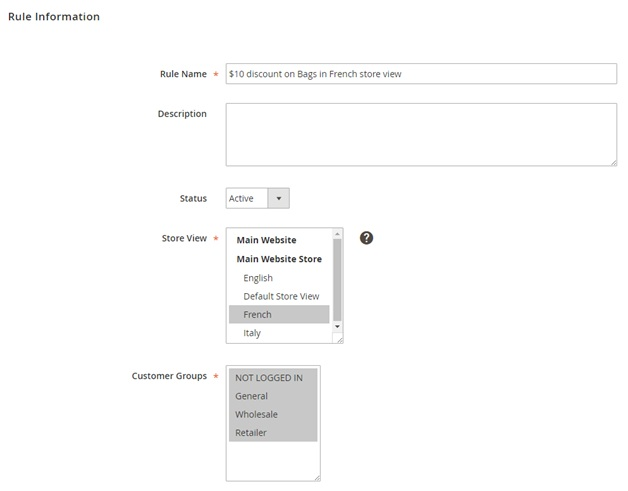
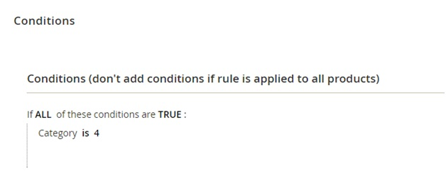
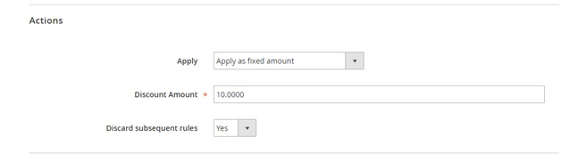
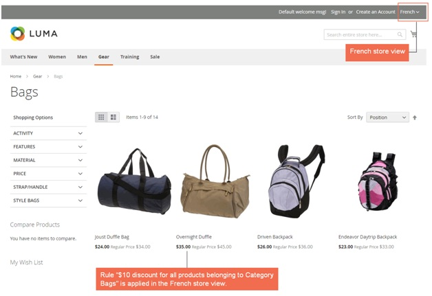

User Guide
=============

Catalog Price Rule Per Store View for Magento 2 Overview
--------------------------------------------------------

As you know, default Magento just allows creating catalog price rules for the whole website. It means that a rule will be set up and applied for all stores or store views of a 
website. Therefore, `Catalog Price Rule per Store View for Magento 2 <https://bsscommerce.com/catalog-price-rule-per-store-view-for-magento-2.html>`_ is developed to help 
administrators to set up catalog price rules for each store view easily, which can offer different promotion programs for customers in particular areas  and generate sales more effectively. 

How Does  Catalog Price Rule Per Store View for Magento 2 Work?
---------------------------------------------------------------

After installing this module, you will select store views to set up cart price rules when you create new rules. 

You go to **MARKETING -> Catalog Price Rules -> Add New Rule.**

You fill in necessary information in sections of **Rule information**. Especially, in **Store View** section, you will select store views to set up this rule and apply in the 
frontend. You can select **multiple store views** to carry out setup at one time.

Take 2 following examples to see how Shopping Cart Price Rule per Store View for Magento 2 can function in details. 

* **Example 1: Set up a rule "20% OFF for all products belonging category Bag" for English store view.**

**In Rule Information:**

	* Fill in Rule name and Description.
	* Set Yes for Active.
	* Select English of Main Website Store  in Store View section. 
	* Select customer groups to apply.
	* Fill in other information: time and priority 

In **Conditions**: Set up the right condition for this rule.

In **Actions**: Choose suitable actions for the rule. 

Finally, you Save  and Apply the rule and then see how it is applied in the frontend of English store view:

* **Example 2: Set up a rule "10% discount for all products belonging category Bag" for French store view.**

You do the same steps as in Example 1 but you need to choose French store view to set up in Store Views section.

In **Conditions:**

In **Actions:**

Finally, you Save  and Apply the rule and then see how it is applied in the frontend of French store view: 

:step:`*Note`: To know how to create a catalog price rule for Magento 2, let's take a look at our following tutorial: `How to Create Catalog Price Rules in Magento 2 <https://bsscommerce.com/blog/how-to-create-catalog-price-rules-in-magento-2/>`_.

.. raw:: html

   

