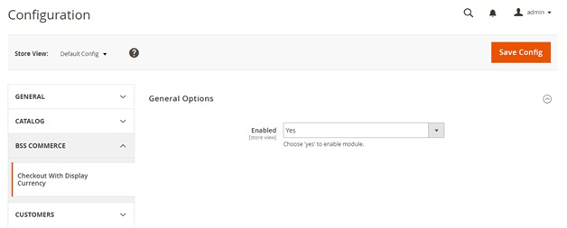
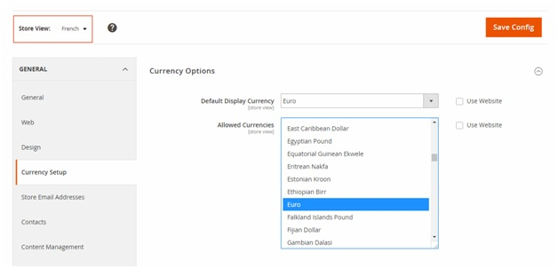
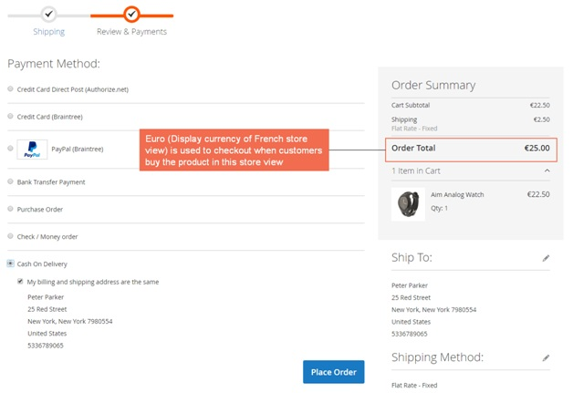
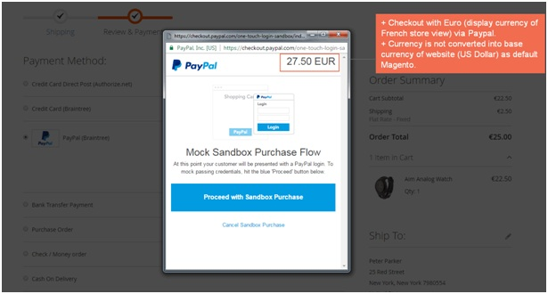
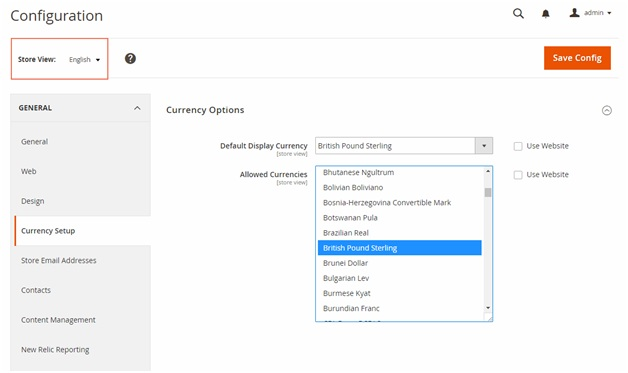
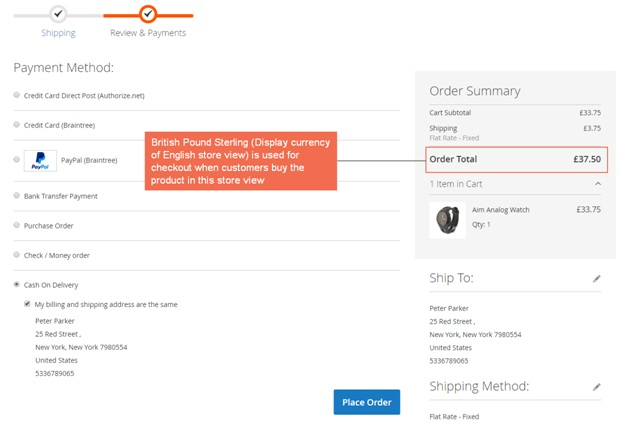

User Guide
=============

Checkout with Display Currency for Magento 2 Extension Overview
---------------------------------------------------------------

`Checkout with Display Currency for Magento 2 <https://bsscommerce.com/checkout-with-display-currency-for-magento-2.html>`_ helps customers to pay with display currency of their selected store views. 

In default Magento, customers always have to checkout with base currency of the whole website no matter which store view they are staying. Therefore, this module will make checkout process more 
convenient when customers use their own currencies corresponding to their store view in order to pay. 

How does Checkout with Display Currency for Magento 2 Extension work?
---------------------------------------------------------------------

You go to **Stores -> Configuration -> BSSCOMMERCE -> Checkout with Display Currency** to start settings.

1. Enable Checkout with Display Currency Extension for Magento 2
^^^^^^^^^^^^^^^^^^^^^^^^^^^^^^^^^^^^^^^^^^^^^^^^^^^^^^^^^^^^^^^^^

In Enabled: Choose Yes to enable the module or choose No to disable it.

2. Set up Display Currency for each store view
^^^^^^^^^^^^^^^^^^^^^^^^^^^^^^^^^^^^^^^^^^^^^^^

Go to **Stores -> Configuration -> General -> Currency Setup -> Currency Option.**

Then select each store view in Scope to set up display currency for each store view. 

**Example 1: Set up display currency for French store view**

In **Store View**: Choose **English.**

In **Default Display Currency**: choose **British Pound Sterling**.

In **Allowed Currencies**: choose **British Pound Sterling** also. 

Then save config.  

When customers buy products in the frontend of French store view and go to checkout, they can checkout easily with Euro. 

You can see this image: 

**For checking out via online payment methods such as Paypal:**

:step:`*Note`:

	* You should test with your Paypal test account on Test Mode to see how it pays with display currency of store views. 
	* The module does not work with currencies that online payment methods don't support.

**Example 2: Set up display currency for English store view**

You fill in information as in French store view and then save config. 

When customers buy products in the frontend of English store view and go to checkout, they can checkout easily with British Poumd Sterling. 

You can see this image: 

.. raw:: html

   

