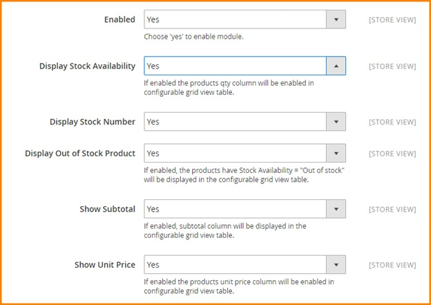
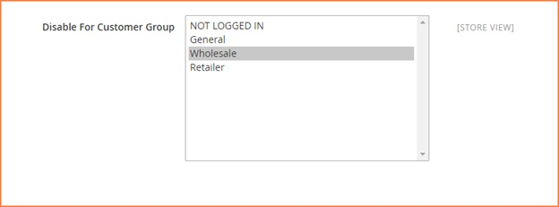

User Guide
=============

Configurable Product Grid Table View for Magento 2 Overview
-----------------------------------------------------------

Along with Magento 1 version, `Configurable Product Grid Table View for Magento 2 extension <http://bsscommerce.com/magento-configurable-product-grid-table-view-for-magento-2.html>`_ supports 
better shopping experience by allowing customers to add multiple products to cart at once. This module displays all children products of the configurable product 
in a very simple table with fields such as product availability, price, quantity and subtotal. Especially, a price range of the configurable product is also 
shown on the category page, which is determined by the lowest and highest one among prices of children products. 

How does Configurable Product Grid Table View for Magento 2 Extension work? 
----------------------------------------------------------------------------

You go to **Admin -> Store -> Configuration -> BSSCOMMERCE -> Configurable Grid View** and start setting up 

In **Enabled**: Choose **Yes** to enable the module or choose **No** to disable it 

In **Display Stock Availability**: 

	* Choose **Yes** to display stock availability in the grid table. When you enable this feature, you can set up Stock number and Out of stock status.
	
	* Choose **No** to hide Availability column from the table 

In **Display Stock Number**: Choose **Yes** to show stock number in the table or choose **No** to replace it by In Stock status 

In **Display Out of Stock Products**: 

	* Choose **Yes** to show out of stock products in the table 
	
	* Choose **No** to hide out of stock products 
	
In **Subtotal**: Choose **Yes** to show subtotal column in the table or choose **No** to exclude it 

In **Show Unit Price**: Choose **Yes** to display the column of Unit price in the grid table or choose **No** to hide it. 

In **Disable for Customer Group**: Choose specific customer groups to disable this module. It means that the grid table does not display with selected 
customer groups

.. raw:: html

	
	