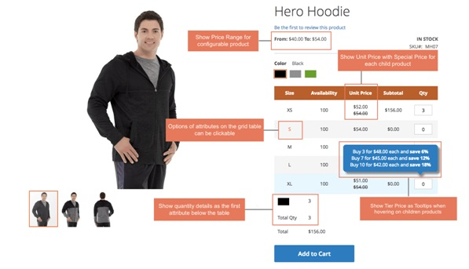
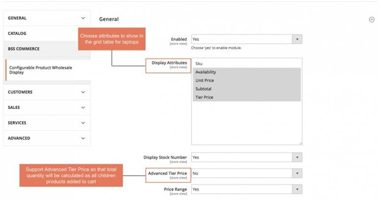
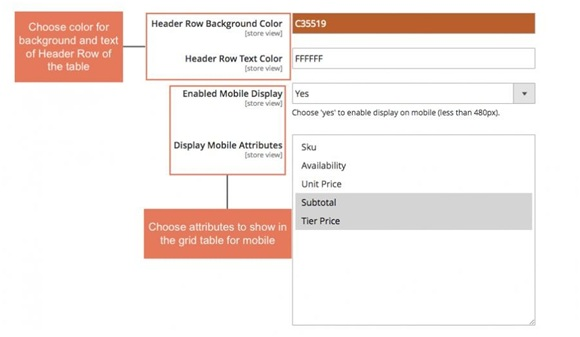
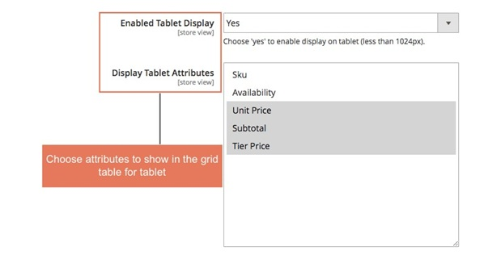
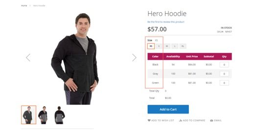
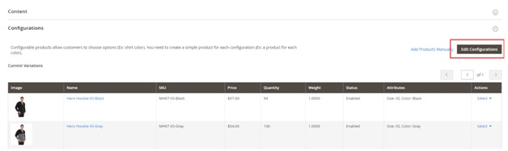
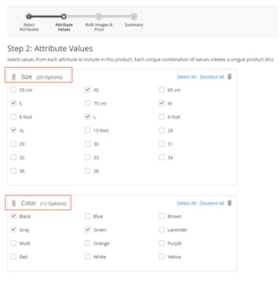
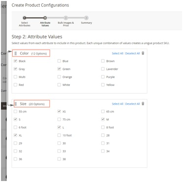
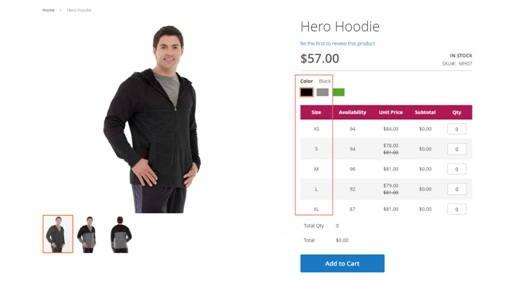

User Guide
=============

Configurable Product Wholesale Display for Magento 2 Overview
-------------------------------------------------------------

`Configurable Product Wholesale Display for Magento 2 <https://bsscommerce.com/configurable-product-wholesale-display-for-magento-2.html>`_ displays all associated 
products in a grid table view which allows wholesale customers to order and add all chosen items to cart at once. This extension not only enhances display for 
configurable products, but helps customers simplify selecting items process as well. It absolutely deserves to be a brilliant solution for any Magento site for selling larger quantity.

How does Configurable Product Wholesale Display for Magento 2 Extension work?
----------------------------------------------------------------------------

1. Function of Configurable Product Wholesale Display for Magento2
^^^^^^^^^^^^^^^^^^^^^^^^^^^^^^^^^^^^^^^^^^^^^^^^^^^^^^^^^^^^^^^^^^

* Show associated products in a grid table with all options, so that customers just need to enter quantity and then add all chosen products to cart by oneclick.
* Show SKU, Availability, Unit Price, Tier Price and Subtotal in this grid table. Especially, the module supports showing Tier Price as Tooltips when hovering onit.
* Show Price Range for configurableproducts.
* Show selected quantity details based on options of the first attribute below thetable.

* Work well with Color swatch function of Magento default with clickable options. Customers can still click options to see images of childrenproducts.
* Work well with all type of customoptions.

2. How to configure Configurable Product Wholesale Display for Magento 2 in the backend
^^^^^^^^^^^^^^^^^^^^^^^^^^^^^^^^^^^^^^^^^^^^^^^^^^^^^^^^^^^^^^^^^^^^^^^^^^^^^^^^^^^^^^^

Go through **System -> Configuration -> BSSCommerce -> Configurable Product Wholesale Display.**

* **Enabled**: choose Yes to enable theextension.
* **Display Attributes**: choose attributes to show in the grid table for laptop aswish.
* **Display StockNumber**:
	- Choose Yes to show number of stock in the gridtable.
	- Choose No, it will show stock status: In stock and Out ofstock.
* **Advanced TierPrice**:
	- Choose Yes: total amount is based on tier price of total quantity of children products added tocart.

**Note:**

	- This feature is only applied for children products having same tier prices. That means: if a configurable product has 50 children products, all 50 children products need to have the same tierprice.
	- If there is at least 1 children product does not have tier price or have different tier price with others, this feature will not beapplied

For example, tier price of buying 1-9 Black-S shirt, 1-9 Gray-S shirt is similarly $45. Tier price of buying 10-more for every children products is $40. Therefore, when you buy 3 Black-S 
shirts and 7 Black-XL shirts, tier price is now $40/shirt. Total amount is now $400.
	
	- Choose No: total quantity will take default tier price, which means that total amount is calculated by tier prices of each children product multiply to total quantity of each chosen childrenproduct.
	
For the above example, when using Magento default tier price calculation, total amount is determined as $450 because it is calculated based on each tier price of each children product (Tier price is equal to $45/shirt)

* **Price Range**:

	- Choose **Yes** if you want to display Price Range for configurable product above thetable.
	- If not, choose **No**.

.. image:: images/configurable_product_wholesale_display_m2_3.jpg

* **Hide Price on Table for Customer Groups**: choose which customer group you want to hideprice.
* **Enable for Customer Groups**: choose which customer group to show this wholesale display.

* **Header Row Background Color**: choose color you want for Header Row Background
* **Header Row Text Color**: choose color for Header Row Text aswish
* **Enabled Mobile Display**: choose Yes to make it responsive onmobiles
* **Display Mobile Attributes**: choose attributes to show in the grid table view for mobiles

* **Enabled Tablet Display**: choose **Yes** to make it responsive ontablets.
* **Display Tablet Attributes**: choose attributes you want to show in the grid table on tablets.

3. Changing sort order of attributes for configurable products
^^^^^^^^^^^^^^^^^^^^^^^^^^^^^^^^^^^^^^^^^^^^^^^^^^^^^^^^^^^^^^

If you get a problem like the order of attributes is not as you wish.

Here is an example: You want to change the sort order, the size attribute should be in the table.

Here is solution: changing sort order of attributes.

Please follow these steps:

**Step 1**: Go to **Product details page** in the backend:

Product -> Catalog -> choose a product detail page of a configurable product.

Step 2: Click **Edit Configuration**

select **Attribute Value**

**Step 3**: Change the sort order of attributes.

**Step 4**: Choose **Next** in the two following steps in **Create Product Configurations**.\

Then **Save**.

**Step 5**: Go the frontend, reload the product page.

Here is result:

.. raw:: html

   

