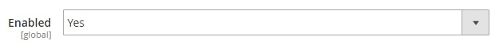
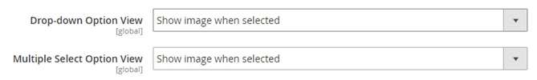
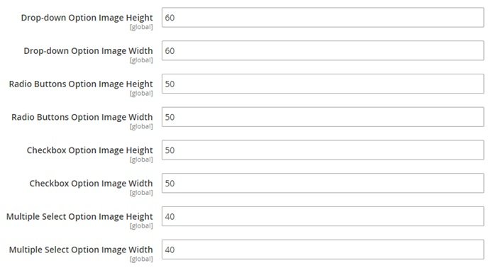
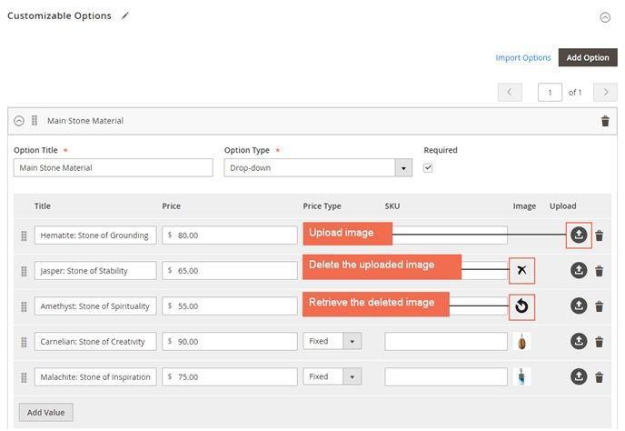

User Guide
=============

Custom Option Image for Magento 2 Extension Overview
-----------------------------------------------------

`Custom Option Image for Magento 2 extension <https://bsscommerce.com/catalog-price-rule-per-store-view-for-magento-2.html>`_ allows admin to add images/colors to custom options 
of products. It supports uploading unlimited images and assigning to custom option of different types, such as drop-down, multiple select, checkbox, radio button. 

How Does Custom Option Image for Magento 2 Extension Work?
----------------------------------------------------------

Please go to **Stores -> Configuration -> BSSCOMMERCE -> Custom Option Image**.

1. General
^^^^^^^^^^

In **Enabled**, choose Yes to enable the extension, or No to disable it. 

**Note**: The module works with simple product, configurable product, bundle product (without dynamic pricing), downloadable and virtual product. 

It only supports adding images for products that can have custom options by Magento default so the extension does not work with grouped product. In 
case of bundle product, it only supports uploading images for the custom options created by admin, not the bundle items. 

2. Frontend View
^^^^^^^^^^^^^^^^^

In **Drop-down Option View**, choose one of the following options: 

	* **Show image when selected**: Image is only displayed when the custom option is selected. 

	For example:

	.. image:: images/custom_option_image_m2_3.jpg

	* **Show all images**: All images are displayed in each custom option. If customer selects an option, its image will be highlighted. 

In **Multiple Select Option View**, choose one of the following options:

	* **Show image when selected**: Image is only displayed when the custom option is selected. 
	
	* **Show all images**: All images are displayed in each custom option. If customer selects an option, its image will be highlighted. 
	
	For example:
	
	.. image:: images/custom_option_image_m2_4.jpg
	
3. Image Size Settings
^^^^^^^^^^^^^^^^^^^^^^
	

In **Drop-down Option Image Height**, set image height for drop-down option type. 

In **Drop-down Option Image Width**, set image width for drop-down option type.

In **Radio Buttons Option Image Height**, set image height for radio buttons option type. 

In **Radio Buttons Option Image Width**, set image width for radio buttons option type.

In **Checkbox Option Image Height**, set image height for checkbox option type.
 
In **Checkbox Option Image Width**, set image width for checkbox option type.

In **Multiple Select Option Image Height**, set image height for multiple select option type. 

In **Multiple Select Option Image Width**, set image width for multiple select option type.

4. Upload Image for Custom Option
^^^^^^^^^^^^^^^^^^^^^^^^^^^^^^^^^

Go to **Products -> Catalog -> Choose the product -> Customizable Options**.

* Click upload icon to upload image from local. Save configuration after finishing. 
* To remove the uploaded image, hover on the chosen image and click the delete icon. 
* To recover the deleted image, hover on the chosen image and click the retrieve icon. 

**Note**: Don't delete the custom option before save configuration or the images uploaded for options won't be saved. 
	
.. raw:: html

   

