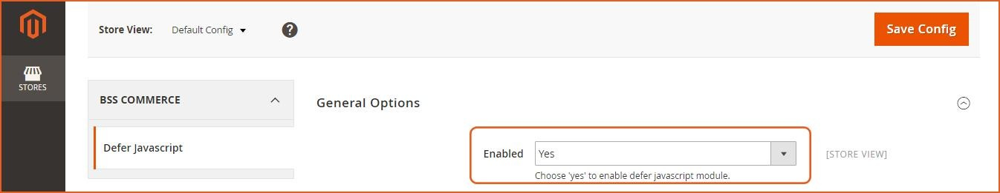
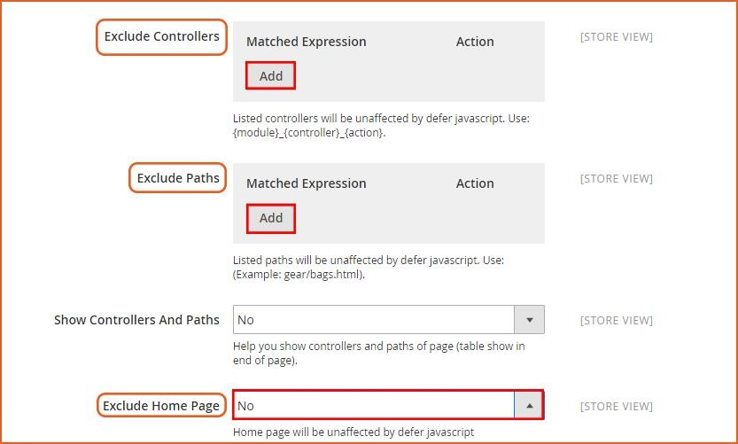
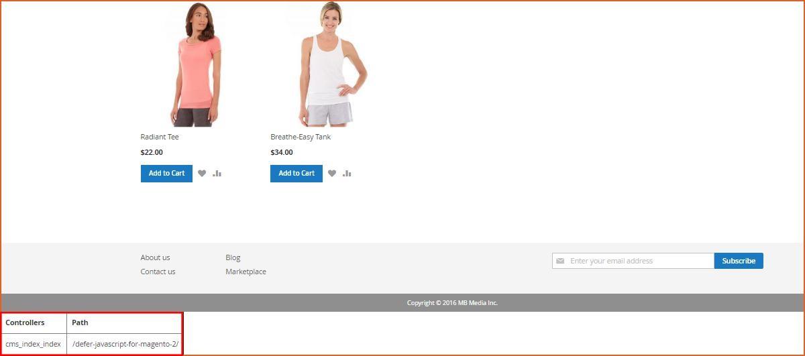
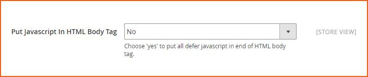

User Guide
=============

.. role:: italic

Defer JavaScript Extension for Magento 2 Overview 
--------------------------------------------------

`Defer JavaScript Extension for Magento 2 <http://bsscommerce.com/magento-defer-javascript-extension-for-magento-2.html>`_ is developed based on the version for 
Magento 1. Like its initial version, Defer JavaScript Extension for Magento 2 is one of the most powerful factors that help to improve the website's speed.

This module is very useful in reducing the loading time of a website, so that customers can enjoy a better shopping experience at your store site, leading to a 
stronger engagement and higher brand loyalty.

How does Defer JavaScript Extension for Magento 2 work?
--------------------------------------------------------

You go to **Stores -> Configuration -> BSSCOMMERCE -> Defer JavaScript** to start setting up

**Step 1:** Enable Defer JavaScript Extension for Magento 2:

At backend, you can easily enable or disable BSS Defer JavaScript module by selecting "Yes" or "No" in the Enable box

**Step 2:** Manage Controllers, Path, and Homepage:

If you want some of your pages not being affected by Defer JavaScript Extension for Magento 2, you can easily exclude it by fulfilling these pages' information 
into these excluded boxes:

* :italic:`Exclude controllers and paths:` Click **Add Match** button and write down your wished paths or controllers that you want to disable Defer JavaScript for Magento 2 

* :italic:`Exclude Homepage:` you can disable this module on Homepage faster and easier by selecting "Yes" in the **Exclude Home Page** box. 

**NOTE:**

	* You have to fill in the controllers/ paths that you want to exclude the affection of Defer JavaScript Extension for Magento 2 when selecting Add Match button. 
	
	.. image:: images/defer_javascript_m2_3.jpg

	* If you do not fill it up, the system will automatically set all pages in your website affected by our module. 

	* You can click on the **wastebasket** symbol in the right side of the box to delete the created blank box. 

If you do not know the controllers / paths to fulfill the **Exclude Controllers / Paths** box, but you still want to disable Defer JavaScript function for 
some pages, you can select **"Yes"** in the **Show Controllers and Paths** box

After selecting **"Yes"**, you can find information of the Controllers / Paths in the table at the end of frontend page.

In **Put JavaScript In HTML Body Tag:**

	* Choose Yes to put all deferred JavaScript in the end of HTML body tag 

	* Choose No to put all deferred JavaScript in the end of page 

When you finish changing the configuration, you can click on **"Save Config"** button to save all of your setting with Defer JavaScript.

.. raw:: html

   