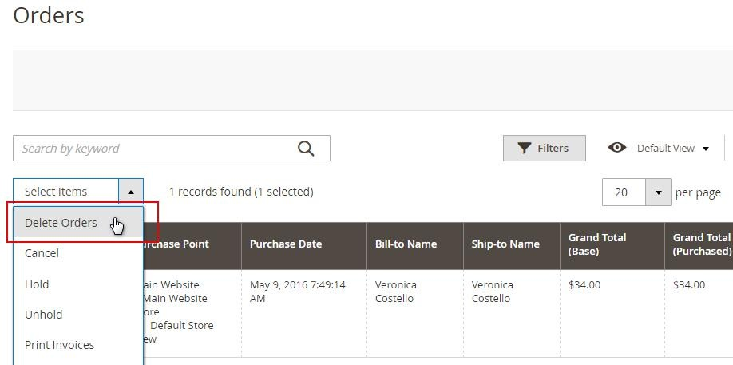
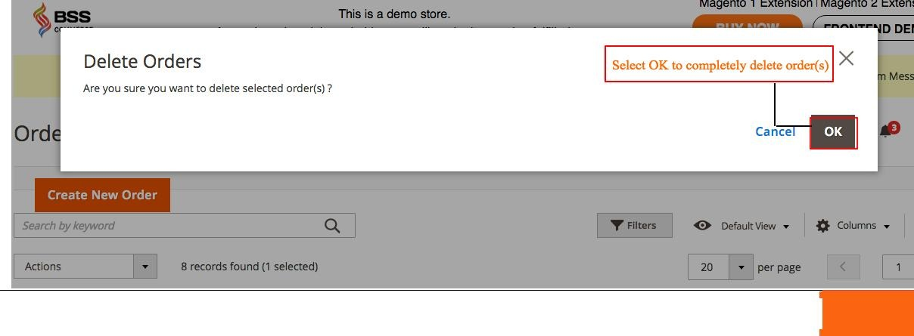
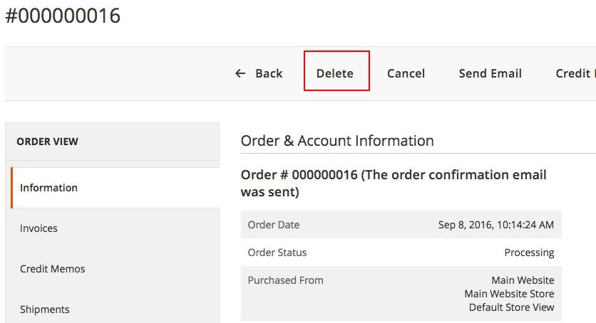
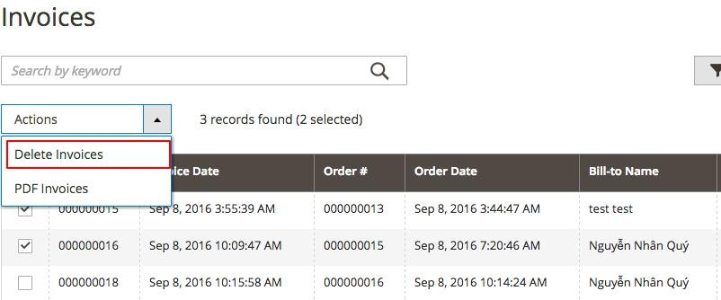
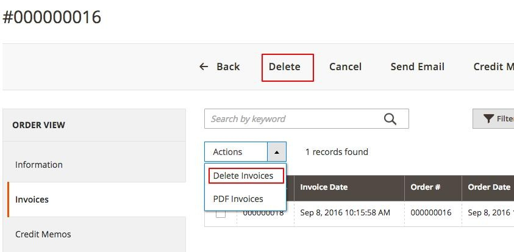

User Guide
=============

Delete Order extension for Magento 2 Overview
---------------------------------------------

`Delete Order for Magento 2 <http://bsscommerce.com/delete-order-for-magento-2.html>`_ is a helpful and easy-to-use extension which allows website admin to 
clear out the backend from all unwanted orders, invoices, shipments, as well as credit memos. Thanks to that, users can effectively keep track on and control 
over all remaining important orders.

How does it work?
-----------------

* **Delete Order(s)**

After installing this module, log in as admin, go to **Sales -> Orders**, a list of all orders will be shown as usual. Tick on the checkbox of unwanted order(s) 
and choose the action **Delete Orders** in Select Items box.

Then a pop-up will appear for action confirmation. Select **OK** to completely delete the order(s).

You can also delete order from **Order View Page** by choosing **Delete** button in Information tab of a particular order

**Note:**

	* You can delete many delete orders at a time by ticking on their checkboxes. 
	
	* Once you delete an order, it would be removed permanently from the system and could not be restored. You’d better do it carefully 
	
	* When an order is deleted, all of its related information like shipment, invoice, credit memo will be erased too 

* **Delete Invoice(s)**

Go to **Sale -> Invoices** and select Invoices you want to wipe out of the backend and then choose **Delete Invoices** in **Select Items** box. After that, a 
popup appears and you click **OK** to confirm removing these selected Invoices.

After Invoices are deleted, order status turns back to Pending (if shipments have not been created) or Processing (if shipments have already created). Credit 
memos are also removed. Invoices can be also recreated

You can also delete invoice of a particular order in its **Order View Page** by going to tab **Invoices**, click on **Delete** button or 
choose **Delete Invoices** in Actions dropdown box.

* **Delete Shipment(s)**

Similar to deleting orders and invoices, we can erase unneeded shipments by navigating to **Sales -> Shipments** and select Shipments that you want to rub 
out. Then, you choose **Delete Shipments** in **Select Items** box and press **OK** in the confirmation popup to finish the process.

Similarly, you can delete shipment from Order View Page under **Shipments** tab by clicking on **Delete** button or choose **Delete Invoices** in **Actions** dropdown box.

When a shipment is removed, its order status is updated to Pending (if invoices have not been created) or Processing (if invoices have already been created). Admin 
can totally recreate shipments.

* **Delete Credit memo(s)**

Like Invoices and Shipments, there are two ways to remove redundant Credit memos:
	
	(i)	Go to **Sales -> Credit memos**, select unwanted Credit memo(s) choose **Delete Credit memos** in **Select Items** box, then click OK in the popup to completely 
	exclude them from the backend. 
	
	(ii) Under **Credit Memos** tab in **Order View Page** of a particular order, click on **Delete** or select **Delete Credit Memos** in **Actions** dropdown box. 

Order Status are altered to Complete (if invoices and shipments have already been generated) or Processing (if only invoices have been created). Credit memos 
are easily recreated.

After finishing with set up, choose **Save Config**
	
.. raw:: html

   